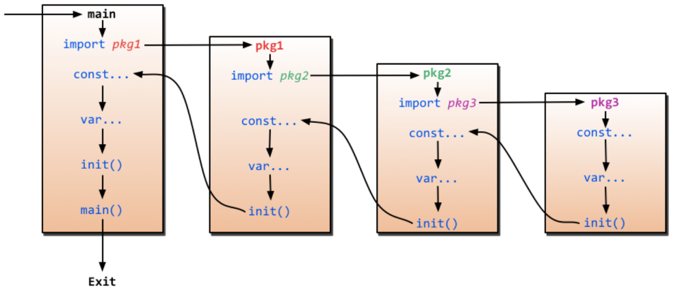
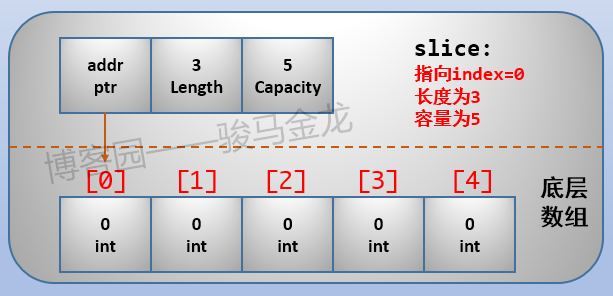
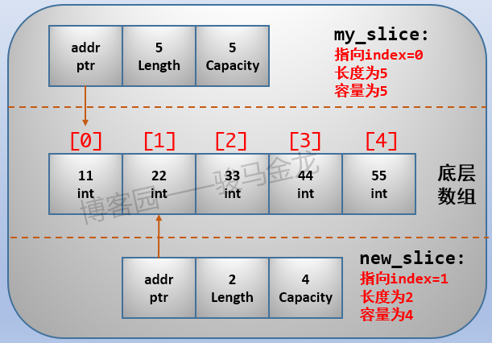
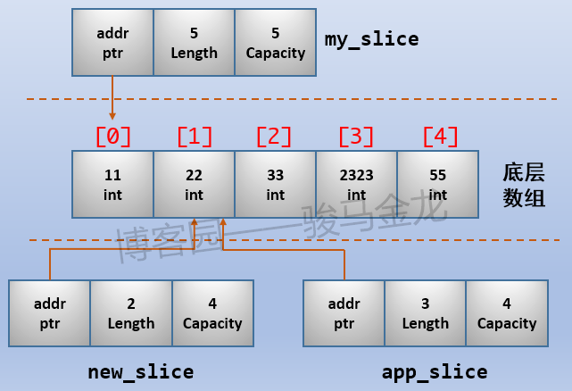
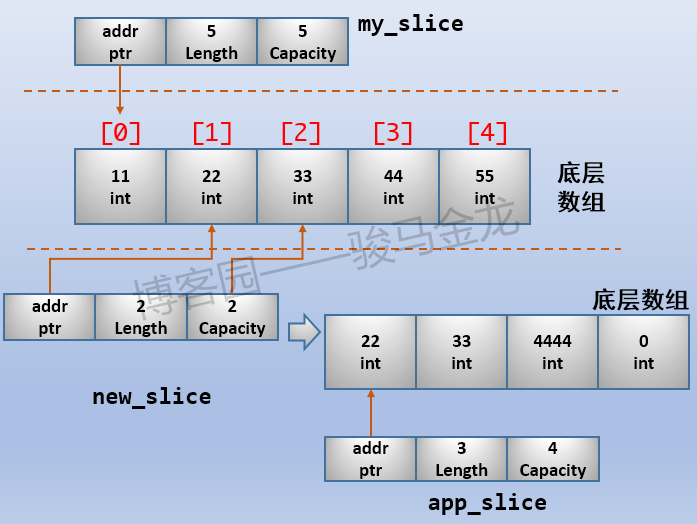

from <https://www.cnblogs.com/f-ck-need-u/p/9832538.html>

## 简介

- 编译型
- 静态类型
- 类C型的语言
- 写一个简单的Go程序
    - `go run --work test.go` --work 查看临时目录
    - `go build test.go`
- main包和main函数
- import
- 关于Go文档
    - `go doc fmt`
    - `godoc -http=:6060` (`go install golang.org/x/tools/cmd/godoc`)
- 变量和变量声明
- 函数定义

## struct

see [here](https://www.cnblogs.com/f-ck-need-u/p/9834459.html)

- Go语言不是一门面向对象的语言，没有对象和继承，也没有面向对象的多态、重写相关特性。
- Go所拥有的是数据结构，它可以关联方法。Go也支持简单但高效的组合(Composition)，请搜索 **面向对象和组合**。 (see [面向对象编程(十一)——组合以及与继承的区别](https://www.cnblogs.com/Qian123/p/5176405.html))
- 虽然Go不支持面向对象，但Go通过定义数据结构的方式，也能实现与Class相似的功能。

```go
type Animal struct {
    name string
    speak string
}

bm_horse := Animal{
    name:"baima",
    speak:"neigh",  // ","不能省略，Go会报错，这个逗号有助于我们去扩展这个结构
}
```

### 引用

比较下面的两种方式

- 第一种将整个数据结构赋值给变量 `bm_horse`，bm_horse从此变成Animal的实例；
- 第二种使用了一个特殊符号 `&` 在数据结构前面，它表示返回这个数据结构的 **引用**，也就是这个数据结构的地址，所以 `ref_bm_horse` 也指向这个数据结构。

实际上，赋值给bm_horse的是Animal实例的地址，赋值给ref_bm_horse是一个中间的指针，这个指针里保存了Animal实例的地址。

```go
bm_horse := Animal{"baima","neigh"}
ref_bm_horse := &Animal{"baima","neigh"}

// bm_horse -> Animal{}
// ref_bm_horse -> Pointer -> Animal{}
```

星号有两种用法：

- `x *int` 表示变量x是一个**引用**，这个引用指向的目标数据是int类型。更通用的形式是`x *TYPE`
- `*x` 表示x是一个引用，`*x` 表示解除这个引用，取回x所指向的数据结构，也就是说这是 一个数据结构，只不过这个数据结构可能是内置数据类型，也可能是自定义的数据结构

`x *int`的x是一个指向int类型的引用，而&y返回的也是一个引用，所以&y的y如果是int类型的数据，&y可以赋值给 `x *int`的x。

注意，x的数据类型是`*int`，不是int，虽然x所指向的是数据类型是int。就像前面perl中的引用只是一个变量，而其指向的却是一个hash数据结构一样。

`*x`代表的是数据结构自身，所以如果为其赋值(如 `*x = 2`)，则新赋的值将直接保存到x指向的数据中。

直接看代码即可

```go
func main() {
 var i int = 10
 println("i addr: ", &i)  // 数据对象10的地址：0xc042064058

 var ptr *int = &i
 fmt.Printf("ptr=%v\n", ptr)        // 0xc042064058
 fmt.Printf("ptr addr: %v\n", &ptr) // 指针对象ptr的地址：0xc042084018
 fmt.Printf("ptr地址: %v\n", *&ptr) // 指针对象ptr的值0xc042064058
 fmt.Printf("ptr->value: %v", *ptr) // 10
}
```

### Go函数参数传值

因为复制传值的方式，如果函数的参数是一个数据结构，将直接复制整个数据结构的副本传递给函数，这有两个问题：

- 函数内部无法修改传递给函数的原始数据结构，它修改的只是原始数据结构拷贝后的副本
- 如果传递的原始数据结构很大，完整地复制出一个副本开销并不小

下例展示了利用传递引用来修改外层变量的例子, 若是传值则无法修改.

```go
func main(){
    bm_horse := &Animal{
        name: "baima",
        weight: 60,
    }
    add(bm_horse)
    fmt.Println(bm_horse.weight)
}

func add(a *Animal){
    a.weight += 10      // struct 的引用也可以直接用 . 取属性
}
```

大多数时候，传递给函数的数据结构都是它们的引用，但极少数时候也有需求直接传递数据结构。

### 方法：属于数据结构的函数

```go
type Animal struct {
    name string
    weight int
}

func (a *Animal) add() {
    a.weight += 10
}

func main() {
    bm_horse := &Animal{"baima",70}
    bm_horse.add()
    fmt.Println(bm_horse.weight)    // 输出80
}
```

### 构造器

Go虽然不支持面向对象，没有构造器的概念，但也具有构造器的功能，毕竟构造器只是一个方法而已。只要一个函数能够根据数据结构返回这个数据结构的一个实例对象，就可以称之为"构造器"。

```go
func newAnimal(n string,w int) *Animal {
    return &Animal{
        name: n,
        weight: w,
    }
}
```

一般上面的方法类型称为工厂方法，就像工厂一样根据模板不断生成产品。但对于创建数据结构的实例来说，一般还是会采用内置的new()方式。

### new 函数

```go
// 两者等价. 但如果要进行初始化赋值，一般采用第二种方法，可读性更强
bm_horse := new(Animal)
bm_horse := &Animal{}

# 第一种方式
bm_horse := new(Animal)
bm_horse.name = "baima"
bm_horse.weight = 60

# 第二种方式
bm_horse := &Animal{
    name: "baima",
    weight: 60,
}
```

### composition & overload

```go
type Animal struct {
    name   string
    weight int
}
// 上面的 Horse数据结构中包含了一行*Animal，表示Animal的数据结构插入到 Horse的结构中，这就像是一种面向对象的类继承。注意，没有给该字段显式命名，但可以隐式地访问Horse组合结构中的字段和函数。
type Horse struct {
    *Animal                  // 注意此行
    speak string
}
// 然后调用属于Animal数据结构的hello方法，它只能访问Animal中的属性，所以无法访问speak属性。
func (a *Animal) hello() {
    fmt.Println(a.name)
    fmt.Println(a.weight)
    //fmt.Println(a.speak)
}
// 重载 overload
func (h *Horse) hello(){
    fmt.Println(h.name)
    fmt.Println(h.weight)
    fmt.Println(h.speak)
}
func main() {
    // 在构建Horse实例的时候，必须显式为其指定字段名(尽管数据结构中并没有指定其名称)，且字段的名称必须和数据结构的名称完全相同
    bm_horse := &Horse{
        Animal: &Animal{        // 注意此行
            name:   "baima",
            weight: 60,
        },
        speak: "neigh",
    }
    bm_horse.hello()
}
```

## 构建 go 程序

- Go通过包的方式管理程序，每个Go源代码文件都必须声明自己所在的包
- 每个程序都必须有一个main包，main包作为整个程序的编译入口包，main包中的main()函数作为程序的执行入口。

Go中有 **两种类型的包**，或者说有两种类型的文件：

- 编译后成为可执行文件的包，也就是main包编译后的得到的文件
- 编译后成为共享库的包，只要go程序文件中声明的不是main包，就是**库文件**

有两种类型的库文件：**标准库** 和 **第三方的库**。标准库是随Go安装的时候放在go安装目录下的(`$GOROOT/src/`)，第三方库是放在workspace下的。

Go中对库文件要求比较严格，或者说强制性的规范。它要求库文件中package声明的包名必须和目录名称相同，且同一个目录下只允许有一个包，但同一个目录下可以有多个库文件片段，只不过这些库文件中必须都使用package声明它的包名为目录名。

```txt
src/mycode
     |- first.go
     |- second.go
     |- third.go
```

如果这三个文件都是库文件，则它们都必须且只能使用package mycode声明自己的包为mycode。`go build`的时候，会将它们合并起来。如果声明的包名不是mycode，`go build` 会直接忽略它。

Go通过名称首字母的大小写决定属性是否允许导出：

- 首字母大写的属性是允许导出的属性
- 首字母小写的属性不允许被导出

### workspace

`GOPATH` 环境变量指定workspace的位置，用来指示go从哪里搜索go源文件/包，例如import时从哪个路径搜索包并导入。`GOROOT` 环境变量用于指定go的安装位置。go需要导入包时，会从GOPATH和GOROOT所设置的位置处搜索包。

```bash
# check env
go env GOPATH
go env | grep GOPATH

# set env
# mkdir -p /gocode/{src,pkg,bin}
mkdir ~/gocode
export GOPATH=~/gocode
echo 'GOPATH=~/gocode' >>~/.bashrc
```

每个workspace都是一个目录，这个目录下至少包含三个目录：

- `src`：该目录用于存放Go源代码文件(也称为命令的 **源文件**)
- `bin`：该目录用于存放 可执行命令(即构建后可执行的二进制go程序，也称为 **命令文件**)
- `pkg`：该目录用于存放 **共享库文件**(即构建后非可执行程序的库包，也称为 **包对象文件**)

### go build

`go build` 可以用于编译，编译时会对import导入的包进行搜索，搜索的路径为标准库所在路径 $GOROOT/src、workspace下的src目录。它只会生成额外的可执行文件放在当前目录下，不会生成额外的库文件。

```bash
cd src/hello
go build             # 生成的可执行文件名为hello
go build .           # 生成的可执行文件名为hello
go build test.go     # 生成的可执行文件名为test
```

### go install

go还有一个工具install，`go install` 的操作称为安装，将文件安装到合适的位置。go install时会先进行编译，然后将编译后的二进制文件保存到workspace的 `bin` 目录下，将编译后的库文件(称为包对象文件，以"`.a`"为后缀)放在pkg目录下。

注意，go install时必须先进入到 `$GOPATH/src` 下，且只能对目录进行操作，不能对具体的go文件操作，因为go认为包和目录名相同。给go install指定一个目录名，就表示编译这个包名。

由于go install可以直接安装二进制文件到$GOPATH/bin，所以出于方便执行这些二进制程序，可以将这个目录放进PATH环境变量。

```bash
# 对src/hello下的test.go (main) 进行安装，由于它导入了strutils包，所以会自动将strutils也安装好
$ cd $GOPATH/src
$ go install hello
$ tree $GOPATH
/gocode
├── bin
│   └── hello           # 二进制程序文件名为hello，而非test
├── pkg
│   └── linux_amd64     
│       └── strutils.a  # 库文件
└── src
    ├── hello
    │   └── test.go
    └── strutils
        └── strutils.go

# set PATH
export PATH=$PATH:`go env GOPATH`/bin
```

## import导包和初始化阶段

编译器会根据上面指定的相对路径去搜索包然后导入，这个相对路径是从GOROOT或GOPATH(workspace)下的src下开始搜索的。

包导入后，就可以使用这个包中的属性。使用`包名.属性`的方式即可。例如，调用fmt包中的Println函数fmt.Println。

```go
import (
    // 路径
    "net/http"
    "mypkg"
    // 别名
    "fmt"
    myfmt "mypkg/fmt"
    // 简写, 这样直接 Println 也能用
    . "fmt"
)
```

### 常量和变量的初始化

Go中的常量在编译期间就会创建好，即使是那些定义为函数的本地常量也如此。常量只允许是数值、字符(runes)、字符串或布尔值。

由于编译期间的限制，定义它们的表达式必须是编译器可评估的常量表达式(constant expression)。例如，`1<<3` 是一个常量表达式，而 `math.Sin(math.Pi/4)` 则不是常量表达式，因为涉及了函数 math.Sin() 的调用过程，而函数调用是在运行期间进行的。

变量的初始化和常量的初始化差不多，但初始化的变量允许是"需要在执行期间计算的一般表达式"。例如：

```go
var (
    home   = os.Getenv("HOME")
    user   = os.Getenv("USER")
    gopath = os.Getenv("GOPATH")
)
```

### 远程包

```bash
go get github.com/golang/example
```

在import语句中也可以使用，首先从GOPATH中搜索路径，显然这是一个URL路径，于是调用go get进行fetch，然后导入。

```go
import (
    "fmt"
    "github.com/golang/example"
)
```

当需要从git上获取代码的时候，将调用go get工具自动进行 fetch、build、install。如果workspace中已经有这个包，那么将只进行最后的install阶段，如果没有这个包，将保存到GOPATH的第一个路径中，并build、install。

### init

Go中除了保留了main()函数，还保留了一个init()函数，这两个函数都不能有任何参数和返回值。它们都是在特定的时候自动调用的，无需我们手动去执行。



## 数组

```go
// 声明
var a [3]int

// 初始化
var cityArray = [3]string{"北京", "上海", "深圳"} //使用指定的初始值完成初始化
var numArray = [...]int{1, 2}  //自行推断
a := [...]int{1: 1, 3: 5} //按照索引值来初始化，这里是 [0, 1, 0, 5]
arr_name := [5]int{1:10, 2:20}  // 只给指定元素赋值
```

必须注意，虽然我们称呼数组为int类型的数组，但数组的数据类型是两部分组成的 `[n]TYPE`，这个整体才是数组的数据类型。所以，`[5]int` 和 `[6]int` 是两种不同的数组类型。不同数据类型，意味着如果数组赋值给另一数组时需要数据类型转换操作，而Go默认是不会进行数据类型转换的。

在Go中，当一个变量被声明之后，都会立即对其进行默认的赋0初始化。对int类型的变量会默认初始化为0，对string类型的变量会初始化为空""，对布尔类型的变量会初始化为false，对指针(引用)类型的变量会初始化为nil。

### 指针数组(引用)

可以声明一个指针类型的数组，这样数组中就可以存放指针。注意，指针的默认初始化值为nil。

```go
arr_name := [5]*int{1:new(int), 3:new(int)}
```

上面的 `*int` 表示数组只能存储 `*int` 类型的数据，也就是指向int的指针类型。`new(TYPE)` 函数会为一个TYPE类型的数据结构划分内存并做默认初始化操作，**并返回这个数据对象的指针**，所以new(int)表示创建一个int类型的数据对象，同时返回指向这个对象的指针。

```go
arr_name := [5]*int{1:new(int), 3:new(int)}
*arr_name[1]=10
*arr_name[3]=30

// 赋值一个新元素
arr_name[4]=new(int)

fmt.Println(*arr_name[1])
fmt.Println(*arr_name[3])
fmt.Println(*arr_name[4])
```

### 数组拷贝

- 在Go中，由于数组算是一个 **值类型**，所以可以将它赋值给其它数组。
- 因为数组类型的完整定义为[n]TYPE，所以数组赋值给其它数组的时候，n和TYPE必须相同。

```go
// 声明一个长度为5的string数组
var str_arr1 [5]string

// 声明并初始化另一个string数组
str_arr2 := [5]string{"Perl","Shell","Python","Go","Java"}

// 将str_arr2拷贝给str_arr1
str_arr1 = str_arr2
```

### array遍历迭代

range关键字可以对array进行迭代，每次返回一个index和对应的元素值。可以将range的迭代结合for循环对array进行遍历。

```go
    my_arr := [4]int{11,22,33,44}
    for index,value := range my_arr {
        println("index:",index," , ","value",value)
    }
```

### 多维数组

```go
t_arr := [4][2]int{{10, 11}, {20, 21}, {30, 31}, {40, 41}}

t_arr := [4][2]int{1: {20, 21}, 3: {40, 41}}
t_arr := [4][2]int{1: {0: 20}, 3: {1: 41}}
```

## slice

```go
my_slice := make([]int,3,5)

fmt.Println(len(my_slice))  // 3
fmt.Println(cap(my_slice))  // 5

// 还可以直接通过print()或println()函数去输出slice，它将得到这个slice结构的属性值，也就是length、capacity和pointer
println(my_slice)      // [3/5]0xc42003df10
```



每一个slice结构都由3部分组成：容量(capacity)、长度(length)和指向底层数组某元素的指针，它们各占8字节(1个机器字长，64位机器上一个机器字长为64bit，共8字节大小，32位架构则是32bit，占用4字节)，所以**任何一个slice都是24字节(3个机器字长)**。

- Pointer：表示该slice结构从底层数组的哪一个元素开始，该指针指向该元素
- Capacity：即底层数组的长度，表示这个slice目前最多能扩展到这么长
- Length：表示slice当前的长度，如果追加元素，长度不够时会扩展，最大扩展到Capacity的长度(不完全准确，后面数组自动扩展时解释)，所以Length必须不能比Capacity更大，否则会报错

务必记住slice的本质是 `[x/y]0xADDR`，记住它将在很多地方有助于理解slice的特性。另外，个人建议，虽然slice的本质不是指针，但仍然可以将它看作是一种包含了另外两种属性的不纯粹的指针，也就是说，直接认为它是指针。其实不仅slice如此，map也如此。

### 创建、初始化、访问slice

make()比new()函数多一些操作，new()函数只会进行内存分配并做默认的赋0初始化，而make()可以先为底层数组分配好内存，然后从这个底层数组中再额外生成一个slice并初始化。另外，make只能构建slice、map和channel这3种结构的数据对象，因为它们都指向底层数据结构，都需要先为底层数据结构分配好内存并初始化。

```go
// 创建一个length和capacity都等于5的slice
slice := make([]int,5)
// length=3,capacity=5的slice
slice := make([]int,3,5)

// 创建长度为3的int数组
array := [3]int{10, 20, 30}
// 创建长度和容量都为3的slice
slice := []int{10, 20, 30}
```

### nil slice和空slice

- 声明一个slice，但不做初始化的时候，这个slice就是一个nil slice。
- nil slice表示它的指针为nil，也就是这个slice不会指向哪个底层数组。也因此，nil slice的长度和容量都为0。

```go
// 声明一个nil slice
var nil_slice []int
```

- 还可以创建空slice(Empty Slice)，空slice表示长度为0，容量为0，但却有指向的slice，只不过指向的底层数组暂时是长度为0的空数组。

```go
// 使用make创建
empty_slice := make([]int,0)

// 直接创建
empty_slice := []int{}
```

### 对slice进行切片

```go
SLICE[A:B]
SLICE[A:B:C]

SLICE[A:]  // 从A切到最尾部
SLICE[:B]  // 从最开头切到B(不包含B)
SLICE[:]   // 从头切到尾，等价于复制整个SLICE
```

其中A表示从SLICE的第几个元素开始切，B控制切片的长度(B-A)，C控制切片的容量(C-A)，如果没有给定C，则表示切到底层数组的最尾部。

```go
my_slice := []int{11,22,33,44,55}

// 生成新的slice，从第二个元素取，切取的长度为2
new_slice := my_slice[1:3]

// 从第二个元素取，切取的长度为2，容量也为2
new_slice := my_slice[1:3:3]
```



由于多个slice共享同一个底层数组，所以当修改了某个slice中的元素时，其它包含该元素的slice也会随之改变，因为slice只是一个指向底层数组的指针(只不过这个指针不纯粹，多了两个额外的属性length和capacity)，实际上修改的是底层数组的值，而底层数组是被共享的。

当同一个底层数组有很多slice的时候，一切将变得混乱不堪，因为我们不可能记住谁在共享它，通过修改某个slice的元素时，将也会影响那些可能我们不想影响的slice。所以，需要一种特性，保证各个slice的底层数组互不影响，相关内容见下面的"扩容"。

### copy()函数

- 将src slice拷贝到dst slice，src比dst长，就截断，src比dst短，则只拷贝src那部分。
- copy的返回值是拷贝成功的元素数量，所以也就是src slice或dst slice中最小的那个长度。

```go
// go doc builtin copy
func copy(dst, src []Type) int
```

```go
s1 := []int{11, 22, 33}
s2 := make([]int, 5)
s3 := make([]int,2)

num := copy(s2, s1)
copy(s3,s1)

fmt.Println(num)   // 3
fmt.Println(s2)    // [11,22,33,0,0]
fmt.Println(s3)    // [11,22]

// copy还能将字符串拷贝到byte slice中，因为字符串实际上就是 []byte。
s1 := []byte("Hello")
num := copy(s1, "World")
fmt.Println(num)
fmt.Println(s1)    // 输出[87 111 114 108 100 32]
fmt.Println(string(s1))  //输出"World"
```

### append()函数

可以使用append()函数对slice进行扩展，因为它追加元素到slice中，所以一定会增加slice的长度。

```go
my_slice := []int{11,22,33,44,55}
new_slice := my_slice[1:3]

// append()追加一个元素2323，返回新的slice
app_slice := append(new_slice,2323)
```

上面的append()在 `new_slice` 的后面增加了一个元素2323，所以 `app_slice[2]=2323`。但因为这些slice共享同一个底层数组，所以2323也会反映到其它slice中。



### 扩容

- 当slice的length已经等于capacity的时候，再使用append()给slice追加元素，会自动扩展底层数组的长度。
- 底层数组扩展时，会生成一个新的底层数组。所以旧底层数组仍然会被旧slice引用，新slice和旧slice不再共享同一个底层数组。

当capacity需要扩容时，会按照当前capacity的2倍对数组进行扩容。或者说，是按照slice的本质[x/y]0xADDR的容量y来判断如何扩容的。

```go
my_slice := []int{11,22,33,44,55}

// 限定长度和容量，且让长度和容量相等
new_slice := my_slice[1:3:3]   // [22 33]

// 扩容
app_slice := append(new_slice,4444)
```



### 合并slice append

```go
s1 := []int{1,2}
s2 := []int{3,4}

s3 := append(s1,s2...)
```

### 传递slice给函数

Go中函数的参数是按值传递的，所以调用函数时会复制一个参数的副本传递给函数。如果传递给函数的是slice，它将复制该slice副本给函数，这个副本实际上就是[3/5]0xc42003df10，所以传递给函数的副本仍然指向源slice的底层数组。

换句话说，如果函数内部对slice进行了修改，有可能会直接影响函数外部的底层数组，从而影响其它slice。但并不总是如此，例如函数内部对slice进行扩容，扩容时生成了一个新的底层数组，函数后续的代码只对新的底层数组操作，这样就不会影响原始的底层数组。
