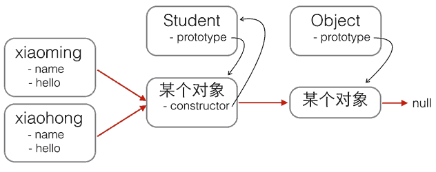
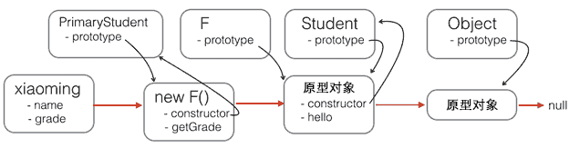

# JavaScript note

- 廖雪峰 <https://www.liaoxuefeng.com/wiki/1022910821149312/1023025235359040>
- RUNOOB <https://www.runoob.com/nodejs/nodejs-tutorial.html>

其他

- Node.js 入门教程 <http://nodejs.cn/learn>
- npm 廖雪峰 [Npm 模块安装机制](http://www.ruanyifeng.com/blog/2016/01/npm-install.html)

## Quick Start

- 将 js 代码放在网页中, 或者专门的 js 文件中, 引入
    - 在 script tag 中专门写 type, 例如 `<script type="text/javascript">`, 是没有必要的, 因为默认的type就是JavaScript
- 使用 VSCode 编辑运行, 参见 [here](https://www.youtube.com/watch?v=fBuNrCv3Irs)
- 调试: 控制台(Console)
    - `console.log('Hello');`

### 数据类型和变量

- Number
    - JavaScript不区分整数和浮点数，统一用Number表示
    - `NaN`, `Infinity`
- 字符串
    - 字符串是以单引号'或双引号"括起来的任意文本，比如'abc'，"xyz"等等
- 布尔值
    - &&, ||, `!`
- 比较运算符
    - `==` 比较，它会自动转换数据类型再比较
    - `===` 比较，它不会自动转换数据类型，如果数据类型不一致，返回false，如果一致，再比较
    - isNaN(NaN)
    - 浮点数比较 `Math.abs()`
- null 和  undefined
    - 大多数情况下，我们都应该用null。undefined仅仅在判断函数参数是否传递的情况下有用。
- 数组
    - 出于代码的可读性考虑，强烈建议直接使用[]。
    - 当然也可以用 `new Array(1, 2, 3);`
- 对象
    - JavaScript的对象是一组由键-值组成的无序集合. JavaScript对象的键都是字符串类型
- 变量
    - 变量名是大小写英文、数字、$和_的组合，且不能用数字开头
- strict模式
    - 如果一个变量没有通过var申明就被使用，那么该变量就自动被申明为全局变量
    - 为了修补JavaScript这一严重设计缺陷，ECMA 在后续规范中推出了strict模式，在strict模式下运行的JavaScript代码，强制通过var申明变量
    - 尝试在 console 中运行 `'use strict';aa = 11;` 会报错
- 类型判断
    - `typeof 76` 返回类型, `6.7 instanceof Number` 判断是否为该类型
- 位运算
    - `&, |, ^, ~`
    - `<<, >>, >>>`, 其中 `>>>` 为零填充右移, `>>` 是正常带符号的

```js
var length = 7;                             // 数字
var lastName = "Gates";                      // 字符串
var cars = ["Porsche", "Volvo", "BMW"];         // 数组
var x = {firstName:"Bill", lastName:"Gates"};    // 对象 
```

#### 比较运算符

```js
false == 0; // true
false === 0; // false，使用 === 不进行类型转换

// 注意特例 NaN
NaN === NaN; // false
isNaN(NaN); // true

// 浮点数比较
1 / 3 === (1 - 2 / 3); // false
Math.abs(1 / 3 - (1 - 2 / 3)) < 0.0000001; // true
```

#### null, undefined

- null表示一个“空”的值，它和0以及空字符串''不同，0是一个数值，''表示长度为0的字符串，而null表示“空”。
- 在其他语言中，也有类似JavaScript的null的表示，例如Java也用null，Swift用nil，Python用None表示。但是，在JavaScript中，还有一个和null类似的undefined，它表示“未定义”。
- JavaScript的设计者希望用null表示一个空的值，而`undefined`表示值未定义。事实证明，这并没有什么卵用，区分两者的意义不大。大多数情况下，我们都应该用n `ull`。`undefined` 仅仅在判断函数参数是否传递的情况下有用。

```js
typeof undefined              // undefined
typeof null                   // object
null === undefined            // false
null == undefined             // true
```

#### 数组

```js
new Array(1, 2, 3); // 创建了数组[1, 2, 3]

var arr = [1, 2, 3.14, 'Hello', null, true];
arr[0]; // 返回索引为0的元素，即1
arr[5]; // 返回索引为5的元素，即true
arr[6]; // 索引超出了范围，返回undefined
```

#### 对象

```js
var person = {
 name: 'Bob',
 age: 20,
 tags: ['js', 'web', 'mobile'],
 city: 'Beijing',
 hasCar: true,
 zipcode: null
};

person.name; // 'Bob'
person.zipcode; // null
```

#### 变量

变量在JavaScript中就是用一个变量名表示，变量名是大小写英文、数字、$和_的组合，且不能用数字开头。变量名也不能是JavaScript的关键字，如if、while等。申明一个变量用var语句。

```js
var a; // 申明了变量a，此时a的值为undefined
var $b = 1; // 申明了变量$b，同时给$b赋值，此时$b的值为1
var s_007 = '007'; // s_007是一个字符串
var Answer = true; // Answer是一个布尔值true
var t = null; // t的值是null

// 动态语言（Java 是静态的）
var a = 123; // a的值是整数123
a = 'ABC'; // a变为字符串
```

### 字符串

[JavaScript 字符串参考手册](https://www.w3school.com.cn/jsref/jsref_obj_string.asp)。

- JavaScript的字符串就是用''或""括起来的字符表示
    - ASCII字符可以以 `\x##` 形式的十六进制表示
    - 还可以用 `\u####` 表示一个Unicode字符
- ES6标准新增了一种多行字符串的表示方法，用反引号 \`...\` 表示
- 模板字符串, `${name}` 引用变量, 注意需要 ES6 的反引号语法
- 操作字符串
    - 注意字符串不可变, 也即 `s[0] = 'X';` 不影响 s
    - toUpperCase, toLowerCase
    - indexOf
    - substring

```js
'I\'m \"OK\"!';
'\x41'; // 完全等同于 'A'
'\u4e2d\u6587'; // 完全等同于 '中文'

// 多行字符串
`这是一个
多行
字符串`;
```

#### 模板字符串

```js
var name = '小明';
var age = 20;
var message = `你好, ${name}, 你今年${age}岁了!`;  // 注意一定要是 `` 格式的字符串才支持
alert(message);
```

```js
// str.length 属性
var s = 'Hello, world!';
s.length; // 13

//引用
var s = 'Hello, world!';
s[0]; // 'H'
s[6]; // ' '
s[7]; // 'w'
s[12]; // '!'
s[13]; // undefined 超出范围的索引不会报错，但一律返回undefined

// 字符串不可变，但对其赋值不会报错
var s = 'Test';
s[0] = 'X';
alert(s); // s仍然为'Test'

// toUpperCase, toLowerCase
var s = 'Hello';
s.toUpperCase(); // 返回'HELLO'
var lower = s.toLowerCase(); // 返回'hello'并赋值给变量lower

// indexOf
var s = 'hello, world';
s.indexOf('world'); // 返回7
s.indexOf('World'); // 没有找到指定的子串，返回-1
```

#### substring(), substr()

substr 和 substring 的区别之处在于第二个参数是想要得到的子串的长度。

```js
// substring
var s = 'hello, world'
s.substring(0, 5); // 从索引0开始到5（不包括5），返回'hello'
s.substring(7); // 从索引7开始到结束，返回'world'
```

#### replace()

```js
// 默认匹配一个
str = "Please visit Microsoft and Microsoft!";
var n = str.replace("Microsoft", "W3School");

// 忽略大小写
str = "Please visit Microsoft!";
var n = str.replace(/MICROSOFT/i, "W3School");

// 替换所有匹配
str = "Please visit Microsoft and Microsoft!";
var n = str.replace(/Microsoft/g, "W3School");
```

您将在 JavaScript 正则表达式这一章学到更多有关[正则表达式](https://www.w3school.com.cn/js/js_regexp.asp)的内容。

#### trim()

```js
var str = "       Hello World!        ";
alert(str.trim());
```

警告：Internet Explorer 8 或更低版本不支持 trim() 方法。
如需支持 IE 8，您可搭配正则表达式使用 replace() 方法代替。
您还可以使用上面的 replace 方案把 trim 函数添加到 JavaScript `String.prototype`。

```js
var str = "       Hello World!        ";
alert(str.replace(/^[\s\uFEFF\xA0]+|[\s\uFEFF\xA0]+$/g, ''));


if (!String.prototype.trim) {
  String.prototype.trim = function () {
 return this.replace(/^[\s\uFEFF\xA0]+|[\s\uFEFF\xA0]+$/g, '');
};
var str = "       Hello World!        ";
alert(str.trim());
```

#### 属性访问（Property Access）

ECMAScript 5 (2009) 允许对字符串的属性访问 [ ]：

使用属性访问有点不太靠谱：

- 不适用 Internet Explorer 7 或更早的版本
- 它让字符串看起来像是数组（其实并不是）
- 如果找不到字符，[ ] 返回 undefined，而 charAt() 返回空字符串。
- 它是只读的。str[0] = "A" 不会产生错误（但也不会工作！）

```js
var str = "HELLO WORLD";
str[0] = "A";             // 不产生错误，但不会工作
str[0];                   // 返回 H
```

#### split()

```js
var txt = "Hello";       // 字符串
txt.split("");           // 分隔为字符
```

### js 数组

- JavaScript的 `Array` 可以包含任意数据类型，并通过索引来访问每个元素。
    - 直接给Array的length赋一个新的值会导致Array大小的变化
    - 如果通过索引赋值时，索引超过了范围，同样会引起Array大小的变化
- `includes` 判断是否包含
- `indexOf` 也可以, 若找不到返回 -1
- slice
    - slice()就是对应String的substring()版本
    - 如果不给slice()传递任何参数，它就会从头到尾截取所有元素。利用这一点，我们可以很容易地 **复制** 一个Array
- `push` 和 pop; `unshift` 和 shift
    - `a.unshift("a", "b");` 传入多个元素, 若要拼接两个数组, 用 concat
- sort
    - 原地修改
- reverse 反转
- splice
    - splice()方法是修改Array的“万能方法”，它可以从指定的索引开始删除若干元素，然后再从该位置添加若干元素
    - 例如, `arr.splice(2, 3, 'Google', 'Facebook');` 表示 从索引2开始删除3个元素,然后再添加两个元素
- concat
    - 请注意，concat()方法并没有修改当前Array，而是返回了一个新的Array。
    - concat()方法可以接收任意个元素和Array，并且自动把Array拆开，然后全部添加到新的Array里, 例如 `arr.concat(1, 2, [3, 4]); // ['A', 'B', 'C', 1, 2, 3, 4]`
- join
    - 把当前Array的每个元素都用指定的字符串连接起来，然后返回连接后的字符串; 如果Array的元素不是字符串，将自动转换为字符串后再连接。

#### base

```js
// 直接给Array的length赋一个新的值会导致Array大小的变化
var arr = [1, 2, 3];
arr.length; // 3
arr.length = 6;
arr; // arr变为[1, 2, 3, undefined, undefined, undefined]
arr.length = 2;
arr; // arr变为[1, 2]

// 如果通过索引赋值时，索引超过了范围，同样会引起Array大小的变化
var arr = [1, 2, 3];
arr[5] = 'x';
arr; // arr变为[1, 2, 3, undefined, undefined, 'x']
```

#### 遍历 forEach

可以通过 for 循环或者调用 `forEach(func)` 方法。

```js
function showList(){
 let fruits, text, fLen, i;
 fruits = ['banana', 'orange', 'apple'];
 fLen = fruits.length;
 text = '<ul>'
 for (i=0; i<fLen; i++) {
  text += "<li>" + fruits[i] + '</li>';
 }
 text += '</ul>';
 // console.log(text);
 document.getElementById('demo').innerHTML = text;
}

function showList2() {
 let fruits, text;
 fruits = ["Banana", "Orange", "Apple", "Mango"];

 text = '<ul>';
 fruits.forEach(foo);
 text += '</ul>';

 function foo(value){
  text += '<li>' + value + '</li>';
 }

 document.getElementById('demo').innerHTML = text;
}
```

#### push(), pop(), unshift(), shift()

```js
// push pop
var arr = [1, 2];
arr.push('A', 'B'); // 返回Array新的长度: 4
arr; // [1, 2, 'A', 'B']
arr.pop(); // pop()返回'B'
arr; // [1, 2, 'A']
arr.pop(); arr.pop(); arr.pop(); // 连续pop 3次
arr; // []
arr.pop(); // 空数组继续pop不会报错，而是返回undefined
arr; // []


// unshift shift 类似 push 和 pop 不过是数组前面
var arr = [1, 2];
arr.unshift('A', 'B'); // 返回Array新的长度: 4
arr; // ['A', 'B', 1, 2]
arr.shift(); // 'A'
arr; // ['B', 1, 2]
arr.shift(); arr.shift(); arr.shift(); // 连续shift 3次
arr; // []
arr.shift(); // 空数组继续shift不会报错，而是返回undefined
arr; // []
```

#### toString(), join()

toString() 用逗号分割
而 join() 的参数指定连接的方式。

```js
// join 支持自动转换
var arr = ['A', 'B', 'C', 1, 2, 3];
arr.join('-'); // 'A-B-C-1-2-3'
```

#### splice() 添加、删除

`splice()` 方法是修改Array的“万能方法”，它可以从指定的索引开始删除若干元素，然后再从该位置添加若干元素

```js
// splice
var arr = ['Microsoft', 'Apple', 'Yahoo', 'AOL', 'Excite', 'Oracle'];
// 从索引2开始删除3个元素,然后再添加两个元素:
arr.splice(2, 3, 'Google', 'Facebook'); // 返回删除的元素 ['Yahoo', 'AOL', 'Excite']
arr; // ['Microsoft', 'Apple', 'Google', 'Facebook', 'Oracle']


// 只删除,不添加:
arr.splice(2, 2); // ['Google', 'Facebook']
arr; // ['Microsoft', 'Apple', 'Oracle']


// 只添加,不删除:
arr.splice(2, 0, 'Google', 'Facebook'); // 返回[],因为没有删除任何元素
arr; // ['Microsoft', 'Apple', 'Google', 'Facebook', 'Oracle']
```

#### slice()

```js
// slice 就是 String 的 substring 方法
var arr = ['A', 'B', 'C', 'D', 'E', 'F', 'G'];
arr.slice(0, 3); // 从索引0开始，到索引3结束，但不包括索引3: ['A', 'B', 'C']
arr.slice(3); // 从索引3开始到结束: ['D', 'E', 'F', 'G']


var arr = ['A', 'B', 'C', 'D', 'E', 'F', 'G'];  // 利用 slice 进行复制
var aCopy = arr.slice();
aCopy; // ['A', 'B', 'C', 'D', 'E', 'F', 'G']
aCopy === arr; // false
```

```js
// indexOf
var arr = [10, 20, '30', 'xyz'];
arr.indexOf(10); // 元素10的索引为0
arr.indexOf(20); // 元素20的索引为1
arr.indexOf(30); // 元素30没有找到，返回-1
arr.indexOf('30'); // 元素'30'的索引为2
```

#### sort(), reverse()

sort() 方法以字母顺序对数组进行排序。
reverse() 方法反转数组中的元素。【注意是原地反转】

```js
// sort
var arr = ['B', 'C', 'A'];
arr.sort();
arr; // ['A', 'B', 'C']，默认升序

// reverse 
var arr = ['one', 'two', 'three'];
arr.reverse(); 
arr; // ['three', 'two', 'one']
```

##### 比值函数

```js
var points = [40, 100, 1, 5, 25, 10];
points.sort(function(a, b){return a - b}); 
```

比较函数应该返回一个负，零或正值，这取决于参数。
当 sort() 函数比较两个值时，会将值发送到比较函数，并根据所返回的值（负、零或正值）对这些值进行排序。
当比较 40 和 100 时，sort() 方法会调用比较函数 function(40,100)。该函数计算 40-100，然后返回 -60（负值）。排序函数将把 40 排序为比 100 更低的值。

```js
// 随机排序数组
var points = [40, 100, 1, 5, 25, 10];
points.sort(function(a, b){return 0.5 - Math.random()}); 


// 查找最大/最小。可采用下面的两种 sort
var points = [40, 100, 1, 5, 25, 10];
points.sort(function(a, b){return a - b});
// 现在 points[0] 包含最低值
// 而 points[points.length-1] 包含最高值
var points = [40, 100, 1, 5, 25, 10];
points.sort(function(a, b){return b - a});
// 现在 points[0] 包含最高值
// 而 points[points.length-1] 包含最低值
```

##### 使用 Math.max()

```js
var arr = [40, 100, 1, 5, 25, 10];
function myArrayMax(arr) {
 return Math.max.apply(null, arr);
}
```

##### 自己写

当然，自己实现的效率更高

```js
function myArrayMax(arr) {
 var len = arr.length
 var max = -Infinity;
 while (len--) {
  if (arr[len] > max) {
   max = arr[len];
  }
 }
 return max;
}
```

#### map

```js
// map
function pow(x) {
 return x * x;
}

var arr = [1, 2, 3, 4, 5, 6, 7, 8, 9];
var results = arr.map(pow); // [1, 4, 9, 16, 25, 36, 49, 64, 81]
console.log(results);

// reduce
var arr = [1, 3, 5, 7, 9];
arr.reduce(function (x, y) {
 return x + y;
}); // 25
```

另外，需要注意 map 虽然多数情况下仅需要传递一个参数，但实际上传递的是三个参数 元素、index、数组本身；因此若接受函数的参数多于 1 个可能就有问题，例如下面的 parseInt，可接受两个参数，第二个参数为进制，参见 <https://developer.mozilla.org/en-US/docs/Web/JavaScript/Reference/Global_Objects/Array/map#tricky_use_case>

```js
["1", "2", "3"].map(parseInt) // [1, NaN, NaN]

// 几种解决方案
function returnInt(element) {
  return parseInt(element, 10)
}
['1', '2', '3'].map(returnInt); // [1, 2, 3]
// Actual result is an array of numbers (as expected)

// Same as above, but using the concise arrow function syntax
['1', '2', '3'].map( str => parseInt(str) )

// A simpler way to achieve the above, while avoiding the "gotcha":
['1', '2', '3'].map(Number)  // [1, 2, 3]
```

#### filter

filter也是一个常用的操作，它用于把Array的某些元素过滤掉，然后返回剩下的元素。

和map()类似，Array的filter()也接收一个函数。和map()不同的是，filter()把传入的函数依次作用于每个元素，然后根据返回值是true还是false决定保留还是丢弃该元素。

【和 map 类似】filter()接收的回调函数，其实可以有多个参数。通常我们仅使用第一个参数，表示Array的某个元素。回调函数还可以接收另外两个参数，表示元素的位置和数组本身。

```js
// 利用 filter 的 index 参数去除重复字符串
var
 r,
 arr = ['apple', 'strawberry', 'banana', 'pear', 'apple', 'orange', 'orange', 'strawberry'];
 
r = arr.filter(function (element, index, self) {
 return self.indexOf(element) === index;
});
console.log(r.toString());    
```

一个例子，过滤素数

```js
let arr = [];
for(var i = 1; i < 101; i++){
 arr.push(i);
};
var getPrime = function(arr){
 return arr.filter(function(ele){
  if (ele==1){return false;}
  for (var i=2; i<=Math.sqrt(ele); i++){
   if (ele % i == 0) return false;
  }
  return true;
 })
}
console.log(getPrime(arr))
```

#### reduce()

reduce() 方法在数组中从左到右工作。另请参见 reduceRight（）。
【注意】reduce 的第一参数为累加的初始值。
在调用的时候，可以不赋值，例如可以以 `numbers1.reduce(myFunction)` 这样的形式调用，也可像下面那样写在后面。

```js
var numbers1 = [45, 4, 9, 16, 25];
var sum = numbers1.reduce(myFunction, 100); // 或 numbers1.reduce(myFunction)

// function myFunction(total, value) 这样也行
function myFunction(total, value, index, array) {
  return total + value;
}
```

#### every(), some()

```js
var numbers = [45, 4, 9, 16, 25];
var someOver18 = numbers.some(myFunction);

function myFunction(value, index, array) {
  return value > 18;
}
```

#### concat()

注意，concat 是返回一个新的数组而非修改原数组。

```js
// concat
var arr = ['A', 'B', 'C'];
var added = arr.concat([1, 2, 3]);
added; // ['A', 'B', 'C', 1, 2, 3]
arr; // ['A', 'B', 'C']

var arr = ['A', 'B', 'C'];  // 事实上 concat 后可接任一个元素和 Array，将 Array 自动展开
arr.concat(1, 2, [3, 4]); // ['A', 'B', 'C', 1, 2, 3, 4]
```

#### indexOf()

```js
var fruits = ["Apple", "Orange", "Apple", "Mango"];
var a = fruits.lastIndexOf("Apple");
```

#### find(), findIndex()

区别在于一个返回所找到的值，一个返回 index

```js
var numbers = [4, 9, 16, 25, 29];
var first = numbers.findIndex(myFunction);

function myFunction(value, index, array) {
  return value > 18;
}
```

### js 对象

- 属性名必须是一个有效的变量名。如果属性名包含特殊字符，就必须用 `""` 括起来。访问这个属性也无法使用 `.` 操作符，必须用 `['xxx']` 来访问.
- JavaScript规定，访问不存在的属性不报错，而是返回 `undefined`
- 如果我们要检测是否拥有某一属性，可以用 `in` 操作符
    - `'name' in xiaoming;`
    - 要判断一个属性是否是某对象自身拥有的，而不是继承得到的，可以用 `hasOwnProperty()` 方法, 例如 `xiaoming.hasOwnProperty('toString');` (toString 定义在object对象中, 而所有对象最终都会在原型链上指向object)
- **JavaScript 对象无法进行对比**，比较两个 JavaScript 将始终返回 false。

```js
var xiaohong = {
 name: '小红',
 'middle-school': 'No.1 Middle School'
};

xiaohong['middle-school']; // 'No.1 Middle School'
xiaohong['name']; // '小红'
xiaohong.name; // '小红'
```

如果访问一个不存在的属性会返回什么呢？JavaScript规定，访问不存在的属性不报错，而是返回undefined

```js
var xiaoming = {
 name: '小明'
};
xiaoming.age; // undefined
xiaoming.age = 18; // 新增一个age属性
xiaoming.age; // 18
delete xiaoming.age; // 删除age属性
xiaoming.age; // undefined
delete xiaoming['name']; // 删除name属性
xiaoming.name; // undefined
delete xiaoming.school; // 删除一个不存在的school属性也不会报错

// 查看一个对象是否有一个属性，可以用 in 操作符
var xiaoming = {
 name: '小明',
 birth: 1990,
 school: 'No.1 Middle School',
 height: 1.70,
 weight: 65,
 score: null
};
'name' in xiaoming; // true
'grade' in xiaoming; // false

// 要判断一个属性是否是xiaoming自身拥有的，而不是继承得到的，可以用hasOwnProperty()方法
xiaoming.hasOwnProperty('name'); // true
xiaoming.hasOwnProperty('toString'); // false
```

### 条件判断

- JavaScript把 null、undefined、0、NaN 和空字符串 '' 视为false，其他值一概视为true。

```js
var age = 3;
if (age >= 18) {
 alert('adult');
} else if (age >= 6) {
 alert('teenager');
} else {
 alert('kid');
}
```

### 循环

#### for

- for 循环，通过初始条件、结束条件和递增条件来循环执行语句块
    - `for (var i = 1; i <= 10; i++) {}`
    - 遍历数组 `for (i=0; i<arr.length; i++){}`
- for循环的一个变体是 `for ... in`  循环，它可以把一个对象的所有属性依次循环出来
    - `for (var key in o) {}`
    - 注意, Array也是对象，而它的每个元素的索引被视为对象的属性 (注意, for ... in对Array的循环得到的是String而不是Number ! 记住 js 中所有的 key 类型都是字符串)
        - `for (var i in arr) { console.log(arr[i]); }`
- while循环
- do { ... } while()循环

```js
// for 语句
var x = 0;
var i;
for (i=1; i<=10000; i++) {
 x = x + i;
}
x; // 50005000

var arr = ['Apple', 'Google', 'Microsoft'];
var i, x;
for (i=0; i<arr.length; i++) {
 x = arr[i];
 console.log(x);
}

// 其中的 3 个条件都是可省略的
var x = 0;
for (;;) { // 将无限循环下去
 if (x > 100) {
  break; // 通过if判断来退出循环
 }
 x ++;
}
```

#### for...in

for 循环的一个变体是 `for ... in` 循环，它可以把一个对象的所有属性依次循环出来。
由于**Array也是对象**，而它的每个元素的索引被视为对象的属性，因此，for ... in循环可以直接循环出Array的索引

```js
// for...in
var o = {
 name: 'Jack',
 age: 20,
 city: 'Beijing'
};
for (var key in o) {
 console.log(key); // 'name', 'age', 'city'
}

// 循环列表
// 但注意，请注意，for ... in对Array的循环得到的是String而不是Number。
var a = ['A', 'B', 'C'];
for (var i in a) {
 console.log(i); // '0', '1', '2'
 console.log(a[i]); // 'A', 'B', 'C'
}
```

#### while

```js
var x = 0;
var n = 99;
while (n > 0) {
 x = x + n;
 n = n - 2;
}
x; // 2500
```

#### do...while

```js
var n = 0;
do {
 n = n + 1;
} while (n < 100);
n; // 100
```

### Map 和 Set

- Map
    - JavaScript的默认对象表示方式{}可以视为其他语言中的Map或Dictionary的数据结构，即一组键值对。但是JavaScript的对象有个小问题，就是键必须是字符串。但实际上Number或者其他数据类型作为键也是非常合理的。
    - 为了解决这个问题，最新的ES6规范引入了新的数据类型 `Map`。
    - 初始化Map需要一个 **二维数组**，或者直接初始化一个空Map。 `var m = new Map([['Michael', 95], ['Bob', 75], ['Tracy', 85]]);`
    - 方法: `set, has, get, delete`
- Set
    - `Set` 和Map类似，也是一组key的集合，但不存储value。由于key不能重复，所以，在Set中，没有重复的key。
    - 要创建一个Set，需要提供一个 Array 作为输入，或者直接创建一个空Set.
    - 方法: `add, delete, has`
- 注意, in 语句 在 Map 和 Set 中无效

```js
var m = new Map([['Michael', 95], ['Bob', 75], ['Tracy', 85]]);
m.get('Michael'); // 95

// set() has() get() delete()
var m = new Map(); // 空Map
m.set('Adam', 67); // 添加新的key-value
m.set('Bob', 59);
m.has('Adam'); // 是否存在key 'Adam': true
m.get('Adam'); // 67
m.delete('Adam'); // 删除key 'Adam'
m.get('Adam'); // undefined
```

```js
var s = new Set([1, 2, 3, 3, '3']);
s; // Set {1, 2, 3, "3"}

// add()
s.add(4);
s; // Set {1, 2, 3, 4}
s.add(4);
s; // 仍然是 Set {1, 2, 3, 4}

// delete()
var s = new Set([1, 2, 3]);
s; // Set {1, 2, 3}
s.delete(3);
s; // Set {1, 2}
```

### iterable

- 遍历Array可以采用下标循环，遍历Map和Set就无法使用下标。为了统一集合类型，ES6标准引入了新的iterable类型，**Array、Map 和 Set 都属于 iterable 类型**。
- 具有iterable类型的集合可以通过新的 `for ... of` 循环来遍历。
- for ... of循环和for ... in循环有何区别？
    - 一个Array数组实际上也是一个对象，它的每个元素的索引被视为一个属性。
    - 例如, Array `['A', 'B', 1, name: 'Hello']` 也是可以的,
        - 此时用 `for ... in` 得到的属性名称为 `'0', '1', '2', 'name'`
        - 注意, for ... in 循环将把name包括在内，但Array的length属性却不包括在内。
        - `for ... of` 循环则完全修复了这些问题，它只循环集合本身的元素
- forEach
    - 然而，更好的方式是直接使用 iterable 内置的 forEach 方法，它接收一个函数，每次迭代就自动回调该函数。以 `Array` 为例，三个参数分别为 element, index 和 array 本身。
        - `Set` 与Array类似，但Set没有索引，因此回调函数的前两个参数都是元素本身。
        - `Map` 的回调函数参数依次为value、key和map本身。

#### for ... of

```js
var a = ['A', 'B', 'C'];
var s = new Set(['A', 'B', 'C']);
var m = new Map([[1, 'x'], [2, 'y'], [3, 'z']]);
for (var x of a) { // 遍历Array
 console.log(x);
}
for (var x of s) { // 遍历Set
 console.log(x);
}
for (var x of m) { // 遍历Map
 console.log(x[0] + '=' + x[1]);
}

// 当我们手动给Array对象添加了额外的属性后，for ... in 循环将带来意想不到的意外效果
var a = ['A', 'B', 'C'];
a.name = 'Hello'; // 会在最后, 也即 a[3] === 1
a.push(1);
console.log(a);
for (var x in a) {
 console.log(x); // '0', '1', '2', 'name'
}
// 此时用 for...of 就只会循环集合本身的元素
for (var x of a) {
 console.log(x); // 'A', 'B', 'C'
}
```

#### forEach 方法

- 然而，更好的方式是直接使用 iterable 内置的 forEach 方法，它接收一个函数，每次迭代就自动回调该函数。以 `Array` 为例，三个参数分别为 `element, index` 和 array 本身。
- `Set` 与Array类似，但Set没有索引，因此回调函数的前两个参数都是元素本身。
- `Map` 的回调函数参数依次为 `value、key` 和map本身。
- 如果对某些参数不感兴趣，由于JavaScript的函数调用不要求参数必须一致，因此可以忽略它们

如果对某些参数不感兴趣，由于JavaScript的函数调用不要求参数必须一致，因此可以忽略它们。

```js
// forEach Array
a.forEach(function (element, index, array) {
 // element: 指向当前元素的值
 // index: 指向当前索引
 // array: 指向Array对象本身
 console.log(element + ', index = ' + index);
});
// Set
var s = new Set(['A', 'B', 'C']);
s.forEach(function (element, sameElement, set) {
 console.log(element);
});
//Map
var m = new Map([[1, 'x'], [2, 'y'], [3, 'z']]);
m.forEach(function (value, key, map) {
 console.log(value);
});

// 函数调用的参数数量可以不一致
var a = ['A', 'B', 'C'];
a.forEach(function (element) {
 console.log(element);
});
```

## JS 函数

- 参数
    - `function foo(a, b, ...rest) {}`; `arguments` 对象; 值传递, 对象引用是值
- 变量作用域
    - 变量提升; 全局作用域; 申明块级作用域 let, const
- Function 构造器
    - `var myFunction = new Function("a", "b", "return a * b");`
- 解构赋值: 类似Python中的序列解包
    - 对象的解构赋值. 别名; 嵌套; 默认值; 在函数传参时使用
- 对象的方法
    - this 关键词
    - apply, call(). `Math.max.apply(null, [3, 5, 4]);`
- 高阶函数
    - forEach
    - map, reduce
    - filter
    - sort. `sort((firstEl, secondEl) => { /* ... */ } )` 注意返回 -1,0,1 负数表示优先级高
    - every
    - find, findIndex
- 函数闭包: 返回一个新的函数
    - 作用: 1. 可以像 class 一样定义私有变量; 2. 可以封装新的函数
- 箭头函数: 主要区别在于对于 this 的指向进行了一定修复, 其内部的 this 是词法作用域, 由上下文确定
- generator 生成器: 类似 Python
    - 作用: 1. 可以记录过程中变量, 完成 object 采用实现的任务; 2. 更重要的是, 可以把异步回调代码变成“同步”代码

### 定义和调用

- 定义函数
    - 两种定义语法
        - `function abs(x) {}`
        - `var abs = function (x) {}`
    - 由于JavaScript的函数也是一个对象，上述定义的`abs()`函数实际上是一个函数对象，而函数名`abs`可以视为指向该函数的变量。
    - 如果没有`return`语句，函数执行完毕后也会返回结果，只是结果为`undefined`。
- JavaScript 函数有一个名为 `arguments` 对象的内置对象。
- rest 参数
    - ES6标准引入了rest参数
    - 写法为 `function foo(a, b, ...rest) {}`
    - 如果传入的参数连正常定义的参数都没填满，也不要紧，rest参数会接收一个空数组（注意不是`undefined`）。
- 函数也是对象, 有 `toString()` 等方法
- 变量作用域与解构赋值
    - 由于JavaScript的函数可以嵌套，此时，内部函数可以访问外部函数定义的变量，反过来则不行
    - 若重名: JavaScript的函数在查找变量时从自身函数定义开始，从“内”向“外”查找。如果内部函数定义了与外部函数重名的变量，则内部函数的变量将“屏蔽”外部函数的变量。
- 变量提升
    - JavaScript的函数定义有个特点，它会先扫描整个函数体的语句，把所有申明的变量“提升”到函数顶部
    - 提升的仅仅是声明 (undefined), 而不会运行变量赋值

如果没有return语句，函数执行完毕后也会返回结果，只是结果为 `undefined`。

```js
function abs(x) {
 if (x >= 0) {
  return x;
 } else {
  return -x;
 }
}
// 也可以这样定义函数
var abs = function (x) {
 if (x >= 0) {
  return x;
 } else {
  return -x;
 }
};
```

- 在第二种方式下，`function (x) { ... }` 是一个匿名函数，它没有函数名。但是，这个匿名函数赋值给了变量abs，所以，通过变量abs就可以调用该函数。
- 上述两种定义完全等价，注意第二种方式按照完整语法需要在函数体末尾加一个 `;`，表示赋值语句结束。

函数调用

- 由于JavaScript **允许传入任意个参数而不影响调用**，因此传入的参数比定义的参数多也没有问题，虽然函数内部并不需要这些参数。
- 传入的参数比定义的少也没有问题（注意函数没有返回值的时候得到的是 `undefined`）。在上例中，abs(x) 函数的参数x将收到 `undefined`，计算结果为 `NaN`。

```js
// 避免收到异常值或是 undefined
function abs(x) {
 if (typeof x !== 'number') {
  throw 'Not a number';
 }
 if (x >= 0) {
  return x;
 } else {
  return -x;
 }
}
```

#### arguments 对象

JavaScript还有一个免费赠送的关键字arguments，它只在函数内部起作用，并且永远指向当前函数的调用者传入的所有参数。arguments 类似 Array，但它不是一个Array。

```js
function foo(x) {
 console.log('x = ' + x); // 10
 for (var i=0; i<arguments.length; i++) {
  console.log('arg ' + i + ' = ' + arguments[i]); // 10, 20, 30
 }
}
foo(10, 20, 30);

// 根据是否传入了该参数进行相应处理
function abs() {
 if (arguments.length === 0) {
  return 0;
 }
 var x = arguments[0];
 return x >= 0 ? x : -x;
}
abs(); // 0
abs(10); // 10
abs(-9); // 9
```

- 参数通过值传递
    - 函数调用中的参数（parameter）是函数的参数（argument）。
    - JavaScript 参数通过值传递：函数只知道值，而不是参数的位置。
    - 如果函数改变了参数的值，它不会改变参数的原始值。
- 对象是由引用传递的
    - 在 JavaScript 中，**对象引用是值**。
    - 正因如此，对象的行为就像它们通过引用来传递：
    - 如果函数改变了对象属性，它也改变了原始值。

#### Function() 构造器

```js
var myFunction = new Function("a", "b", "return a * b");
// 等价
var myFunction = function (a, b) {return a * b};
```

大多数情况下，您可以避免在 JavaScript 中使用 new 关键词。

#### rest 参数

```js
function foo(a, b, ...rest) {
 console.log('a = ' + a);
 console.log('b = ' + b);
 console.log(rest);
}

foo(1, 2, 3, 4, 5);
// 结果:
// a = 1
// b = 2
// Array [ 3, 4, 5 ]

foo(1);
// 结果:
// a = 1
// b = undefined
// Array []
```

- rest参数只能写在最后，前面用...标识，从运行结果可知，传入的参数先绑定a、b，多余的参数以数组形式交给变量rest。
- 注意：若调用函数是未赋值，则为使用的参数默认值为 undefined，而 rest 则是空数组。

### 变量作用域

由于JavaScript的函数可以嵌套，此时，内部函数可以访问外部函数定义的变量，反过来则不行.

```js
function foo() {
 var x = 1;
 function bar() {
  var y = x + 1; // bar可以访问foo的变量x!
 }
 var z = y + 1; // ReferenceError! foo不可以访问bar的变量y!
}
```

#### 变量提升

JavaScript的函数定义有个特点，它会先扫描整个函数体的语句，把所有申明的变量“提升”到函数顶部。下例中，虽然是strict模式，但语句 `var x = 'Hello, ' + y;` 并不报错，原因是变量y在稍后申明了。但是console.log显示Hello, undefined，说明变量y的值为 undefined。**这正是因为JavaScript引擎自动提升了变量y的声明，但不会提升变量y的赋值**。

```js
'use strict';

function foo() {
 var x = 'Hello, ' + y;
 console.log(x);
 var y = 'Bob';
}

foo();
```

由于JavaScript的这一怪异的“特性”，我们在函数内部定义变量时，请严格遵守“在函数内部首先申明所有变量”这一规则。最常见的做法是用一个var申明函数内部用到的所有变量.

```js
function foo() {
 var
  x = 1, // x初始化为1
  y = x + 1, // y初始化为2
  z, i; // z和i为undefined
 // 其他语句:
 for (i=0; i<100; i++) {
  ...
 }
}
```

#### 全局作用域

- 不在任何函数内定义的变量就具有全局作用域。实际上，JavaScript默认有一个全局对象window，全局作用域的变量实际上被绑定到window的一个属性。
- 由于函数定义有两种方式，以变量方式var foo = function () {}定义的函数实际上也是一个全局变量，因此，顶层函数的定义也被视为一个全局变量，并绑定到window对象。

```js
var course = 'Learn JavaScript';
alert(course); // 'Learn JavaScript'
alert(window.course); // 'Learn JavaScript'
```

```js
// 事实上，我们每次直接调用的alert()函数其实也是window的一个变量
window.alert('调用window.alert()');
// 把alert保存到另一个变量:
var old_alert = window.alert;
// 给alert赋一个新函数:
window.alert = function () {}
alert('无法用alert()显示了!');
// 恢复alert:
window.alert = old_alert;
alert('又可以用alert()了!');
```

**这说明JavaScript实际上只有一个全局作用域**。任何变量（函数也视为变量），如果没有在当前函数作用域中找到，就会继续往上查找，最后如果在全局作用域中也没有找到，则报ReferenceError错误。

#### 命名空间

- 全局变量会绑定到window上，不同的JavaScript文件如果使用了相同的全局变量，或者定义了相同名字的顶层函数，都会造成命名冲突，并且很难被发现。
- 减少冲突的一个方法是把自己的所有变量和函数全部绑定到一个全局变量中。
- 许多著名的JavaScript库都是这么干的：jQuery，YUI，underscore等等。

```js
// 唯一的全局变量MYAPP:
var MYAPP = {};

// 其他变量:
MYAPP.name = 'myapp';
MYAPP.version = 1.0;

// 其他函数:
MYAPP.foo = function () {
 return 'foo';
};
```

#### 局部作用域 let

- 由于JavaScript的变量作用域实际上是函数内部，我们在for循环等语句块中是无法定义具有局部作用域的变量的。
- 为了解决块级作用域，ES6引入了新的关键字 `let`，用let替代var可以申明一个块级作用域的变量。

```js
function foo() {
 for (var i=0; i<100; i++) {
  //
 }
 i += 100; // 仍然可以引用变量i
}

function foo() {
 var sum = 0;
 for (let i=0; i<100; i++) {
  sum += i;
 }
 // SyntaxError:
 i += 1;
}
```

#### 常量 const

- ES6标准引入了新的关键字 `const` 来定义常量，const与let都具有块级作用域。

### 解构赋值

- 【类似 Python 中的序列解包】
- 如果需要从一个对象中取出若干属性，也可以使用解构赋值，便于快速获取对象的指定属性。
    - 注意，对数组元素进行解构赋值时，多个变量要用`[...]`括起来。
        - 支持嵌套
    - 解构赋值还可以忽略某些元素
    - 如果需要从一个对象中取出若干属性，也可以使用解构赋值，便于快速获取对象的指定属性
        - 例如, `var {name, address: {city, zip}} = person;`, 注意此时没有声明 address 变量
        - 同样可以直接对嵌套的对象属性进行赋值，只要保证对应的层次是一致的
        - 使用解构赋值对对象属性进行赋值时，如果对应的属性不存在，变量将被赋值为 `undefined`，这和引用一个不存在的属性获得undefined是一致的
        - 可以使用别名, 例如 `let {name, passport:id} = person;`, 注意此时没有声明 passport 变量, 它仅仅是为了取出 person 对象的 passport 属性赋值给 id
        - 设置默认值 (替代 undefined) `var {name, single=true} = person;`
        - 如果变量已经声明过了, 为了避免被引擎解释为块代码 `{}`, 可以加上括号将解构赋值写成 `({x, y} = { name: '小明', x: 100, y: 200});`
- 案例
    - 交换变量的值, `[x, y] = [y, x]`
    - 如果一个函数接收一个对象作为参数，那么，可以使用解构直接把对象的属性绑定到变量中
        - 例如 `function buildDate({year, month, day, hour=0, minute=0, second=0}) {}`

```js
let [x, [y, z]] = ['hello', ['JavaScript', 'ES6']];
x; // 'hello'
y; // 'JavaScript'
z; // 'ES6'

let [, , z] = ['hello', 'JavaScript', 'ES6']; // 忽略前两个元素，只对z赋值第三个元素
z; // 'ES6'


// 对象的解构赋值还可以嵌套
var person = {
 name: '小明',
 age: 20,
 gender: 'male',
 passport: 'G-12345678',
 school: 'No.4 middle school',
 address: {
  city: 'Beijing',
  street: 'No.1 Road',
  zipcode: '100001'
 }
};
var {name, address: {city, zip}} = person;
name; // '小明'
city; // 'Beijing'
zip; // undefined, 因为属性名是zipcode而不是zip
// 注意: address不是变量，而是为了让city和zip获得嵌套的address对象的属性:
address; // Uncaught ReferenceError: address is not defined
```

- 使用解构赋值对对象属性进行赋值时，如果对应的属性不存在，变量将被赋值为undefined，这和引用一个不存在的属性获得undefined是一致的。如果要使用的变量名和属性名不一致，可以后面加冒号。
- 解构赋值还可以使用默认值，这样就避免了不存在的属性返回undefined的问题。

```js
var person = {
 name: '小明',
 age: 20,
 gender: 'male',
 passport: 'G-12345678',
 school: 'No.4 middle school'
};

// 把passport属性赋值给变量id:
let {name, passport:id} = person;
name; // '小明'
id; // 'G-12345678'
// 注意: passport不是变量，而是为了让变量id获得passport属性:
passport; // Uncaught ReferenceError: passport is not defined


// 如果person对象没有single属性，默认赋值为true:
var {name, single=true} = person;
name; // '小明'
single; // true
```

注意下面的例子，这是因为JavaScript引擎把 { 开头的语句当作了块处理，于是=不再合法。解决方法是用小括号括起来。

```js
// 声明变量:
var x, y;
// 解构赋值:
{x, y} = { name: '小明', x: 100, y: 200};
// 语法错误: Uncaught SyntaxError: Unexpected token =

// 加一个 () 来避免
({x, y} = { name: '小明', x: 100, y: 200});
```

##### 案例

- 交换变量的值, `[x, y] = [y, x]`
- 如果一个函数接收一个对象作为参数，那么，可以使用解构直接把对象的属性绑定到变量中
    - 例如 `function buildDate({year, month, day, hour=0, minute=0, second=0}) {}`

```js
// 交换变量
var x=1, y=2;
[x, y] = [y, x]

// 快速获取当前页面的域名和路径
var {hostname:domain, pathname:path} = location;
```

如果一个函数接收一个对象作为参数，那么，可以使用解构直接把对象的属性绑定到变量中。例如，下面的函数可以快速创建一个Date对象。它的方便之处在于传入的对象只需要year、month和day这三个属性。也可以传入hour、minute和second属性。

```js
function buildDate({year, month, day, hour=0, minute=0, second=0}) {
 return new Date(year + '-' + month + '-' + day + ' ' + hour + ':' + minute + ':' + second);
}

buildDate({ year: 2017, month: 1, day: 1 });
// Sun Jan 01 2017 00:00:00 GMT+0800 (CST)
buildDate({ year: 2017, month: 1, day: 1, hour: 20, minute: 15 });
// Sun Jan 01 2017 20:15:00 GMT+0800 (CST)
```

### 方法

- 在一个对象中绑定函数，称为这个对象的方法。
- `this` 是一个特殊变量，它始终指向当前对象;
    - 在非严格模式下, 全局变量 this 指向的是全局 window 对象 (因此有 `this === window`), 因此想要将 object 中的方法分离成全局的函数, 函数内部使用的 this 指向就有问题
    - 在严格模式下, 定义 this 为 undefined
- 要指定函数的this指向哪个对象，可以用函数本身的 `apply` 方法
    - 它接收两个参数，第一个参数就是需要绑定的this变量，第二个参数是Array，表示函数本身的参数。
    - 例如, `getAge.apply(xiaoming, []);` 将 getAge 函数内的 this 定义为 xiaoming 这个 object, 从而能够得到其出生日期
- 另一个相关的是 `call()` 方法, 区别在于`call()` 把参数按顺序传入。
    - 例如, 可以 `Math.max.apply(null, [3, 5, 4]);`, `Math.max.call(null, 3, 5, 4);`

#### this 关键词

- JavaScript this 关键词指的是它所属的对象。它拥有不同的值，具体取决于它的使用位置：
    - 在方法中，this 指的是所有者对象。
    - 单独的情况下，this 指的是全局对象。
    - 在函数中，this 指的是全局对象。
    - 在函数中，严格模式下，this 是 undefined。
    - 在事件中，this 指的是接收事件的元素。【HTML 元素, 见下】
- 像 call() 和 apply() 这样的方法可以将 this 引用到任何对象。

```html
<button onclick="this.style.display='none'">
  点击来删除我！
</button>
```

对象的方法

```js
var xiaoming = {
 name: '小明',
 birth: 1990,
 age: function () {
  var y = new Date().getFullYear();
  return y - this.birth;
 }
};

xiaoming.age; // function xiaoming.age()
xiaoming.age(); // 今年调用是25,明年调用就变成26了
```

```js
function getAge() {
 var y = new Date().getFullYear();
 return y - this.birth;
}

var xiaoming = {
 name: '小明',
 birth: 1990,
 age: getAge
};

xiaoming.age(); // 25, 正常结果
getAge(); // NaN
// 下面这样也不行
var fn = xiaoming.age; // 先拿到xiaoming的age函数
fn(); // NaN
// 而在 strict 模式下，上面这种先取出对象方法然后调用会报错
fn(); // Uncaught TypeError: Cannot read property 'birth' of undefined
```

- 注意到，上面单独调用 getAge 函数，或者在非 strict 模式下将对象方法取出作为函数，则其（this）指向的是全局对象，也就是 `window`，因此可能对象没有该属性/方法；
- 而在 strict 模式下，重新拿到的对象方法指向的是 `undefined`，这时候调用其属性/方法会报错。

#### apply(), call()

- 虽然在一个独立的函数调用中，根据是否是strict模式，this指向undefined或window，不过，我们还是可以控制this的指向的！
- 要指定函数的this指向哪个对象，可以用函数本身的 `apply` 方法
    - 它接收两个参数，第一个参数就是需要绑定的this变量，第二个参数是Array，表示函数本身的参数。
- 另一个相关的是 `call()` 方法, 区别在于`call()` 把参数按顺序传入。

```js
function getAge() {
 var y = new Date().getFullYear();
 return y - this.birth;
}

var xiaoming = {
 name: '小明',
 birth: 1990,
 age: getAge
};

xiaoming.age(); // 25
getAge.apply(xiaoming, []); // 25, this指向xiaoming, 参数为空
```

```js
// 比如调用Math.max(3, 5, 4)，分别用apply()和call()实现如下：
Math.max.apply(null, [3, 5, 4]); // 5
Math.max.call(null, 3, 5, 4); // 5
```

另一个例子

```js
var person = {
 fullName: function() {
  return this.firstName + " " + this.lastName;
 }
}
var person1 = {
 firstName:"Bill",
 lastName: "Gates",
}
person.fullName.call(person1);  // 将返回 "Bill Gates"
```

#### 装饰器

- 利用apply()，我们还可以动态改变函数的行为。
- JavaScript的所有对象都是动态的，即使内置的函数，我们也可以重新指向新的函数。
- 现在假定我们想统计一下代码一共调用了多少次parseInt()，可以把所有的调用都找出来，然后手动加上count += 1，不过这样做太傻了。最佳方案是用我们自己的函数替换掉默认的parseInt()。

```js
var count = 0;
var oldParseInt = parseInt; // 保存原函数

window.parseInt = function () {
 count += 1;
 return oldParseInt.apply(null, arguments); // 调用原函数
};

// 测试:
parseInt('10');
parseInt('20');
parseInt('30');
console.log('count = ' + count); // 3
```

### 高阶函数 Higher-order function

查看 Array 的内置方法 <https://developer.mozilla.org/en-US/docs/Web/JavaScript/Reference/Global_Objects/Array>

- map
    - `arr.map(function (x) {});`
    - 注意, 这里回调函数只用了 Array 的value, 但实际上 map 支持的回调函数类型还包括 `map((element, index, array) => { /* ... */ })` 等,
    - 因此, 若采用 `arr.map(parseInt);`, 由于 parseInt 支持第二个参数指定进制, 因此调用会变成 `parseInt(arr[i], i)`, 会出错
    - 可以写成 `arr.map(c=>parseInt(c));`
- reduce
    - `arr.reduce(function (x, y) {})`
    - 同样支持 `reduce((previousValue, currentValue, currentIndex, array) => { /* ... */ } )`
- `filter()`把传入的函数依次作用于每个元素，然后根据返回值是`true`还是`false`决定保留还是丢弃该元素
- sort
    - `sort((firstEl, secondEl) => { /* ... */ } )`
    - 注意, js 根据比较函数的返回值来决定是否调整两个元素之间的位置, 0 表示不变, 负数表示 firstEl 应该排在 secondEl 前面; 因此, 一般返回 -1, 0, 1
- every()
- find(), findIndex() 搜索 Array 中第一个满足条件的元素, 分别返回元素和 index; 找不到时分别返回 undefined 和 -1
- forEach()
    - `forEach()`和`map()`类似，它也把每个元素依次作用于传入的函数，但不会返回新的数组。`forEach()`常用于遍历数组，因此，传入的函数不需要返回值

JavaScript的函数其实都指向某个变量。既然变量可以指向函数，函数的参数能接收变量，那么一个函数就可以接收另一个函数作为参数，这种函数就称之为高阶函数。

```js
function add(x, y, f) {
 return f(x) + f(y);
}
```

#### map, reduce

- map
    - `arr.map(function (x) {});`
    - 注意, 这里回调函数只用了 Array 的value, 但实际上 map 支持的回调函数类型还包括 `map((element, index, array) => { /* ... */ })` 等,
    - 因此, 若采用 `arr.map(parseInt);`, 由于 parseInt 支持第二个参数指定进制, 因此调用会变成 `parseInt(arr[i], i)`, 会出错
    - 可以写成 `arr.map(c=>parseInt(c));`
- reduce
    - `arr.reduce(function (x, y) {})`

```js
// map
function pow(x) {
 return x * x;
}
var arr = [1, 2, 3, 4, 5, 6, 7, 8, 9];
var results = arr.map(pow); // [1, 4, 9, 16, 25, 36, 49, 64, 81]
console.log(results);

// reduce
var arr = [1, 3, 5, 7, 9];
arr.reduce(function (x, y) {
 return x + y;
}); // 25
```

#### filter 方法

- `filter()`把传入的函数依次作用于每个元素，然后根据返回值是`true`还是`false`决定保留还是丢弃该元素

```js
// 把一个`Array`中的空字符串删掉，可以这么写：

var arr = ['A', '', 'B', null, undefined, 'C', '  '];
var r = arr.filter(function (s) {
 return s && s.trim(); // 注意：IE9以下的版本没有trim()方法
});
r; // ['A', 'B', 'C']
```

```js
/* 去除重复元素 */
var
 r,
 arr = ['apple', 'strawberry', 'banana', 'pear', 'apple', 'orange', 'orange', 'strawberry'];
r = arr.filter(function (element, index, self) {
 return self.indexOf(element) === index;
});
```

#### sort 方法

- sort
    - `sort((firstEl, secondEl) => { /* ... */ } )`
    - 注意, js 根据比较函数的返回值来决定是否调整两个元素之间的位置, 0 表示不变, 负数表示 firstEl 应该排在 secondEl 前面; 因此, 一般返回 -1, 0, 1

```js
// 注意 sort 默认是转化为字符串排序的 !
// apple排在了最后:
['Google', 'apple', 'Microsoft'].sort(); // ['Google', 'Microsoft", 'apple']
// 无法理解的结果:
[10, 20, 1, 2].sort(); // [1, 10, 2, 20]
```

```js
/* 按照数字大小排序 */
arr.sort(function (x, y) {
 if (x < y) {
  return -1;
 }
 if (x > y) {
  return 1;
 }
 return 0;
});
console.log(arr); // [1, 2, 10, 20]

/* 忽略大小写排序 */
var arr = ['Google', 'apple', 'Microsoft'];
arr.sort(function (s1, s2) {
 x1 = s1.toUpperCase();
 x2 = s2.toUpperCase();
 if (x1 < x2) {
  return -1;
 }
 if (x1 > x2) {
  return 1;
 }
 return 0;
}); // ['apple', 'Google', 'Microsoft']
```

#### every, find, findIndex, forEach

`forEach()`和`map()`类似，它也把每个元素依次作用于传入的函数，但不会返回新的数组。`forEach()`常用于遍历数组，因此，传入的函数不需要返回值

```js
var arr = ['Apple', 'pear', 'orange'];
arr.forEach(console.log); // 依次打印每个元素
```

### 函数闭包

- 自调用
    - 表示 **创建一个匿名函数并立刻执行**
    - 形如 `(function (x) {})();`
- 闭包的作用
    - 实现 **私有变量**
        - 在面向对象的程序设计语言里，比如Java和C++，要在对象内部封装一个私有变量，可以用`private`修饰一个成员变量。
        - 在没有`class`机制，只有函数的语言里，借助闭包，同样可以封装一个私有变量
    - 闭包还可以把多参数的函数变成单参数的函数
        - 例如将 `Math.pow(x, y)` 函数, 实现 `make_pow(n)` 分别封装为 新的函数 `pow2`和`pow3`

```js
/* 利用闭包实现私有变量
例子: 计数器 */
function create_counter(initial) {
 var x = initial || 0;
 return {
  inc: function () {
   x += 1;
   return x;
  },
 };
}
var c1 = create_counter();
c1.inc(); // 1
c1.inc(); // 2
c1.inc(); // 3

var c2 = create_counter(10);
c2.inc(); // 11
c2.inc(); // 12
c2.inc(); // 13
```

在返回的对象中，实现了一个闭包，该闭包携带了局部变量`x`，并且，从外部代码根本无法访问到变量`x`。换句话说，闭包就是携带状态的函数，并且它的状态可以完全对外隐藏起来。

```js
/* 利用闭包包装多参数函数 */
function make_pow(n) {
 return function (x) {
  return Math.pow(x, n);
 }
}

// 创建两个新函数:
var pow2 = make_pow(2);
var pow3 = make_pow(3);

console.log(pow2(5)); // 25
console.log(pow3(7)); // 343
```

#### 自调用

```js
// 创建一个匿名函数并立刻执行
(function (x) {
 return x * x;
})(3); // 9

var add = (function () {
 var counter = 0;
 return function () {return counter += 1;}
})();

add();
add();
add();

// 计数器目前是 3 
```

- 变量 add 的赋值是自调用函数的返回值。
- 这个自调用函数只运行一次。它设置计数器为零（0），并返回函数表达式。
- 这样 add 成为了函数。最“精彩的”部分是它能够访问父作用域中的计数器。
- 这被称为 JavaScript 闭包。它使函数拥有“私有”变量成为可能。
- 计数器被这个匿名函数的作用域保护，并且只能使用 add 函数来修改。
- **闭包** 指的是有权访问父作用域的函数，即使在父函数关闭之后。

### 箭头函数

- 例如 `x => x * x`
- 箭头函数相当于匿名函数，并且简化了函数定义。箭头函数有两种格式，一种像上面的，只包含一个表达式，连`{ ... }`和`return`都省略掉了。还有一种可以包含多条语句，这时候就不能省略`{ ... }`和`return`
- 如果参数不是一个，就需要用括号()括起来, 例如 `(x, y, ...rest) => {}`
- 注意, 在单表达式语句中, 如果要返回一个对象, 可能会语法冲突, 会被解释为语法块
    - 例如 `x => { foo: x }` 应该写成 `x => ({ foo: x })`
- this
    - 箭头函数看上去是匿名函数的一种简写，但实际上，箭头函数和匿名函数有个明显的区别：箭头函数内部的`this`是 **词法作用域**，由上下文确定。
    - 从而避免了之前 this 关键字的一些问题, 见下
    - 由于`this`在箭头函数中已经按照词法作用域绑定了，所以，用`call()`或者`apply()`调用箭头函数时，无法对`this`进行绑定，即传入的第一个参数被忽略

```js
var age, obj;

// 由于JavaScript函数对`this`绑定的错误处理，下面的例子无法得到预期结果
obj = {
 birth: 1990,
 getAge: function () {
  var b = this.birth; // 1990
  var fn = function () {
   return new Date().getFullYear() - this.birth; // this指向window或undefined
  };
  return fn();
 },
};
age = obj.getAge();
console.log("由于this指向window而出错: ", age);

obj = {
 birth: 1990,
 getAge: function () {
  var b = this.birth; // 1990
  var that = this; // 指向obj
  var fn = function () {
   return new Date().getFullYear() - that.birth;
  };
  return fn();
 },
};
age = obj.getAge();
console.log("保存this为that: ", age);

// 箭头函数完全修复了`this`的指向，`this`总是指向词法作用域，也就是外层调用者`obj`
obj = {
 birth: 1990,
 getAge: function () {
  var b = this.birth; // 1990
  var fn = () => new Date().getFullYear() - this.birth; // this指向obj对象
  return fn();
 },
};
age = obj.getAge(); // 25
console.log("采用箭头函数: ", age);

// 由于`this`在箭头函数中已经按照词法作用域绑定了，所以，用`call()`或者`apply()`调用箭头函数时，无法对`this`进行绑定，即传入的第一个参数被忽略
obj = {
 birth: 1990,
 getAge: function (year) {
  var b = this.birth; // 1990
  var fn = () => new Date().getFullYear() - this.birth; // this.birth仍是1990
  return fn.call({ birth: 2000 }, year);
 },
};
age = obj.getAge(); 
console.log("apply的第一个参数会被忽略", age);
```

### generator

- generator由`function*`定义（注意多出的`*`号），并且，除了`return`语句，还可以用`yield`返回多次
- 调用generator对象有两个方法，一是不断地调用generator对象的 `next()` 方法
    - `next()`方法会执行generator的代码，然后，每次遇到`yield x;`就返回一个对象`{value: x, done: true/false}`，然后“暂停”。返回的`value`就是`yield`的返回值，`done`表示这个generator是否已经执行结束了。如果`done`为`true`，则`value`就是`return`的返回值。
    - 当执行到`done`为`true`时，这个generator对象就已经全部执行完毕，不要再继续调用`next()`了。
- 第二个方法是直接用`for ... of`循环迭代generator对象，这种方式不需要我们自己判断`done`
    - 每次拿到的都是 next 方式返回的对象的 value 值

```js
/* 语法 */
function* foo(x) {
 yield x + 1;
 yield x + 2;
 return x + 3;
}

/* 两种调用方式 */
function* fib(max) {
 var t,
  a = 0,
  b = 1,
  n = 0;
 while (n < max) {
  yield a;
  [a, b] = [b, a + b];
  n++;
 }
 return;
}

/* 注意, next() 方法返回的是一个对象 */
var f = fib(5);
f.next(); // {value: 0, done: false}
f.next(); // {value: 1, done: false}
f.next(); // {value: 1, done: false}
f.next(); // {value: 2, done: false}
f.next(); // {value: 3, done: false}
f.next(); // {value: undefined, done: true}

for (var x of fib(10)) {
 console.log(x); // 依次输出0, 1, 1, 2, 3, ...
}
```

- 作用
    - 因为generator可以在执行过程中多次返回，所以它看上去就像一个 **可以记住执行状态的函数**，利用这一点，写一个generator就可以实现需要用面向对象才能实现的功能
    - generator还有另一个巨大的好处，就是把异步回调代码变成“同步”代码
- 例子, 例如闭包实现一个自增的计数器

```js
/* 利用 generator 把异步回调代码变成“同步”代码 */
// 不用 yield
ajax('http://url-1', data1, function (err, result) {
 if (err) {
  return handle(err);
 }
 ajax('http://url-2', data2, function (err, result) {
  if (err) {
   return handle(err);
  }
  ajax('http://url-3', data3, function (err, result) {
   if (err) {
    return handle(err);
   }
   return success(result);
  });
 });
});
// 用 generator
try {
 r1 = yield ajax('http://url-1', data1);
 r2 = yield ajax('http://url-2', data2);
 r3 = yield ajax('http://url-3', data3);
 success(r3);
}
catch (err) {
 handle(err);
}
```

```js
// 如果不用闭包, 需要一个全局变量
// var current_id = 0;
// function next_id() {
//     current_id++;
//     return current_id;
// }
// 利用 generator
function* next_id() {
 var current_id = 0;
 while (true) {
  current_id++;
  yield current_id;
 }
}
```

## 标准对象

- `number`、`string`、`boolean`、`function` 和 `undefined`
- 包装对象, `Number, Boolean, String`; 注意用 new 来创建的话将返回一个对象
- 转为数字 `parseInt(), parseFloat()`
- 判断
    - 是否为 array `Array.isArray(arr)`
    - 是否为 null `myVar === null` (null 类型为 object)
    - 是否存在 `typeof myVar === 'undefined'`
- Date
    - `var now = new Date();`
    - Date 对象的方法: getFullYear, getMonth, getDate, getDay, getHours, getMinutes, getSeconds, getMilliseconds
        - getTime 返回时间戳
    - now 方法返回时间戳 `Date.now()`
    - parse 方法: `var d = Date.parse('2015-06-24T19:49:22.875+08:00');`
- RegExp
    - `/正则表达式/`, 表达式内的 `\` 符号不需要转义, 若用 new 创建输入的字符串需要转义
    - 标志: g 全局 (记录 lastIndex 再次运行回往后匹配), i 忽略大小写, m 多行
    - test
    - `exec` 匹配失败返回 null, 成功则返回 Array, 其中第一个为完整匹配, 后面是分组
    - 默认贪婪匹配, 加 `?` 非贪婪, 例如 `var re = /^(\d+?)(0*)$/;` 第二组匹配最后的 0
    - 正则基础
        - `*, +, ?, {n}, {n,m}` 限制长度
- JSON
    - 序列化: `JSON.stringify()`, 第二个参数为对 key, value 进行处理的函数, 第三个参数指定输出个数
        - 还可以通过指定 object 的 `toJSON` 方法自定义输出对象内容
    - 反序列化: `JSON.parse('{"name":"小明","age":14}')`

### 对象 basic

- 在JavaScript的世界里，一切都是对象。
- 但是某些对象还是和其他对象不太一样。为了区分对象的类型，我们用typeof操作符获取对象的类型
    - `number`、`string`、`boolean`、`function` 和 `undefined` 有别于其他类型。特别注意 null的类型是object，Array的类型也是object，如果我们用typeof将无法区分出 null、Array 和通常意义上的 object—— `{}`。
- JavaScript还提供了包装对象, 包装对象的类型为 object !
    - number、boolean和string都有包装对象, 也即 `Number, Boolean, String`
    - 包装对象的类型为 object, 因此 `new Number(123) === 123;` 返回 false !
        - 另外, 一定要用 new 来修饰, 如果不加的话, Number() 等就被当作普通函数, 将任何类型转化为 number 类型
        - 也即, `var n = Number('123');` 的类型为 number
    - 所以闲的蛋疼也不要使用包装对象！尤其是针对string类型！！！

总结一下，有这么几条规则需要遵守：

- 不要使用 `new Number()`、`new Boolean()`、`new String()` 创建包装对象；
- 用 `parseInt()` 或 `parseFloat()` 来转换任意类型到 `number`；
- 用`String()`来转换任意类型到`string`，或者直接调用某个对象的`toString()`方法；
- 通常不必把任意类型转换为`boolean`再判断，因为可以直接写`if (myVar) {...}`；
- `typeof`操作符可以判断出`number`、`boolean`、`string`、`function`和`undefined`；
- 判断 `Array` 要使用 `Array.isArray(arr)`；
- 判断 `null` 请使用 `myVar === null`；
- 判断某个全局变量是否存在用 `typeof window.myVar === 'undefined'`；
- 函数内部判断某个变量是否存在用 `typeof myVar === 'undefined'`。

```js
// 类型
typeof 123; // 'number'
typeof NaN; // 'number'
typeof 'str'; // 'string'
typeof true; // 'boolean'
typeof undefined; // 'undefined'
typeof Math.abs; // 'function'
typeof null; // 'object'
typeof []; // 'object'
typeof {}; // 'object'

// 包装对象
var n = new Number(123); // 123,生成了新的包装类型
var b = new Boolean(true); // true,生成了新的包装类型
var s = new String('str'); // 'str',生成了新的包装类型
// 包装对象的类型为 object !
typeof new Number(123); // 'object'
new Number(123) === 123; // false

typeof new Boolean(true); // 'object'
new Boolean(true) === true; // false

typeof new String('str'); // 'object'
new String('str') === 'str'; // false
```

- 最后有细心的同学指出，任何对象都有`toString()`方法吗？`null`和`undefined`就没有！确实如此，这两个特殊值要除外，虽然`null`还伪装成了`object`类型。
- 更细心的同学指出，`number`对象调用`toString()`报SyntaxError：`123.toString(); // SyntaxError`。
    - 遇到这种情况，要特殊处理一下：

```js
123..toString(); // '123', 注意是两个点！
(123).toString(); // '123'
```

### Date

- 在JavaScript中，Date对象用来表示日期和时间。
- 获取系统当前时间 `var now = new Date();`
    - 注意，当前时间是浏览器从本机操作系统获取的时间，所以不一定准确，因为用户可以把当前时间设定为任何值。
    - 方法:
        - getFullYear, getMonth, getDate,
        - getDay
        - getHours, getMinutes, getSeconds, getMilliseconds
        - getTime 返回时间戳
- 创建
    - 可以用 `var d = new Date(2015, 5, 19, 20, 15, 30, 123);`
        - 注意, 月份和日期是从 0 开始的!
    - 第二种方式是用 parse 方法解析 ISO 8601 格式的字符串
        - 返回时间戳, 可以再转化为 Date 类型
        - `var d = Date.parse('2015-06-24T19:49:22.875+08:00');`
- 时区
    - toLocalString
    - toUTCString

```js
var now = new Date();
now; // Wed Jun 24 2015 19:49:22 GMT+0800 (CST)
now.getFullYear(); // 2015, 年份
now.getMonth(); // 5, 月份，注意月份范围是0~11，5表示六月
now.getDate(); // 24, 表示24号
now.getDay(); // 3, 表示星期三
now.getHours(); // 19, 24小时制
now.getMinutes(); // 49, 分钟
now.getSeconds(); // 22, 秒
now.getMilliseconds(); // 875, 毫秒数
now.getTime(); // 1435146562875, 以number形式表示的时间戳
```

#### 创建一个指定日期和时间的`Date`对象

```js
var d = new Date(2015, 5, 19, 20, 15, 30, 123);
d; // Fri Jun 19 2015 20:15:30 GMT+0800 (CST)
```

【注意】 JavaScript的Date对象月份值从0开始，牢记0=1月，1=2月，2=3月，……，11=12月。

- 第二种创建一个指定日期和时间的方法是解析一个符合[ISO 8601](http://www.w3.org/TR/NOTE-datetime)格式的字符串。
- 但它返回的不是`Date`对象，而是一个时间戳。不过有时间戳就可以很容易地把它转换为一个`Date`

```js
var d = Date.parse('2015-06-24T19:49:22.875+08:00');
d; // 1435146562875

var d = new Date(1435146562875);
d; // Wed Jun 24 2015 19:49:22 GMT+0800 (CST)
d.getMonth(); // 5
```

#### 时区

`Date`对象表示的时间总是按浏览器所在时区显示的，不过我们既可以显示本地时间，也可以显示调整后的UTC时间：

```js
var d = new Date(1435146562875);
d.toLocaleString(); // '2015/6/24 下午7:49:22'，本地时间（北京时区+8:00），显示的字符串与操作系统设定的格式有关
d.toUTCString(); // 'Wed, 24 Jun 2015 11:49:22 GMT'，UTC时间，与本地时间相差8小时
```

要获取当前时间戳，可以用：

```js
if (Date.now) {
 console.log(Date.now()); // 老版本IE没有now()方法
} else {
 console.log(new Date().getTime());
}
```

### RegExp

- 正则表达式
- 创建
    - `/正则表达式/`, 此时表达式内的 `\` 符号不需要转义,
        - 例如 `var re1 = /ABC\-001/;`
    - `new RegExp('正则表达式')`,
        - 此时, 输入函数的是一个字符串, 因此字符串内部的 `\` 符号需要转义
        - 例如 `var re2 = new RegExp('ABC\\-001');`
- 匹配: test()
- 切分字符串
    - 字符串方法 split 中传入正则, 例如 `split(/\s+/)`
- 分组
    - `exec()` 匹配失败返回 null, 成功则返回 Array, 其中第一个为完整匹配, 后面是分组
    - 例如, `/^(\d{3})-(\d{3,8})$/` 匹配电话
- 贪婪匹配: 默认是贪婪匹配, 加上 `?` 设置为非贪婪
    - 例如, `/^(\d+)(0*)$/` 中第二个分组匹配结尾的 0
- 全局匹配
    - 写成 `/test/g`, 或者 `new RegExp('test', 'g')`
    - 全局匹配可以多次执行exec()方法来搜索一个匹配的字符串。当我们指定g标志后，每次运行exec()，正则表达式本身会更新 `lastIndex` 属性，表示上次匹配到的最后索引
- 正则表达式还可以指定 `i` 标志，表示忽略大小写，`m` 标志，表示执行多行匹配。

#### 正则表达式

- 正则基础
    - `\d, \w, .` 特殊字符
    - `*, +, ?, {n}, {n,m}` 限制长度
- `[]` 表示范围
    - 例如, `[a-zA-Z\_\$][0-9a-zA-Z\_\$]*` 匹配 JavaScript允许的变量名；
- `A|B` 可以匹配A或B
- `^` 表示行的开头，`^\d` 表示必须以数字开头。
- `$` 表示行的结束，`\d$` 表示必须以数字结束。

#### 创建 RegExp

JavaScript有两种方式创建一个正则表达式：

- 第一种方式是直接通过`/正则表达式/`写出来，第二种方式是通过`new RegExp('正则表达式')`创建一个RegExp对象。
- 【Note】用第二种方式时，需要考虑字符串转义的问题。

```js
var re1 = /ABC\-001/;
var re2 = new RegExp('ABC\\-001');

re1; // /ABC\-001/
re2; // /ABC\-001/
```

```js
var re = /^\d{3}\-\d{3,8}$/;
re.test('010-12345'); // true
re.test('010-1234x'); // false
re.test('010 12345'); // false
```

#### 切分字符串

```js
console.log(
 '  a b   c  '.split(' '),
 '  a b   c  '.split(/\s+/),
 '  a, b,   c  '.split(/[\s+,]+/)        //[ '', 'a', 'b', 'c', '' ]
)
```

#### 分组

- `exec()`方法在匹配成功后，会返回一个`Array`，第一个元素是正则表达式匹配到的整个字符串，后面的字符串表示匹配成功的子串。
- `exec()`方法在匹配失败时返回`null`。

```js
var re = /^(\d{3})-(\d{3,8})$/;
re.exec('010-12345'); // ['010-12345', '010', '12345']
re.exec('010 12345'); // null
```

#### 贪婪匹配

需要特别指出的是，正则匹配默认是贪婪匹配，也就是匹配尽可能多的字符。

```js
var re = /^(\d+)(0*)$/;
re.exec('102300'); // ['102300', '102300', '']

//非贪婪
var re = /^(\d+?)(0*)$/;
re.exec('102300'); // ['102300', '1023', '00']
```

#### 全局搜索

- JavaScript的正则表达式还有几个特殊的标志，最常用的是`g`，表示全局匹配。
- 正则表达式还可以指定`i`标志，表示忽略大小写，`m`标志，表示执行多行匹配。

```js
var r1 = /test/g;
// 等价于:
var r2 = new RegExp('test', 'g');
```

全局匹配可以多次执行`exec()`方法来搜索一个匹配的字符串。当我们指定`g`标志后，每次运行`exec()`，正则表达式本身会更新`lastIndex`属性，表示上次匹配到的最后索引：

```js
var s = 'JavaScript, VBScript, JScript and ECMAScript';
var re=/[a-zA-Z]+Script/g;

// 使用全局匹配:
re.exec(s); // ['JavaScript']
re.lastIndex; // 10

re.exec(s); // ['VBScript']
re.lastIndex; // 20

re.exec(s); // ['JScript']
re.lastIndex; // 29

re.exec(s); // ['ECMAScript']
re.lastIndex; // 44

re.exec(s); // null，直到结束仍没有匹配到
```

### JSON

- JSON: JavaScript Object Notation（JavaScript 对象标记法）
    - JSON 是一种存储和交换数据的语法。
    - JSON 是通过 JavaScript 对象标记法书写的文本。
- 序列化: `JSON.stringify()`
    - 第一个参数为要序列化的 object;
    - 第二个参数为对于 key, value 进行处理的函数; 也可指定 `['age', 'name']` 对于 key 进行过滤;
    - 第三个参数指定输出格式, 默认输出一行, 可以指定格式化输出的空格数量, 或者指定 `\t` 进行格式化;
- 还可以通过指定 object 的 `toJSON` 方法进行自定义输出;
- 反序列化: `JSON.parse()`
    - 将 JSON 格式的字符串变为 js 对象

JSON 语法规则

- 数据是名称/值对
- 数据由逗号分隔
- 花括号保存对象
- 方括号保存数组

#### 序列化

```js
var xiaoming = {
 name: '小明',
 age: 14,
 gender: true,
 height: 1.65,
 grade: null,
 'middle-school': '\"W3C\" Middle School',
 skills: ['JavaScript', 'Java', 'Python', 'Lisp']
};

var s = JSON.stringify(xiaoming);
console.log(s);

// 1. 调整格式
s = JSON.stringify(xiaoming, null, '  ');
console.log(s);

// 2. 第二个参数：控制如何筛选对象的键值
s = JSON.stringify(xiaoming, ['name', 'skills'], '  ');
console.log(s);
// 也可传入一个函数
function convert(key, value){
 if (typeof value === 'string'){
  return value.toUpperCase();
 }
 return value;
}
s = JSON.stringify(xiaoming, convert, '\t');
console.log(s)


// 3. 自定义
xiaoming = {
 name: '小明',
 age: 14,
 gender: true,
 height: 1.65,
 grade: null,
 'middle-school': '\"W3C\" Middle School',
 skills: ['JavaScript', 'Java', 'Python', 'Lisp'],
 toJSON: function () {
  return { // 只输出name和age，并且改变了key：
   'Name': this.name,
   'Age': this.age
  };
 }
};
s = JSON.stringify(xiaoming);
console.log(s);
```

#### 反序列化

```js
JSON.parse('[1,2,3,true]'); // [1, 2, 3, true]
JSON.parse('{"name":"小明","age":14}'); // Object {name: '小明', age: 14}
JSON.parse('true'); // true
JSON.parse('123.45'); // 123.45
```

`JSON.parse()`还可以接收一个函数，用来转换解析出的属性

```js
var obj = JSON.parse('{"name":"小明","age":14}', function (key, value) {
 if (key === 'name') {
  return value + '同学';
 }
 return value;
});
console.log(JSON.stringify(obj)); // {name: '小明同学', age: 14}
```

#### 案例：解析天气 API OpenWeatherMap

- 注意到下面的代码中用到了 jQuery，因此不能用 node 但可在浏览器中调试。

用浏览器访问OpenWeatherMap的[天气API](https://api.openweathermap.org/data/2.5/forecast?q=Beijing,cn&appid=800f49846586c3ba6e7052cfc89af16c)，查看返回的JSON数据，然后返回城市、天气预报等信息。

```js
var url = 'https://api.openweathermap.org/data/2.5/forecast?q=Beijing,cn&appid=800f49846586c3ba6e7052cfc89af16c';
$.getJSON(url, function (data) {
 var info = {
  city: data.city.name,
  weather: data.list[0].weather[0].main,
  time: data.list[0].dt_txt
 };
 console.log(JSON.stringify(info, null, '  '));
});    
```

## 面向对象编程

参见 [JavaScript的原型对象的彻底理解](https://zhuanlan.zhihu.com/p/288635990)

- JavaScript不区分类和实例的概念，而是通过原型（prototype）来实现面向对象编程。
- 一个对象的 `__proto__` 属性 指向其原型
- 构造函数
    - 使用 `new` 关键字创建;
    - 为了避免冗余, 不应该在构造函数中定义方法, 而应该定义在其原型上, 例如 `Student.prototype.func = ...`
- 注意区分:
    - `prototype` 是函数独有的属性
    - `__proto__` 和 `constructor` 是对象的属性; 但是由于 JS 中函数也是一种对象，所以函数也拥有
- 不应该操作 `__proto__` 属性
- 一个构造函数及其所构造出来的对象满足关系 `foo.__proto__ === Foo.prototype` , 这里的 foo 通过 `new Foo()` 构造.
- 如何实现继承 (实现构造函数)
    - 比如要实现继承链 `new PrimaryStudent() ----> PrimaryStudent.prototype ----> Student.prototype ----> Object.prototype ----> null` (注意, 继承链 通过 `__proto__` 属性连接, 例如 `Object.prototype.__proto__===null`)
    - 我们最终要写的 PrimaryStudent 这样一个构造函数, 但要完成继承链, 注意要有一个 `PrimaryStudent.prototype` 原型(对象).
    - 因此, 可以分三步: 1. 定义构造函数 PrimaryStudent(props), 注意在其中要调用 `Student.call(this, props);` 类比 Python 中的 `super(A, self).__init__()` ; 2. 修复继承链, 可以用一个空函数 `F(){}` 构造一个对象作为 `PrimaryStudent.prototype`, 维护 `__proto__, prototype, constructor` 属性; 3. 在 `PrimaryStudent.prototype` 上定义新的原型方法.
- ES6 标准中引入了 `class` 关键词, 大大简化了类和继承的语法.
    - 语法: `class Student {}`
        - `class`的定义包含了构造函数 `constructor`和定义在原型对象上的方法（注意没有`function`关键字）
    - 继承: `class PrimaryStudent extends Student {}`; 记得在 constructor 函数中调用父类的构造方法 `super(name);`


### 创建对象

- JavaScript对每个创建的对象都会设置一个原型，指向它的原型对象。
- 当我们用`obj.xxx`访问一个对象的属性时，JavaScript引擎先在当前对象上查找该属性，如果没有找到，就到其原型对象上找，如果还没有找到，就一直上溯到`Object.prototype`对象，最后，如果还没有找到，就只能返回`undefined`。
- Array
    - 其原型链为 `arr ----> Array.prototype ----> Object.prototype ----> null`
    - `Array.prototype`定义了`indexOf()`、`shift()`等方法，因此你可以在所有的`Array`对象上直接调用这些方法。
- function
    - 原型链为 `foo ----> Function.prototype ----> Object.prototype ----> null`
    - 由于`Function.prototype`定义了`apply()`等方法，因此，所有函数都可以调用`apply()`方法。

#### 构造函数

- 在JavaScript中，可以用关键字`new`来调用构造函数 (就是一个普通的函数)，并返回一个对象
- 构造函数绑定的`this`指向新创建的对象，并默认返回`this` (因此不需要写 return this)
- 例如, 下面的原型链为 `xiaoming ----> Student.prototype ----> Object.prototype ----> null`

```js
/* 构造函数 (就是个普通的函数, 但是通过 new 来调用会返回一个对象) */
function Student(name) {
 this.name = name;
 this.hello = function () {
  alert('Hello, ' + this.name + '!');
 }
}
var xiaoming = new Student('小明'); // new !!
xiaoming.name; // '小明'
xiaoming.hello(); // Hello, 小明!
```

注意, 用`new Student()`创建的对象还从原型上获得了一个`constructor`属性，它指向函数`Student`本身

```js
// 构造函数 的 prototype 属性指向其原型, 原型 的 constructor 属性指向构造函数
Student.prototype.constructor === Student; // true
// 实例 的 constructor 属性指向构造函数
xiaoming.constructor === Student.prototype.constructor; // true
xiaoming.constructor === Student; // true

Object.getPrototypeOf(xiaoming) === Student.prototype; // true

xiaoming instanceof Student; // true
```



- 红色箭头是原型链。注意，`Student.prototype`指向的对象就是`xiaoming`、`xiaohong`的原型对象，这个原型对象自己还有个属性`constructor`，指向`Student`函数本身。
- 另外，函数`Student`恰好有个属性`prototype`指向`xiaoming`、`xiaohong`的原型对象，但是`xiaoming`、`xiaohong`这些对象可没有`prototype`这个属性，不过可以用`__proto__`这个非标准用法来查看。
- 现在我们就认为`xiaoming`、`xiaohong`这些对象“继承”自`Student`。

另外, 为了避免构造函数索构造出来的「实例」对象包含重复代码 (例如上例中的 hello 方法会绑定到各个实例上, 浪费内存), 可以将方法绑定在其原型上.


```js
function Student(name) {
 this.name = name;
}

Student.prototype.hello = function () {
 alert('Hello, ' + this.name + '!');
};
```

##### 规范的做法

- 忘记写 new 的后果: 在strict模式下，`this.name = name`将报错，因为`this`绑定为`undefined`，在非strict模式下，`this.name = name`不报错，因为`this`绑定为`window`，于是无意间创建了全局变量`name`，并且返回`undefined`，这个结果更糟糕。
- 因此, 遵循一些规范
    - 构造函数首字母应当大写，而普通函数首字母应当小写, 这样，一些语法检查工具如 [jslint](http://www.jslint.com/) 将可以帮你检测到漏写的`new`。
    - 还可以编写一个`createStudent()`函数，在内部封装所有的`new`操作
        - 好处: 一是不需要`new`来调用，二是参数非常灵活 (字典形式传参)

```js
function Student(props) {
 this.name = props.name || '匿名'; // 默认值为'匿名'
 this.grade = props.grade || 1; // 默认值为1
}

Student.prototype.hello = function () {
 alert('Hello, ' + this.name + '!');
};

function createStudent(props) {
 return new Student(props || {})
}

var xiaoming = createStudent({
 name: '小明'
});
xiaoming.grade; // 1
```

### 原型继承

- 注意
    - `prototype` 是 (构造) 函数独有的属性
    - `__proto__` 和 `constructor` 是对象的属性; 但是由于 JS 中函数也是一种对象，所以函数也拥有
- 不应该操作 `__proto__` 属性
- 一个构造函数及其所构造出来的对象满足关系 `foo.__proto__ === Foo.prototype` , 这里的 foo 通过 `new Foo()` 构造.

JavaScript的原型继承实现方式就是：

- 定义新的构造函数，并在内部用 `call()` 调用希望“继承”的构造函数，并绑定 `this`；
- 借助中间函数 F 实现原型链继承，最好通过封装的 inherits 函数完成；
- 继续在新的构造函数的原型上定义新方法。

这里 F 函数的作用:

1. 指定构造函数 F 的 prototype 属性(注意prototype为函数所特有的属性) 为 Student.prototype; 从而使得 new 出来的 F对象有属性 `(new F()).__proto__ === Student.prototype`
2. 构造一个 F对象 (记为 f), 这个对象就是我们要构造的 PrimaryStudent.prototype 原型, 通过 1 我们指定好了这一对象 `__proto__` 属性
3. 链接 对象f 和 构造函数PrimaryStudent, 使得它们互为 constructor, prototype

我们希望完成一个 PrimaryStudent 构造函数, 使其继承 Student 函数. 也即继承链 `new PrimaryStudent() ----> PrimaryStudent.prototype ----> Student.prototype ----> Object.prototype ----> null`

```js
/* 实现 PrimaryStudent 继承 Student */
function Student(props) {
 this.name = props.name || "Unnamed";
}
Student.prototype.hello = function () {
 alert("Hello, " + this.name + "!");
};

// PrimaryStudent构造函数:
function PrimaryStudent(props) {
 Student.call(this, props); // 注意调用了 Student 构造函数, 传入 this
 this.grade = props.grade || 1;
}

/* 以下这块代码可以用下面实现的 inherits 函数替代
 这里 F 函数的作用: 
 1. 指定构造函数 F 的 prototype 属性(注意prototype为函数所特有的属性) 为 Student.prototype; 从而使得 new 出来的 F对象有属性 `(new F()).__proto__ === Student.prototype`
 2. 构造一个 F对象 (记为 f), 这个对象就是我们要构造的 PrimaryStudent.prototype 原型, 通过 1 我们指定好了这一对象 `__proto__` 属性
 3. 链接 对象f 和 构造函数PrimaryStudent, 使得它们互为 constructor, prototype
*/
// 空函数F:
function F() {}
// 把F的原型指向Student.prototype:
F.prototype = Student.prototype;
// 把PrimaryStudent的原型指向一个新的F对象，F对象的原型正好指向Student.prototype:
PrimaryStudent.prototype = new F();
// 把PrimaryStudent原型的构造函数修复为PrimaryStudent:
PrimaryStudent.prototype.constructor = PrimaryStudent;

// 继续在PrimaryStudent原型（就是new F()对象）上定义方法：
PrimaryStudent.prototype.getGrade = function () {
 return this.grade;
};

// 创建xiaoming:
var xiaoming = new PrimaryStudent({
 name: "小明",
 grade: 2,
});
xiaoming.name; // '小明'
xiaoming.grade; // 2

// 验证原型:
xiaoming.__proto__ === PrimaryStudent.prototype; // true
xiaoming.__proto__.__proto__ === Student.prototype; // true

// 验证继承关系:
xiaoming instanceof PrimaryStudent; // true
xiaoming instanceof Student; // true
```



- 注意，函数`F`仅用于桥接，我们仅创建了一个`new F()`实例，而且，没有改变原有的`Student`定义的原型链。
- 如果把继承这个动作用一个`inherits()`函数封装起来，还可以隐藏`F`的定义，并简化代码

```js
function inherits(Child, Parent) {
 var F = function () {};
 F.prototype = Parent.prototype;
 Child.prototype = new F();
 Child.prototype.constructor = Child;
}
```

### class继承

- 新的关键字`class`从ES6开始正式被引入到JavaScript中。`class`的目的就是让定义类更简单。
- 语法规则
    - `class`的定义包含了构造函数`constructor`和定义在原型对象上的函数`hello()`（注意没有`function`关键字），这样就避免了`Student.prototype.hello = function () {...}`这样分散的代码。
- class 继承: `extends` 关键词
    - `class PrimaryStudent extends Student {}`
    - 记得在 constructor 函数中调用父类的构造方法 `super(name);`

```js
// 之前的写法
function Student(name) {
 this.name = name;
}
Student.prototype.hello = function () {
 alert('Hello, ' + this.name + '!');
}

// 用 class 关键词来写
class Student {
 constructor(name) {
  this.name = name;
 }

 hello() {
  alert('Hello, ' + this.name + '!');
 }
}

var xiaoming = new Student('小明');
xiaoming.hello();
```

继承

- 注意`PrimaryStudent`的定义也是class关键字实现的，而`extends`则表示原型链对象来自`Student`。子类的构造函数可能会与父类不太相同，例如，`PrimaryStudent`需要`name`和`grade`两个参数，并且需要通过`super(name)`来调用父类的构造函数，否则父类的`name`属性无法正常初始化。
- `PrimaryStudent`已经自动获得了父类`Student`的`hello`方法，我们又在子类中定义了新的`myGrade`方法。

```js
class PrimaryStudent extends Student {
 constructor(name, grade) {
  super(name); // 记得用super调用父类的构造方法!
  this.grade = grade;
 }

 myGrade() {
  alert('I am at grade ' + this.grade);
 }
}
```

## 浏览器

### 浏览器对象

- window
    - window 对象不但充当全局作用域，而且表示浏览器窗口
    - 属性: innerWidth, outterHeight
- navigator
    - navigator 对象表示浏览器的信息
    - 属性: appName, appVersion, language, platform, userAgent
- screen
    - screen 对象表示屏幕的信息
    - 属性: width, height, colorDepth
- location
    - location 对象表示当前页面的URL信息
    - 属性
        - `href` 完整 URL, 例如 `http://www.example.com:8080/path/index.html?a=1&b=2#TOP`
        - `protocol`, `host`, `port`, `pathname`
        - `search`, `hash`
    - 方法: assign, reload
- document
    - document对象表示当前页面。由于HTML在浏览器中以DOM形式表示为树形结构，document对象就是整个DOM树的根节点。
    - document的 `title` 属性是从HTML文档中的 `<title>xxx</title>` 读取的，但是可以动态改变
    - document对象还有一个 `cookie` 属性，可以获取当前页面的Cookie
    - 方法: getElementById, getElementsByTagName
- history
    - `history`对象保存了浏览器的历史记录
    - JavaScript可以调用`history`对象的`back()`或`forward()`，相当于用户点击了浏览器的“后退”或“前进”按钮
    - 不应该使用

#### window

- `window`对象不但充当全局作用域，而且表示浏览器窗口。
- `window`对象有`innerWidth`和`innerHeight`属性，可以获取浏览器窗口的内部宽度和高度。内部宽高是指除去菜单栏、工具栏、边框等占位元素后，用于显示网页的净宽高。
- 对应的，还有一个`outerWidth`和`outerHeight`属性，可以获取浏览器窗口的整个宽高。

```js
// 可以调整浏览器窗口大小试试:
console.log('window inner size: ' + window.innerWidth + ' x ' + window.innerHeight);
```

#### navigator

`navigator`对象表示浏览器的信息，最常用的属性包括：

- navigator.appName：浏览器名称；
- navigator.appVersion：浏览器版本；
- navigator.language：浏览器设置的语言；
- navigator.platform：操作系统类型；
- navigator.userAgent：浏览器设定的`User-Agent`字符串。

请注意，`navigator`的信息可以很容易地被用户修改，所以JavaScript读取的值不一定是正确的。很多初学者为了针对不同浏览器编写不同的代码，喜欢用`if`判断浏览器版本，例如：

```js
var width; 
if (getIEVersion(navigator.userAgent) < 9) { 
 width = document.body.clientWidth; 
} else { 
 width = window.innerWidth; 
} 
```

但这样既可能判断不准确，也很难维护代码。正确的方法是充分利用JavaScript对不存在属性返回`undefined`的特性，直接用短路运算符`||`计算：

```js
var width = window.innerWidth || document.body.clientWidth;
```

#### screen

`screen`对象表示屏幕的信息，常用的属性有：

- screen.width：屏幕宽度，以像素为单位；
- screen.height：屏幕高度，以像素为单位；
- screen.colorDepth：返回颜色位数，如8、16、24。

#### location

`location`对象表示当前页面的URL信息。例如，一个完整的URL：`http://www.example.com:8080/path/index.html?a=1&b=2#TOP`

可以用`location.href`获取。要获得URL各个部分的值，可以这么写：

```js
location.protocol; // 'http'
location.host; // 'www.example.com'
location.port; // '8080'
location.pathname; // '/path/index.html'
location.search; // '?a=1&b=2'
location.hash; // 'TOP'
```

要加载一个新页面，可以调用`location.assign()`。如果要重新加载当前页面，调用`location.reload()`方法非常方便。

```js
if (confirm('重新加载当前页' + location.href + '?')) {
 location.reload();
} else {
 location.assign('/'); // 设置一个新的URL地址
}
```

#### document

- `document`对象表示当前页面。由于HTML在浏览器中以DOM形式表示为树形结构，`document`对象就是整个DOM树的根节点。
- `document`的`title`属性是从HTML文档中的`<title>xxx</title>`读取的，但是可以动态改变：

```js
document.title = '努力学习JavaScript!';
```

- 用`document`对象提供的`getElementById()`和`getElementsByTagName()`可以按ID获得一个DOM节点和按Tag名称获得一组DOM节点
- `document`对象还有一个`cookie`属性，可以获取当前页面的Cookie。

Cookie 简介

- Cookie是由服务器发送的key-value标示符。因为HTTP协议是无状态的，但是服务器要区分到底是哪个用户发过来的请求，就可以用Cookie来区分。当一个用户成功登录后，服务器发送一个Cookie给浏览器，例如`user=ABC123XYZ(加密的字符串)...`，此后，浏览器访问该网站时，会在请求头附上这个Cookie，服务器根据Cookie即可区分出用户。
- Cookie还可以存储网站的一些设置，例如，页面显示的语言等等。

安全性

- 由于JavaScript能读取到页面的Cookie，而用户的登录信息通常也存在Cookie中，这就造成了巨大的安全隐患。
- 为了解决这个问题，服务器在设置Cookie时可以使用`httpOnly`，设定了`httpOnly`的Cookie将不能被JavaScript读取。
- 为了确保安全，服务器端在设置Cookie时，应该始终坚持使用httpOnly。

#### history

- `history`对象保存了浏览器的历史记录，JavaScript可以调用`history`对象的`back()`或`forward ()`，相当于用户点击了浏览器的“后退”或“前进”按钮。
- 这个对象属于历史遗留对象，对于现代Web页面来说，由于大量使用AJAX和页面交互，简单粗暴地调用`history.back()`可能会让用户感到非常愤怒。
- 新手开始设计Web页面时喜欢在登录页登录成功时调用`history.back()`，试图回到登录前的页面。这是一种错误的方法。
- 任何情况，你都不应该使用`history`这个对象了。

### 操作 DOM

- 由于HTML文档被浏览器解析后就是一棵DOM树，要改变HTML的结构，就需要通过JavaScript来操作DOM
- 包括: 更新, 遍历, 添加, 删除
- 拿到 DOM 节点
    - `document.getElementById()`, `document.getElementsByTagName()`，以及CSS选择器 `document.getElementsByClassName()`
        - 由于ID在HTML文档中是唯一的，所以`document.getElementById()`可以直接定位唯一的一个DOM节点。`document.getElementsByTagName()`和`document.getElementsByClassName()`总是返回一组DOM节点。要精确地选择DOM，可以先定位父节点，再从父节点开始选择，以缩小范围
    - 第二种方法是使用 `querySelector()` 和 `querySelectorAll()`，需要了解selector语法，然后使用条件来获取节点
- DOM
    - DOM节点实际上是 `Node`，在HTML中，Node包括Element、Comment、CDATA_SECTION等很多种，以及根节点 Document类型，但是，绝大多数时候我们只关心 Element，也就是实际控制页面结构的Node，其他类型的Node忽略即可。
        - 根节点Document已经自动绑定为全局变量document。
        - 严格地讲，我们这里的DOM节点是指Element
    - innerHTML, innerText
    - id
    - parentNode
    - `children`
        - 注意返回的是 HTMLCollection, 若需要操作, 需要 `Arrray.from()` 转化为列表
        - 参见 [here](https://developer.mozilla.org/en-US/docs/Web/API/HTMLCollection)
    - firstElementChild, lastElementChild
    - setAttribute 方法, 例如 `setAttribute('type', 'text/css')`
- 更新
    - 修改节点的文本
        - 一种是修改`innerHTML`属性
        - 第二种是修改`innerText`或`textContent`属性，这样可以自动对字符串进行HTML编码，保证无法设置任何HTML标签
            - 两者的区别在于读取属性时，innerText不返回隐藏元素的文本，而textContent返回所有文本
    - 修改 CSS
        - DOM节点的style属性对应所有的CSS，可以直接获取或设置。因为CSS允许font-size这样的名称，但它并非JavaScript有效的属性名，所以需要在JavaScript中改写为驼峰式命名fontSize
- 插入
    - `appendChild`，把一个节点添加到父节点的最后一个子节点
    - 添加的节点可以是原本 DOM 就有的, 也可以是新建的
        - 例如, `document.createElement('p')`, 并修改 innerText 等属性
    - 通过这种方法, 还可以动态创建 `<style>` 节点, 将其放在 head 节点可以更新页面样式
    - 想要插入到指定位置, 可以用 `parentElement.insertBefore(newElement, referenceElement);`
- 删除
    - removeChild 方法, 例如 `parent.removeChild(parent.children[0])` 删除 parnet 的第一个子节点

#### get, querySelector

```js
// 1. 
// 返回ID为'test'的节点：
var test = document.getElementById('test');
// 先定位ID为'test-table'的节点，再返回其内部所有tr节点：
var trs = document.getElementById('test-table').getElementsByTagName('tr');
// 先定位ID为'test-div'的节点，再返回其内部所有class包含red的节点：
var reds = document.getElementById('test-div').getElementsByClassName('red');
// 获取节点test下的所有直属子节点:
var cs = test.children;
// 获取节点test下第一个、最后一个子节点：
var first = test.firstElementChild;
var last = test.lastElementChild;

// 2. querySelector
// 通过querySelector获取ID为q1的节点：
var q1 = document.querySelector('#q1');
// 通过querySelectorAll获取q1节点内的符合条件的所有节点：
var ps = q1.querySelectorAll('div.highlighted > p');
```

```js
// see https://www.liaoxuefeng.com/wiki/1022910821149312/1023022310122752
js = document.querySelector("#test-p");
// 选择 class 为 c-red c-green 的元素, 的所有 p 子节点
arr = document.querySelectorAll("#test-div .c-red.c-green p");
// 选择 id 为 test-div 元素的最后一个 div 子节点, 的最后一个 p 子节点
haskell = document.querySelector("#test-div div:last-child p:last-child");
```

#### 更新 DOM

```js
// 1. 修改 innerHTML
// 获取<p id="p-id">...</p>
var p = document.getElementById('p-id');
// 设置文本为abc:
p.innerHTML = 'ABC'; // <p id="p-id">ABC</p>
// 设置HTML:
p.innerHTML = 'ABC <span style="color:red">RED</span> XYZ';
// <p>...</p>的内部结构已修改

// 2. 修改 innerText
// 获取<p id="p-id">...</p>
var p = document.getElementById('p-id');
// 设置文本:
p.innerText = '<script>alert("Hi")</script>';
// HTML被自动编码，无法设置一个<script>节点:
// <p id="p-id">&lt;script&gt;alert("Hi")&lt;/script&gt;</p>

// CSS
// 获取<p id="p-id">...</p>
var p = document.getElementById('p-id');
// 设置CSS:
p.style.color = '#ff0000';
p.style.fontSize = '20px';
p.style.paddingTop = '2em';
```

#### 插入 DOM

```js
// 1. 这里的 js 节点是原本 DOM 就有的, 这样会将其移动到 list 节点下
var
 js = document.getElementById('js'),
 list = document.getElementById('list');
list.appendChild(js);
// 2. 新建节点
var
 list = document.getElementById('list'),
 haskell = document.createElement('p');
haskell.id = 'haskell';
haskell.innerText = 'Haskell';
list.appendChild(haskell);
```

动态创建一个节点然后添加到DOM树中，可以实现很多功能。举个例子，下面的代码动态创建了一个`<style>`节点，然后把它添加到`<head>`节点的末尾，这样就动态地给文档添加了新的CSS定义

```js
var d = document.createElement('style');
d.setAttribute('type', 'text/css');
d.innerHTML = 'p { color: red }';
document.getElementsByTagName('head')[0].appendChild(d);
```

#### 删除 DOM

```js
// 拿到待删除节点:
var self = document.getElementById('to-be-removed');
// 拿到父节点:
var parent = self.parentElement;
// 删除:
var removed = parent.removeChild(self);
removed === self; // true
```

### 操作表单

- TODO:, see [here](https://www.liaoxuefeng.com/wiki/1022910821149312/1023022460826944)
- 先去看看 HTML

HTML表单的输入控件主要有以下几种：

- 文本框，对应的`<input type="text">`，用于输入文本；
- 口令框，对应的`<input type="password">`，用于输入口令；
- 单选框，对应的`<input type="radio">`，用于选择一项；
- 复选框，对应的`<input type="checkbox">`，用于选择多项；
- 下拉框，对应的`<select>`，用于选择一项；
- 隐藏文本，对应的`<input type="hidden">`，用户不可见，但表单提交时会把隐藏文本发送到服务器。

### 操作文件

- 在HTML表单中，可以上传文件的唯一控件就是`<input type="file">`
    - 当一个表单包含`<input type="file">`时，表单的`enctype`必须指定为`multipart/form-data`，`method`必须指定为`post`，浏览器才能正确编码并以`multipart/form-data`格式发送表单的数据
- File API
    - HTML5的File API提供了`File`和`FileReader`两个主要对象，可以获得文件信息并读取文件

```js
var
 fileInput = document.getElementById('test-image-file'),
 info = document.getElementById('test-file-info'),
 preview = document.getElementById('test-image-preview');
// 监听change事件:
fileInput.addEventListener('change', function () {
 // 清除背景图片:
 preview.style.backgroundImage = '';
 // 检查文件是否选择:
 if (!fileInput.value) {
  info.innerHTML = '没有选择文件';
  return;
 }
 // 获取File引用:
 var file = fileInput.files[0];
 // 获取File信息:
 info.innerHTML = '文件: ' + file.name + '<br>' +
      '大小: ' + file.size + '<br>' +
      '修改: ' + file.lastModified;
 if (file.type !== 'image/jpeg' && file.type !== 'image/png' && file.type !== 'image/gif') {
  alert('不是有效的图片文件!');
  return;
 }
 // 读取文件:
 var reader = new FileReader();
 reader.onload = function(e) {
  var
   data = e.target.result; // 'data:image/jpeg;base64,/9j/4AAQSk...(base64编码)...'            
  preview.style.backgroundImage = 'url(' + data + ')';
 };
 // 以DataURL的形式读取文件:
 reader.readAsDataURL(file);
});
```

上面的代码演示了如何通过HTML5的File API读取文件内容。以DataURL的形式读取到的文件是一个字符串，类似于`data:image/jpeg;base64,/9j/4AAQSk...(base64编码)...`，常用于设置图像。如果需要服务器端处理，把字符串`base64,`后面的字符发送给服务器并用Base64解码就可以得到原始文件的二进制内容。

### AJAX

[here](https://www.liaoxuefeng.com/wiki/1022910821149312/1023022332902400)

- AJAX不是JavaScript的规范，它只是一个哥们“发明”的缩写：Asynchronous JavaScript and XML，意思就是用JavaScript执行异步网络请求。
    - 如果仔细观察一个Form的提交，你就会发现，一旦用户点击“Submit”按钮，表单开始提交，浏览器就会刷新页面，然后在新页面里告诉你操作是成功了还是失败了。如果不幸由于网络太慢或者其他原因，就会得到一个404页面。
    - 这就是Web的运作原理：一次HTTP请求对应一个页面。
    - 如果要让用户留在当前页面中，同时发出新的HTTP请求，就必须用JavaScript发送这个新请求，接收到数据后，再用JavaScript更新页面，这样一来，用户就感觉自己仍然停留在当前页面，但是数据却可以不断地更新。
    - 用JavaScript写一个完整的AJAX代码并不复杂，但是需要注意：AJAX请求是异步执行的，也就是说，要通过回调函数获得响应。
- 在现代浏览器上写AJAX主要依靠 `XMLHttpRequest` 对象
    - 新建 `XMLHttpRequest()` 对象
    - 当创建了`XMLHttpRequest`对象后，要先设置`onreadystatechange`的回调函数。在回调函数中，通常我们只需通过`readyState === 4`判断请求是否完成，如果已完成，再根据`status === 200`判断是否是一个成功的响应。
    - `XMLHttpRequest`对象的`open()`方法有3个参数，第一个参数指定是`GET`还是`POST`，第二个参数指定URL地址，第三个参数指定是否使用异步，默认是`true`，所以不用写。
        - 注意，千万不要把第三个参数指定为`false`，否则浏览器将停止响应，直到AJAX请求完成。如果这个请求耗时10秒，那么10秒内你会发现浏览器处于“假死”状态。
    - 后调用`send()`方法才真正发送请求。`GET`请求不需要参数，`POST`请求需要把body部分以字符串或者`FormData`对象传进去。
- 安全限制
    - **浏览器的同源策略**: 默认情况下，JavaScript在发送AJAX请求时，URL的域名必须和当前页面完全一致。(域名、协议、端口号)
    - 用 JavaScript 请求外域 URL 的方法
        - 通过Flash插件发送HTTP请求, 弃之
        - 通过在同源域名下架设一个代理服务器来转发, 也即 js 将请求发送到 `'/proxy?url=http://www.sina.com.cn'` 由服务器代理
        - 称为 `JSONP`，它有个限制，只能用GET请求，并且要求返回JavaScript. 利用了浏览器允许跨域引用JavaScript资源, 在 head 中添加一个 script 节点, 然后事先要在 HTML 中预留好位置, 以及写好回调函数.
            - 参见 [说说JSON和JSONP，也许你会豁然开朗，含jQuery用例](https://www.cnblogs.com/dowinning/archive/2012/04/19/json-jsonp-jquery.html)
- CORS
    - CORS全称 `Cross-Origin Resource Sharing` ，是HTML5规范定义的如何跨域访问资源。
    - Origin表示本域，也就是浏览器当前页面的域。当JavaScript向外域（如sina.com）发起请求后，浏览器收到响应后，首先检查 `Access-Control-Allow-Origin` 是否包含本域，如果是，则此次跨域请求成功，如果不是，则请求失败，JavaScript将无法获取到响应的任何数据。
    - 假设本域是`my.com`，外域是`sina.com`，只要响应头`Access-Control-Allow-Origin`为`http://my.com`，或者是`*`，本次请求就可以成功。
    - 可见，跨域能否成功，取决于对方服务器是否愿意给你设置一个正确的`Access-Control-Allow-Origin`，决定权始终在对方手中。
    - 上面这种跨域请求，称之为“简单请求”。简单请求包括GET、HEAD和POST（POST的Content-Type类型 仅限`application/x-www-form-urlencoded`、`multipart/form-data`和`text/plain`），并且不能出现任何自定义头（例如，`X-Custom: 12345`），通常能满足90%的需求。
    - 对于PUT、DELETE以及其他类型如`application/json`的POST请求，在发送AJAX请求之前，浏览器会先发送一个`OPTIONS`请求（称为preflighted请求）到这个URL上，询问目标服务器是否接受

```js
function success(text) {
 var textarea = document.getElementById('test-response-text');
 textarea.value = text;
}

function fail(code) {
 var textarea = document.getElementById('test-response-text');
 textarea.value = 'Error code: ' + code;
}

var request = new XMLHttpRequest(); // 新建XMLHttpRequest对象

request.onreadystatechange = function () { // 状态发生变化时，函数被回调
 if (request.readyState === 4) { // 成功完成
  // 判断响应结果:
  if (request.status === 200) {
   // 成功，通过responseText拿到响应的文本:
   return success(request.responseText);
  } else {
   // 失败，根据响应码判断失败原因:
   return fail(request.status);
  }
 } else {
  // HTTP请求还在继续...
 }
}

// 发送请求:
request.open('GET', '/api/categories');
request.send();

alert('请求已发送，请等待响应...');
```

#### CORS

对于PUT、DELETE以及其他类型如`application/json`的POST请求，在发送AJAX请求之前，浏览器会先发送一个`OPTIONS`请求（称为preflighted请求）到这个URL上，询问目标服务器是否接受：

```js
OPTIONS /path/to/resource HTTP/1.1
Host: bar.com
Origin: http://my.com
Access-Control-Request-Method: POST
```

服务器必须响应并明确指出允许的Method：

```js
HTTP/1.1 200 OK
Access-Control-Allow-Origin: http://my.com
Access-Control-Allow-Methods: POST, GET, PUT, OPTIONS
Access-Control-Max-Age: 86400
```

浏览器确认服务器响应的`Access-Control-Allow-Methods`头确实包含将要发送的AJAX请求的Method，才会继续发送AJAX，否则，抛出一个错误。

由于以`POST`、`PUT`方式传送JSON格式的数据在REST中很常见，所以要跨域正确处理`POST`和`PUT`请求，服务器端必须正确响应`OPTIONS`请求。

需要深入了解CORS的童鞋请移步[W3C文档](http://www.w3.org/TR/cors/)。

### Promise

- 在JavaScript的世界中，所有代码都是单线程执行的
    - 因此JavaScript的所有网络操作，浏览器事件，都必须是异步执行
    - 异步操作会在将来的某个时间点触发一个函数调用
        - `setTimeout(callback, 1000);`
- Promise
    - 语法:
        - `var p1 = new Promise(test);` 新建 Promise 对象, 其中回调函数 `function test(resolve, reject) {}` 是我们主要关心的函数逻辑,
            - 其中 resolve, reject 分别是执行成功或失败之后的操作, 不关心
        - `var p2 = p1.then(function (result) {})`. 这里 `then` 中传入的就是上面的 resolve
        - `var p3 = p2.catch(function (reason) {})`. 其中 `catch` 传入的是 reject
        - 可以串联写成 `new Promise(test).then(resolve).catch(reject)` 的形式
    - 作用: Promise最大的好处是在异步执行的流程中，把执行代码和处理结果的代码清晰地分离了
- 例子: 将上一节 AJAX 异步执行函数转换为 Promise 对象, 从而简化代码逻辑
- 串行
    - `job1.then(job2).then(job3).catch(handleError);`
    - 其中，`job1`、`job2`和`job3`都是Promise对象。
    - job2 的输入是 job1 的输出
- 并行执行
    - `Promise.all([p1, p2])` 全部执行, 输出(then 的输入) 也是一个 Array
    - `Promise.race([p1, p2])` 哪个先返回就执行哪个

```js
// 回调函数
function callback() {
 console.log('Done');
}
console.log('before setTimeout()');
setTimeout(callback, 1000); // 1秒钟后调用callback函数
console.log('after setTimeout()');
```

```js
/* 我们把上一节的AJAX异步执行函数转换为Promise对象，看看用Promise如何简化异步处理 */
// ajax函数将返回Promise对象:
function ajax(method, url, data) {
 var request = new XMLHttpRequest();
 return new Promise(function (resolve, reject) {
  request.onreadystatechange = function () {
   if (request.readyState === 4) {
    if (request.status === 200) {
     resolve(request.responseText);
    } else {
     reject(request.status);
    }
   }
  };
  request.open(method, url);
  request.send(data);
 });
}
function testAJAX() {
 var log = document.getElementById("test-promise-ajax-result");
 var p;
 // p = ajax("GET", "http://www.baidu.com");
 p = ajax("GET", "/test.json");

 p.then(function (text) {
  log.innerText = text;
 }).catch(function (status) {
  log.innerText = `Error: ${status}`;
 });
}
```

#### all, race

- 并行执行
    - 试想一个页面聊天系统，我们需要从两个不同的URL分别获得用户的个人信息和好友列表，这两个任务是可以并行执行的，用`Promise.all()`实现
    - 有些时候，多个异步任务是为了容错。比如，同时向两个URL读取用户的个人信息，只需要获得先返回的结果即可。这种情况下，用`Promise.race()`实现

```js
/* Promise.all */
var p1 = new Promise(function (resolve, reject) {
 setTimeout(resolve, 500, 'P1');
});
var p2 = new Promise(function (resolve, reject) {
 setTimeout(resolve, 600, 'P2');
});
// 同时执行p1和p2，并在它们都完成后执行then:
Promise.all([p1, p2]).then(function (results) {
 console.log(results); // 获得一个Array: ['P1', 'P2']
});

/* Promise.race */
var p1 = new Promise(function (resolve, reject) {
 setTimeout(resolve, 500, 'P1');
});
var p2 = new Promise(function (resolve, reject) {
 setTimeout(resolve, 600, 'P2');
});
Promise.race([p1, p2]).then(function (result) {
 console.log(result); // 'P1'
});
```

### Canvas

- Canvas
    - Canvas是HTML5新增的组件，它就像一块幕布，可以用JavaScript在上面绘制各种图表、动画等。
    - 没有 Canvas 之前, 要用 Flash
    - `<canvas id="test-canvas" width="300" height="200"></canvas>`
- `getContext('2d')`方法让我们拿到一个 `CanvasRenderingContext2D` 对象，所有的绘图操作都需要通过这个对象完成。
    - 3D 用 `"webgl"`
- 坐标
    - Canvas的坐标以左上角为原点，水平向右为X轴，垂直向下为Y轴，以像素为单位，所以每个点都是非负整数。
- 绘制形状
- 绘制文字

## 错误处理

- `try ... catch(e) ... finally`
- JavaScript有一个标准的`Error`对象表示错误，还有从`Error`派生的`TypeError`、`ReferenceError`等错误对象。我们在处理错误时，可以通过`catch(e)`捕获的变量`e`访问错误对象
    - `e instanceof TypeError` 判断错误类型
    - `e.message`
- 抛出错误使用`throw`语句
    - `throw new Error('输入错误');`
- 错误传播
    - 如果在一个函数内部发生了错误，它自身没有捕获，错误就会被抛到外层调用函数，如果外层函数也没有捕获，该错误会一直沿着函数调用链向上抛出，直到被JavaScript引擎捕获，代码终止执行。
- 异步错误处理
    - 编写JavaScript代码时，我们要时刻牢记，JavaScript引擎是一个事件驱动的执行引擎，代码总是以单线程执行，而回调函数的执行需要等到下一个满足条件的事件出现后，才会被执行。
    - 因此, 对于异步代码, 对于其的错误的处理应该在回调函数内部实现!

```js
var r1, r2, s = null;
try {
 r2 = 1
 r1 = s.length; // 此处应产生错误
 r2 = 100; // 该语句不会执行
} catch (e) {
 console.log('出错了：' + e);
} finally {
 console.log('finally');
}
console.log('r1 = ' + r1); // r1应为undefined
console.log('r2 = ' + r2); // r2应为undefined

```

```js
// 访问 Error对象
try {
 ...
} catch (e) {
 if (e instanceof TypeError) {
  alert('Type error!');
 } else if (e instanceof Error) {
  alert(e.message);
 } else {
  alert('Error: ' + e);
 }
}

// 抛出错误
var r, n, s;
try {
 s = prompt('请输入一个数字');
 n = parseInt(s);
 if (isNaN(n)) {
  throw new Error('输入错误');
 }
 // 计算平方:
 r = n * n;
 console.log(n + ' * ' + n + ' = ' + r);
} catch (e) {
 console.log('出错了：' + e);
}
```

## underscore

- underscore
    - JavaScript是函数式编程语言，支持高阶函数和闭包。函数式编程非常强大，可以写出非常简洁的代码。例如`Array`的`map()`和`filter()`方法
    - 可是Object没有这些方法, 如何解决?
    - 除了自己实现, 可以直接找一个成熟可靠的第三方开源库，使用统一的函数来实现`map()`、`filter()`这些操作 —— `underscore`
- 特点
    - 正如jQuery统一了不同浏览器之间的DOM操作的差异，让我们可以简单地对DOM进行操作，underscore则提供了一套完善的函数式编程的接口，让我们更方便地在JavaScript中实现函数式编程。
    - jQuery在加载时，会把自身绑定到唯一的全局变量`$`上，underscore与其类似，会把自身绑定到唯一的全局变量`_`上，这也是为啥它的名字叫underscore的原因。

### Collections

- underscore为集合类对象提供了一致的接口。集合类是指Array和Object
    - 当作用于Object时，传入的函数为`function (value, key)`
- `map, mapObject, filter`
    - 注意, map 虽然回调函数接受 `value, key`, 返回的仅仅是回调函数处理结果的 Array; 要想得到 key 不变的对象, 应该用 `mapObject`
    - `_.map(obj, (value, key) => value.toUpperCase())` 返回 toUpperCase 后的 value 列表
- `every, some`
    - 当集合的所有元素都满足条件时，`_.every()`函数返回`true`，当集合的至少一个元素满足条件时，`_.some()`函数返回`true`
    - `_.every([1, 4, 7, -3, -9], (x) => x > 0); // false`
- `max, min`
    - 直接返回集合中最大和最小的数
    - `_.max([3,9]); // 9`
    - 对于 object, 只作用 value, 例如 `_.max({ a: 1, b: 2, c: 3 }); // 3`
- `groupBy`
    - `groupBy()`把集合的元素按照key归类，key由传入的函数返回：
- `shuffle, sample`
    - `shuffle()`用洗牌算法随机打乱一个集合
    - `sample()`则是随机选择一个或多个元素

```js
// groupBy
var scores = [20, 81, 75, 40, 91, 59, 77, 66, 72, 88, 99];
var groups = _.groupBy(scores, function (x) {
 if (x < 60) {
  return 'C';
 } else if (x < 80) {
  return 'B';
 } else {
  return 'A';
 }
});
// 结果:
// {
//   A: [81, 91, 88, 99],
//   B: [75, 77, 66, 72],
//   C: [20, 40, 59]
// }
```

### Arrays

underscore为`Array`提供了许多工具类方法，可以更方便快捷地操作`Array`。(类比 Python)

- first, last
- flatten
- zip, unzip
- object
    - `_.object(names, scores);` 以 names 数组作为key scores 数组作为value
- range
    - `_.range(0, 30, 5);` 从0开始小于30，步长5

### Functions

因为underscore本来就是为了充分发挥JavaScript的函数式编程特性，所以也提供了大量JavaScript本身没有的高阶函数。

- bind
    - 当用一个变量`fn`指向一个对象的方法时，直接调用`fn()`是不行的，因为丢失了`this`对象的引用。用`bind`可以修复这个问题。
- partial
    - `partial()`就是为一个函数创建偏函数。
    - 例如 `var cube = _.partial(Math.pow, _, 3);` 计算三次方
    - `_` 用作占位符
- memorize
    - 如果一个函数调用开销很大，我们就可能希望能把结果缓存下来，以便后续调用时直接获得结果。
    - 用`memoize()`就可以自动缓存函数计算的结果
- once
    - `once()`保证某个函数执行且仅执行一次。如果你有一个方法叫`register()`，用户在页面上点两个按钮的任何一个都可以执行的话，就可以用`once()`保证函数仅调用一次，无论用户点击多少次
- delay
    - `delay()`可以让一个函数延迟执行，效果和`setTimeout()`是一样的，但是代码明显简单了
    - 例如, `_.delay(console.log, 2000, 'Hello,', 'world!');`

```js
// bind
var s = ' Hello  ';
var fn = _.bind(s.trim, s); // 将 s.trim 函数绑定在 s 对象上 (固定this指向)
fn(); // 然后就可以直接调用了
// 输出Hello

// partial
var cube = _.partial(Math.pow, _, 3);
cube(3); // 27
cube(5); // 125
cube(10); // 1000

// memorize
var factorial = _.memoize(function(n) {
 console.log('start calculate ' + n + '!...');
 if (n < 2) {
  return 1;
 }
 return n * factorial(n - 1);
});

factorial(10); // 3628800
// 输出结果说明factorial(1)~factorial(10)都已经缓存了:
// start calculate 10!...
// start calculate 9!...
// start calculate 8!...
// start calculate 7!...
// start calculate 6!...
// start calculate 5!...
// start calculate 4!...
// start calculate 3!...
// start calculate 2!...
// start calculate 1!...

factorial(9); // 362880
// console无输出

// delay
var log = _.bind(console.log, console);
_.delay(log, 2000, 'Hello,', 'world!');
// 2秒后打印'Hello, world!':
```

### Object

- `keys, allKeys`
    - `keys()`可以非常方便地返回一个object自身所有的key，但不包含从原型链继承下来的
    - `allKeys()`除了object自身的key，还包含从原型链继承下来的
- `values`
    - 和`keys()`类似，`values()`返回object自身但不包含原型链继承的所有值
- `mapObject`
    - `mapObject()`就是针对object的map版本
- invert
    - `invert()`把object的每个key-value来个交换，key变成value，value变成key
- extend, extendOwn
    - `extend()`把多个object的key-value合并到第一个object并返回
    - `extendOwn()`和`extend()`类似，但获取属性时忽略从原型链继承下来的属性
- clone
    - 如果我们要复制一个object对象，就可以用`clone()`方法，它会把原有对象的所有属性都复制到新的对象中
    - 注意，`clone()`是“浅复制”。所谓“浅复制”就是说，两个对象相同的key所引用的value其实是同一对象
- isEqual
    - `isEqual()`对两个object进行深度比较，如果内容完全相同，则返回`true`
    - `isEqual()`其实对`Array`也可以比较：

```js
function Student(name, age) {
 this.name = name;
 this.age = age;
}
Student.prototype.school = 'No.1 Middle School';
var xiaoming = new Student('小明', 20);
_.allKeys(xiaoming); // ['name', 'age', 'school']

var obj = { a: 1, b: 2, c: 3 };
// 注意传入的函数签名，value在前，key在后:
_.mapObject(obj, (v, k) => 100 + v); // { a: 101, b: 102, c: 103 }

var obj = {
 Adam: 90,
 Lisa: 85,
 Bart: 59
};
_.invert(obj); // { '59': 'Bart', '85': 'Lisa', '90': 'Adam' }

/* extend */
var a = {name: 'Bob', age: 20};
_.extend(a, {age: 15}, {age: 88, city: 'Beijing'}); // {name: 'Bob', age: 88, city: 'Beijing'}
// 变量a的内容也改变了：
a; // {name: 'Bob', age: 88, city: 'Beijing'}

/* clone */
var source = {
 name: '小明',
 age: 20,
 skills: ['JavaScript', 'CSS', 'HTML']
};
var copied = _.clone(source);
source.skills === copied.skills; // true

/* isEqual */
var o1 = ['Bob', { skills: ['Java', 'JavaScript'] }];
var o2 = ['Bob', { skills: ['Java', 'JavaScript'] }];

o1 === o2; // false
_.isEqual(o1, o2); // true
```

### Chaining

- 把对象包装成能进行链式调用的方法，就是`chain()`函数
- 联系 jQuery 的链式调用

```js
/* jQuery支持链式调用 */
$('a').attr('target', '_blank')
   .append(' <i class="uk-icon-external-link"></i>')
   .click(function () {});

/* chain */
var r = _.chain([1, 4, 9, 16, 25])
   .map(Math.sqrt)
   .filter(x => x % 2 === 1)
   .value();
```
