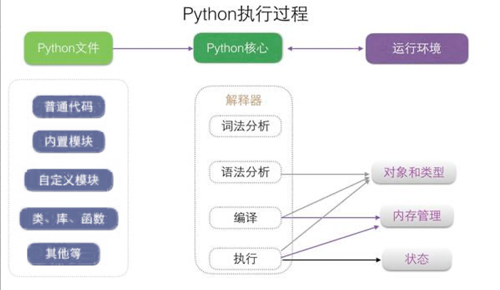

- 蓝桥 [oeasy 教您玩转 python](https://www.lanqiao.cn/courses/3584)


## 调试

```sh
python -m pdb hello.py
```

## Python 运行原理

- 下面 from [lanqiao](https://www.lanqiao.cn/courses/3584/learning/?id=530001)
- 相关指令 `uname; objdump; vi`
- 相关模块 `tokenize, ast, py_compile, dis`


总结: 一开始是Python源文件

- 词法分析 得到 词流(token stream)
- 语法分析 得到 抽象语法树(Abstract Syntax Tree)
- 编译 得到 字节码 (bytecode)
    - 注意这里得到的是二进制码了. 可以通过工具进行查看. opcode 的表见 [cpython](https://github.com/python/cpython/blob/main/Lib/opcode.py). 例如 `name_op('LOAD_NAME', 101)`
- 反编译 得到 指令文件(opcode)

```sh
# 1.词法分析(lexical analysis)
python -m tokenize hello.py
# 2.抽象语法树  AST(Abstract Syntax Tree)
# ast 包, 见下
# 3.编译
python -m py_compile hello.py
# :set wrap 设置换行
# :%!xxd 转为二进制
# 说明: %是针对所有行的范围; !是执行外部命令 xxd转为16进制
# 4.反编译 (disassembler)成这些指令字节码对应的助记符 指令文件(opcode)
python -m dis hello.py 
# 这些字节码(bytecode)对应的是python虚拟机上面虚拟cpu的指令集
```

`ast` 简介

```py
import ast
f = open("Guido. py") 
s = f.read()
# 3.9以上
print(ast.dump(ast.parse(s), indent=4))
```

```sh
# python3是什么?
whatis python3
# an interpreted, interactive, object-oriented programming language
# python3在哪里？
whereis python3
# 可执行的这个东西到底在哪？ (路径)
which python3

ll -alh /usr/bin/python3
# usr 是 unix software resource
```

### python3 程序

具体来看 python3 这个文件/解释器都做了什么? 可以将二进制文件反汇编, 比较两者的联系.

```sh
# 先把~/python3对应的机器语言输出为汇编指令形式(反汇编)
objdump -d ~/python3 > ~/python3.asm
# 再用vi分窗口分别打开打开python3 和 python3.asm
vi -o python3 python3.asm
```

- `uname -a` 进行查看本机所用的指令集
- 具体指令集列表见 <https://en.wikipedia.org/wiki/X86_instruction_listings> 简要见 [知乎](https://zhuanlan.zhihu.com/p/53394807)

在执行 `python3 hello.py` 的时候, 载入程序, 然后按照上一节中的四步最后反汇编得到命令. 不过, 这个指令文件是基于虚拟机的虚拟cpu的指令集.

这里 `python3` 解释器的作用: 1. 是先编译成python虚拟机的字节码; 2. 然后在python虚拟机上运行.



跨平台的原理

- 因为不同平台分发的python3.8二进制文件是根据当前操作系统/架构编译出来的. 因此底层运行的指令集不同.
- 而 python3.8 构建了一个运行时环境. 这个环境可以 **解释读到的python语句, 把python语句翻译成系统能读懂输入输出, 翻译成当前物理架构能够执行的代码**. 然后边解释边执行

