# LeetCode 刷题记录

看到一个比较习惯的 Blogger 微石也有 LeetCode 刷题记录：<https://akihoo.github.io/posts/c80e95e5.html> 思路还挺像哈哈哈

## 一些文章

### 大佬 Blog

[辰曦~文若](https://www.cnblogs.com/chenxiwenruo/) 看到 KMP 的似乎很硬核

### DP

[编辑距离](https://github.com/labuladong/fucking-algorithm/blob/master/%E5%8A%A8%E6%80%81%E8%A7%84%E5%88%92%E7%B3%BB%E5%88%97/%E7%BC%96%E8%BE%91%E8%B7%9D%E7%A6%BB.md) 显然用动态规划，若是要求出如何进行的编辑，则需要记录每一次转移的来源；DP 表的每一个元素可以是一个设计好的数据结构。

[排课问题](https://blog.csdn.net/GentleCP/article/details/103095884) DP+贪心

#### KMP

阮一峰 [字符串匹配的KMP算法](http://www.ruanyifeng.com/blog/2013/05/Knuth%E2%80%93Morris%E2%80%93Pratt_algorithm.html)
[KMP 求最小循环节](https://www.cnblogs.com/zjl192628928/p/9552949.html)

### 其他

[今日头条2017校招题目解析(一)：KMP中next数组与Trie树的应用](https://segmentfault.com/a/1190000014466075)

## 面经

[面经 | 字节跳动实习算法岗（2019届）](https://zhuanlan.zhihu.com/p/86746425)
[字节跳动数据挖掘算法工程师一面（记录）](https://blog.csdn.net/jianminli2/article/details/103585066)

### 002 两数相加

两个非空链表表示两个非负整数，逆序存储
将两数相加，返回一个形式相同的数字

```python
输入：l1 = [2,4,3], l2 = [5,6,4]
输出：[7,0,8]
解释：342 + 465 = 807.
```

考虑到两数组链长度可能不等，引入了一个**空节点**（value=0, next=None）以简化讨论：这样可以将 while 循环判定条件简化为 `while l1.next or l2.next or up:`，即某一条还有后继或者还有进位存在。

### 004 寻找两正序数组的中位数 ***

给定两个从小到大（正序）数组，返回中位数
进阶：你能设计一个时间复杂度为 O(log (m+n)) 的算法解决此问题吗？

问题等价于查询这两个数组中第 k 大的元素。为了降低时间复杂性，可以这样考虑：每次判断两数组中第 k/2 个元素，取其中较小的那一个，这样就可以保证这个数字的序号至少比 k 小；迭代搜索。
【数据结构】这里需要维护两个指针 index1, index2，分别表征在两数组上的搜索位置，并用删去的字符数动态更新 k
【边界】一种情况是某一个指针到达了数组尾部；另一种情况是 k 更新到了边界值
以上是简要说明，具体实现的时候还是比较复杂，例如：1. k 是从 0 还是 1 开始计数（重新想了下似乎影响不大）；2. 对于正比较的两个数是否要将其删去（也就是说假设 step=newIndex-index，每次是更新 step 还是 step+1），这是需要的因为若 step=0 时可能导致指针无法更新；

### 005 最长回文子串

```python
输入：s = "babad"
输出："bab"
解释："aba" 同样是符合题意的答案。
```

【线性搜索】总体的想法就是线性搜索第 i 个字符为中心的回文子串的长度，取其中最长的。其中一个小 trick 就是当遇到连续出现的字符时，例如 'baaaabcfa'，可将连续出现的 a 作为回文子串总体的中心，因此实践上通过维护两个指针 left, right 指向连续字符的左右两端，然后向两侧检索是否回文。

### 006 Z 字形变换

```python
将一个给定字符串 s 根据给定的行数 numRows 进行排列，然后输出
例如对于 PAYPALISHIRING 若指定行数为 3 则排列为
P   A   H   N
A P L S I I G
Y   I   R
在逐行输出为 PAHNAPLSIIGYIR
```

【算法】原本试图找出每一行的规律，非常傻
官方思路：利用一个二维数组记录每一行的内容，用一个 flag 记录前进的方向，以更新下一个字符应该放在第几行，遇到字符串「转向」的时候翻转 flag，这样一次遍历即可。

### 006 整数反转

```python
给一个 32 位有符号整数，输出数字反转后的结果
若整数超过范围 [-2^31, 2^31-1] 则返回 0
输入：x = -123
输出：-321

输入：x = 120
输出：21
```

例如最大值为 INT_MAX = 2**31-1 = 2147483647

正数
假设更新公式为 rev*10+pop，则可能溢出的情况：1. rev>INT_MAX/10; 2. rev=INT_MAX/10, pop>7
负数
也是两种：1. rev<INT_MAX/10; 2. rev=INT_MAX/10, pop<-8

【Python】注意这里用的 C 的整除，也就是 -21/10=-2, -11%10=-1；为了在 Python 中模拟向 0 round 的整数，可用 `int(x/10)`，为了得到相应的余数，用了下面的代码

```python
tmp = int(x/10)
pop = x-10*tmp
x = tmp
```

### 008 字符串转化为整数 Atoi

函数myAtoi(string s) 的算法如下：

读入字符串并丢弃无用的前导空格
检查下一个字符（假设还未到字符末尾）为正还是负号，读取该字符（如果有）。 确定最终结果是负数还是正数。 如果两者都不存在，则假定结果为正。
读入下一个字符，直到到达下一个非数字字符或到达输入的结尾。字符串的其余部分将被忽略。
将前面步骤读入的这些数字转换为整数（即，"123" -> 123， "0032" -> 32）。如果没有读入数字，则整数为 0 。必要时更改符号（从步骤 2 开始）。
如果整数数超过 32 位有符号整数范围 [−2^31, 2^31− 1] ，需要截断这个整数，使其保持在这个范围内。具体来说，小于 −2^31 的整数应该被固定为 −2^31 ，大于 2^31− 1 的整数应该被固定为 2^31 − 1 。
返回整数作为最终结果。
注意：

本题中的空白字符只包括空格字符 ' ' 。
除前导空格或数字后的其余字符串外，请勿忽略 任何其他字符。

```python
输入：s = "4193 with words"
输出：4193
解释：
第 1 步："4193 with words"（当前没有读入字符，因为没有前导空格）
         ^
第 2 步："4193 with words"（当前没有读入字符，因为这里不存在 '-' 或者 '+'）
         ^
第 3 步："4193 with words"（读入 "4193"；由于下一个字符不是一个数字，所以读入停止）
             ^
解析得到整数 4193 。
由于 "4193" 在范围 [-231, 231 - 1] 内，最终结果为 4193
```

【思路 1】比较直观（蠢）的就是分成两个阶段：第一阶段去除先导符号；第二阶段循环数字部分。 代码复杂的部分在于需要进行很多的 if 判断。
【思路 2】官方给出了有限状态自动机的解题策略

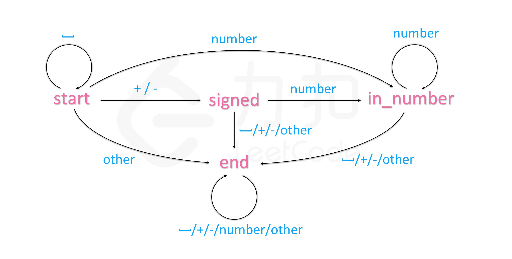

状态转移矩阵如下

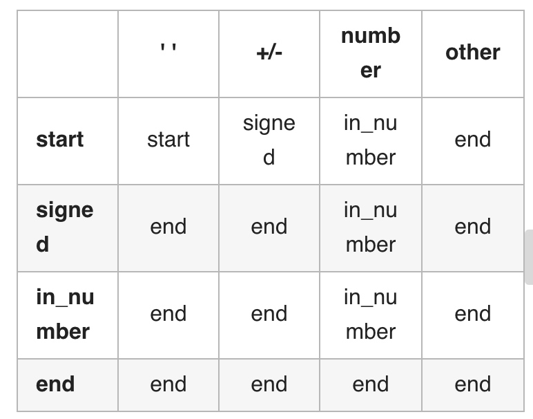

```python
INT_MAX = 2 ** 31 - 1
INT_MIN = -2 ** 31

class Automaton:
    def __init__(self):
        self.state = 'start'
        self.sign = 1
        self.ans = 0
        self.table = {
            'start': ['start', 'signed', 'in_number', 'end'],
            'signed': ['end', 'end', 'in_number', 'end'],
            'in_number': ['end', 'end', 'in_number', 'end'],
            'end': ['end', 'end', 'end', 'end'],
        }
        
    def get_col(self, c):
        if c.isspace():
            return 0
        if c == '+' or c == '-':
            return 1
        if c.isdigit():
            return 2
        return 3

    def get(self, c):
        self.state = self.table[self.state][self.get_col(c)]
        if self.state == 'in_number':
            self.ans = self.ans * 10 + int(c)
            self.ans = min(self.ans, INT_MAX) if self.sign == 1 else min(self.ans, -INT_MIN)
        elif self.state == 'signed':
            self.sign = 1 if c == '+' else -1

class Solution:
    def myAtoi(self, str: str) -> int:
        automaton = Automaton()
        for c in str:
            automaton.get(c)
            if automaton.state == 'end':
                return automaton.sign * automaton.ans
        return automaton.sign * automaton.ans
```

内存和时间消耗居然总体差不多。

#### 065 有效数字

和上一题类似，只是状态更多了。
这里采用字典的转移矩阵形式，简化了很多。

【总结】这里需要考虑到各种情况，例如分了 开始、符号、数字、小数点、前无数字的小数点、尾数（STATE_FRACTION）、e 符号、指数符号位、指数数字 等状态。
如遇到 `+.` 就是无效的而 `12.` 则是许可的；因此之前没有区分 小数点、前无数字的小数点 两种状态就造成了困扰。

```python
        from enum import Enum
        State = Enum("State", [
            "STATE_INITIAL",
            "STATE_INT_SIGN",
            "STATE_INTEGER",
            "STATE_POINT",
            "STATE_POINT_WITHOUT_INT",
            "STATE_FRACTION",
            "STATE_EXP",
            "STATE_EXP_SIGN",
            "STATE_EXP_NUMBER",
            "STATE_END",
        ])
        Chartype = Enum("Chartype", [
            "CHAR_NUMBER",
            "CHAR_EXP",
            "CHAR_POINT",
            "CHAR_SIGN",
            "CHAR_ILLEGAL",
        ])

        def toChartype(ch: str) -> Chartype:
            if ch.isdigit():
                return Chartype.CHAR_NUMBER
            elif ch.lower() == "e":
                return Chartype.CHAR_EXP
            elif ch == ".":
                return Chartype.CHAR_POINT
            elif ch == "+" or ch == "-":
                return Chartype.CHAR_SIGN
            else:
                return Chartype.CHAR_ILLEGAL

        transfer = {
            State.STATE_INITIAL: {
                Chartype.CHAR_NUMBER: State.STATE_INTEGER,
                Chartype.CHAR_POINT: State.STATE_POINT_WITHOUT_INT,
                Chartype.CHAR_SIGN: State.STATE_INT_SIGN,
            },
            State.STATE_INT_SIGN: {
                Chartype.CHAR_NUMBER: State.STATE_INTEGER,
                Chartype.CHAR_POINT: State.STATE_POINT_WITHOUT_INT,
            },
            State.STATE_INTEGER: {
                Chartype.CHAR_NUMBER: State.STATE_INTEGER,
                Chartype.CHAR_EXP: State.STATE_EXP,
                Chartype.CHAR_POINT: State.STATE_POINT,
            },
            State.STATE_POINT: {
                Chartype.CHAR_NUMBER: State.STATE_FRACTION,
                Chartype.CHAR_EXP: State.STATE_EXP,
            },
            State.STATE_POINT_WITHOUT_INT: {
                Chartype.CHAR_NUMBER: State.STATE_FRACTION,
            },
            State.STATE_FRACTION: {
                Chartype.CHAR_NUMBER: State.STATE_FRACTION,
                Chartype.CHAR_EXP: State.STATE_EXP,
            },
            State.STATE_EXP: {
                Chartype.CHAR_NUMBER: State.STATE_EXP_NUMBER,
                Chartype.CHAR_SIGN: State.STATE_EXP_SIGN,
            },
            State.STATE_EXP_SIGN: {
                Chartype.CHAR_NUMBER: State.STATE_EXP_NUMBER,
            },
            State.STATE_EXP_NUMBER: {
                Chartype.CHAR_NUMBER: State.STATE_EXP_NUMBER,
            },
        }

        st = State.STATE_INITIAL
        for ch in s:
            typ = toChartype(ch)
            if typ not in transfer[st]:
                return False
            st = transfer[st][typ]

        return st in [State.STATE_INTEGER, State.STATE_POINT, State.STATE_FRACTION, State.STATE_EXP_NUMBER,
                      State.STATE_END]
```

### 010 正则表达式匹配 ***

```python
给定字符串 s 和规律 p，实现一个支持 . 和 * 格式的正则匹配，完全匹配
其中 . 匹配任意单个字符，* 匹配 0 或多个前一个元素（可能是字符也可能是 .）

输入：s = "ab" p = ".*"
输出：true
解释：".*" 表示可匹配零个或多个（'*'）任意字符（'.'）。

输入：s = "aab" p = "c*a*b"
输出：true
解释：因为 '*' 表示零个或多个，这里 'c' 为 0 个, 'a' 被重复一次。因此可以匹配字符串 "aab"。
```

【动态规划】注意到由于会有懒惰匹配的情况，例如 `s = "aaaab"; p = "a*ab"`，不能通过简单的策略要直接求解，采用 DP。用一个大小为 (m+1)\*(n+1) 的数组 f 保存结果，f[i][j] 表示 s 的前 i 个字符能否给 p 前 j 个字符匹配（不管 p[i+1] 是否为 \*）。

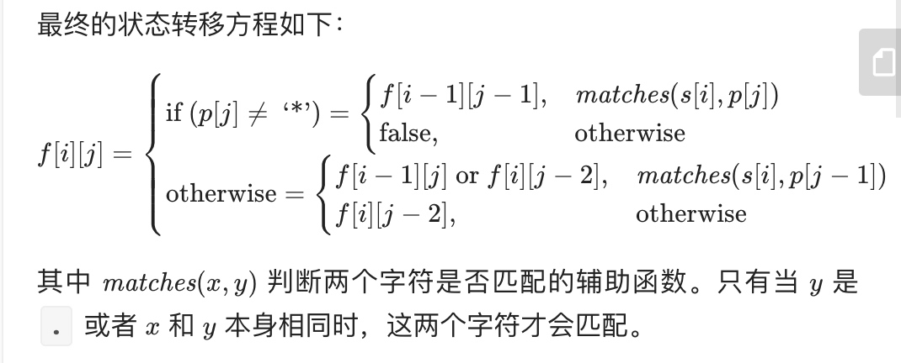

【边界】注意 0 长度的 s 是可能和如 'a*' 的 p 匹配的，因此要从 0 开始循环；而 0 长度 p 只能和 0 长 s 匹配。

```python
class Solution:
    def isMatch(self, s: str, p: str) -> bool:
        m, n = len(s), len(p)

        def match(i, j):
            # 辅助函数，判断 s[i-1] 是否等于 p[j-1]。成立条件：1. p[j-1] == '.'则可匹配任意非空字符；2. 或者 s[i-1]=p[j-1]
            # 考虑边界条件：i>=0, j>=1
            if i == 0:
                # 加上这一行的目的在于：例如 "" 无法被 "." 匹配，但不加的话因为 p[j-1] == '.' 而返回 True
                return False
            if p[j-1] == '.':
                return True
            return s[i-1] == p[j-1]

        f = [[False] * (n+1) for _ in range(m+1)]
        f[0][0] = True
        for i in range(m+1):
            # 注意 0 长度的 s 是可能和如 'a*' 的 p 匹配的，因此要从开始循环
            for j in range(1, n+1):
                # 而 0 长度 p 只能和 0 长 s 匹配
                if p[j-1] != '*':
                    if match(i, j):
                        f[i][j] |= f[i-1][j-1]
                    # else:
                    #     f[i][j] = False
                else:
                    # if match(i, j-1):
                    #     f[i][j] |= f[i][j-2] | f[i-1][j]
                    # else:
                    #     f[i][j] |= f[i][j-2]
                    f[i][j] |= f[i][j - 2]
                    if match(i, j - 1):
                        f[i][j] |= f[i-1][j]
        return f[m][n]

sol = Solution()
# s = ''; p = '.'     #边界
s = "aaaab"; p = "a*ab"   #懒惰匹配
# s = "ab"; p = ".*"
# s = "aab"; p = "c*a*b"
print(sol.isMatch(s,p))
```

#### 044 通配符匹配

[官方解析](https://leetcode-cn.com/problems/wildcard-matching/solution/tong-pei-fu-pi-pei-by-leetcode-solution/)

> 本题与「10. 正则表达式匹配」非常类似，但相比较而言，本题稍微容易一些。因为在本题中，模式 p 中的任意一个字符都是独立的，即不会和前后的字符互相关联，形成一个新的匹配模式。因此，本题的状态转移方程需要考虑的情况会少一些。

```python
'?' 可以匹配任何单个字符。
'*' 可以匹配任意字符串（包括空字符串）。

两个字符串完全匹配才算匹配成功。


输入:
s = "aa"
p = "*"
输出: true
解释: '*' 可以匹配任意字符串。

s = "adceb"
p = "*a*b"
输出: true
解释: 第一个 '*' 可以匹配空字符串, 第二个 '*' 可以匹配字符串 "dce".
```

关键是要写出 DP 的转移方程

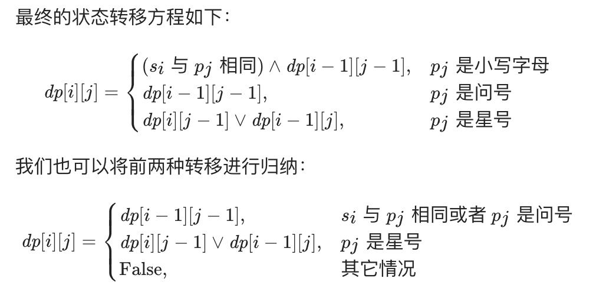

例如，对于 p[j]='*'，有两种情况：（1）用到了星号匹配，注意此时可转到 dp[i-1][j] 进行递归；（2）没有用到，即星号匹配空字符，因此是 dp[i][j-1]。
另外，注意写出完整的可能的转移情况，对于某些情况若可以合并的尽量精简。

```python
class Solution:
    def isMatch(self, s: str, p: str) -> bool:
        m, n = len(s), len(p)

        dp = [[False]*(n+1) for _ in range(m+1)]
        dp[0][0] = True
        for j in range(n):
            if p[j] == '*':
                dp[0][j+1] = dp[0][j]
            else:
                break

        for i in range(m):
            for j in range(n):
                if p[j]=='?' or (p[j]==s[i]):
                    dp[i+1][j+1] = dp[i][j]
                elif p[j]=='*':
                    dp[i+1][j+1] = dp[i][j+1] or dp[i+1][j]
        return dp[m][n]
```

### 011 盛水最多的容器

```python
给定 n 个正整数，第 i 个正整数表示坐标为 i 的地方有高度为 a_i 的柱子；找出两个点（柱子），使其构成的容器（盛水，所以是矩形）容积最大

输入：[1,8,6,2,5,4,8,3,7]
输出：49
解释：图中垂直线代表输入数组 [1,8,6,2,5,4,8,3,7]。在此情况下，容器能够容纳水（表示为蓝色部分）的最大值为 49。

输入：height = [1,1]
输出：1
```

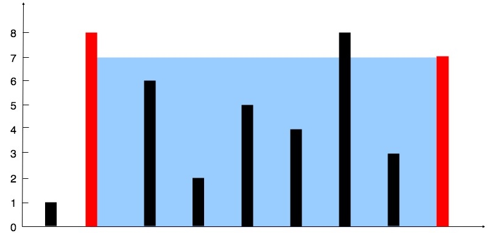

现在想起来非常简单，但能想到这一思路还是不容易的。
【思路】双指针。从两侧开始搜索，注意到其中短的那一根可能组成的最大矩阵，只能和与它距离最远的比它高的柱子匹配；因此，每次移动指向较短柱子的那一个指针，直至相遇。

```python
class Solution:
    # def maxArea(self, height: List[int]) -> int:
    def maxArea(self, height):
        # # 原本想对于每一根建立一个 partner，保存与其组队的距离最远的柱子；问题在于这样做需要维护两个方向上的；
        # # 似乎还不如真正两两组合的暴力求解
        # num = len(height)
        # partner = list(range(num))  # 保存第 i 根柱子所对应的最远（宽度最大）的 partner 的 index
        # for i in range(1, num):
        #     for j in range(i):
        #         if height[i] >= height[j]:
        #             partner[j] = i
        # volume = [height[i] * (partner[i]-i) for i in range(num)]
        # result = max(volume)
        #
        # partner2 = list(range(num))
        # for i in range(num-2, -1, -1):
        #     for j in range(num-1, i, -1):
        #         if height[i] >= height[j]:
        #             partner2[j] = i
        # volume = [height[i] * (i - partner2[i]) for i in range(num)]
        # result = max(volume + [result])
        # return result

        # 暴力
        # result = 0
        # num = len(height)
        # for i in range(num):
        #     for j in range(i+1, num):
        #         result = max(result, (j-i)*min(height[i], height[j]))
        # return result

        # 注意到，从两侧开始搜索，对于 right, left 对应的柱子中较小的那一根来说，它们组成矩形的面积就是其可能的最大面积
        result = 0
        left, right = 0, len(height)-1
        while left != right:
            result = max(result, min(height[left], height[right]) * (right-left))
            if height[right] < height[left]:
                right -= 1
            else:
                left += 1
        return result
```

### 012 整数转罗马数字

```python
字符          数值
I             1
V             5
X             10
L             50
C             100
D             500
M             1000

一些特例
4   IV
9   IX
40  XL
90  XC
400 CD
900 CM

【输入不大于 3999】

输入: 58
输出: "LVIII"
解释: L = 50, V = 5, III = 3.

输入: 1994
输出: "MCMXCIV"
解释: M = 1000, CM = 900, XC = 90, IV = 4.
```

【思路一】本质上就是两种进制的转换，只不过罗马数字的基数为 1, 4, 5, 9, 10, 40,... 等；将待转化的数字分别除以这些基数即可。
【思路二】又由于罗马数字和阿拉伯数字都有十进制的思想，可将 10, 20,...90 对照出相应的罗马数字表示，然后将阿拉伯数字的每一位映射成罗马数字即可。

```python
class Solution:
    def intToRoman(self, num: int) -> str:
        roman_digits = []
        digits = [
            (1000, "M"),
            (900, "CM"),
            (500, "D"),
            (400, "CD"),
            (100, "C"),
            (90, "XC"),
            (50, "L"),
            (40, "XL"),
            (10, "X"),
            (9, "IX"),
            (5, "V"),
            (4, "IV"),
            (1, "I")
        ]
        for value, symbol in digits:
            count, num = divmod(num, value)
            roman_digits.append(symbol*count)
            if not num:
                break
        return "".join(roman_digits)
```

### 016 最接近的三数之和

```python
给定一个数组 nums 和一个 target，找出其中的一个三元组，要求之和与 target 距离最小，返回这个和

输入：nums = [-1,2,1,-4], target = 1
输出：2
解释：与 target 最接近的和是 2 (-1 + 2 + 1 = 2) 。
```

继承自 015 三数之和 ，就要求找到一个数组中所有的和为 0 的**不同**三元组。

#### 双指针法 ***

【简化】考虑更为基本的问题：**如何找到一个数字中和为 target 的二元组**？
【思路一】采用 hash/dict，相当于记录了此前遇到的所有元素。
【思路二】就是双指针，需要事先对数组排序；然后双指针分别指向头尾，根据指向数字之和与 target 的大小决定移动哪个指针；**终止条件**：两指针相遇。复杂度不考虑排序是 O(n)

而对于 015 的三数之和来说，先对数组排序，然后进行一次遍历，取定第一个数字，则其相反数就是另外两个数字的 target，然后利用双指针的思路。总的复杂度是 O(N^2)

下面代码中，注释部分试图借用 015 的框架，采用 for 循环来遍历双指针；但考虑双指针法的本质，用 while 判断是否相遇更为清晰。

```python
class Solution:
    # def threeSumClosest(self, nums: List[int], target: int) -> int:
    def threeSumClosest(self, nums, target):
        result = int(9999)
        diff = 9999

        n = len(nums)
        nums.sort()

        def update(threeSum):
            nonlocal diff, result
            if abs(threeSum - target) < diff:
                diff = abs(threeSum - target)
                result = threeSum
        # 枚举 a
        for first in range(n):
            if first>0 and nums[first]== nums[first-1]:
                continue
            # third = n-1
            # # 使用双指针枚举 b 和 c
            # for second in range(first+1, n):
            #     if second>first+1 and nums[second]==nums[second-1]:
            #         continue
            #     while third>second and nums[first]+nums[second]+nums[third] > target:
            #         third -= 1
            #     if second == third:
            #         update(nums[first]+nums[second]+nums[second+1])
            #         break
            #     update(nums[first]+nums[second]+nums[third])
            #     if third == second+1:
            #         break
            #     # third -= 1
            #     update(nums[first]+nums[second]+nums[third-1])

            second, third = first+1, n-1
            while second < third:
                s = nums[first]+nums[second]+nums[third]
                if s == target:
                    return s
                update(s)
                if s > target:
                    third -= 1
                    while third>second and nums[third]==nums[third+1]:
                        third -= 1
                else:
                    second += 1
                    while second<third and nums[second]==nums[second-1]:
                        second += 1
        return result
```

### 017 电话号码的数字组合

```python
输入：digits = "23"
输出：["ad","ae","af","bd","be","bf","cd","ce","cf"]

输入：digits = ""
输出：[]
```

第一道 DFS / backtrack 题目，记录一下

```python
digits2alph = {
    2: 'abc',
    3: 'def',
    4: 'ghi',
    5: 'jkl',
    6: 'mno',
    7: 'pqrs',
    8: 'tuv',
    9: 'wxyz'
}

class Solution:
    # def letterCombinations(self, digits: str) -> List[str]:
    def letterCombinations(self, digits):
        if not digits:
            return []
        results = []

        combination = []
        def backtrack(depth):
            if depth == len(digits):
                results.append(''.join(combination))
            else:
                d = int(digits[depth])
                for char in digits2alph[d]:
                    combination.append(char)
                    backtrack(depth+1)
                    combination.pop()
        backtrack(0)
        return results
```

### 022 括号生成

```python
给定一个整数 n 代表生成括号的对数，请你设计一个函数，用于能够生成所有可能的并且 有效的 括号组合。

输入：n = 3
输出：["((()))","(()())","(())()","()(())","()()()"]
```

【思路】总体上来看还是一个搜索问题/backtrack。但这一块最近接触得比较少，所以下面列出自己一开始写的代码。

```python
class Solution:
    # def generateParenthesis(self, n: int) -> List[str]:
    def generateParenthesis(self, n):
        result = []
        seq = []
        def gen(i,j):
            # 需要保证 i>=j 的循环条件
            # 结束条件
            if i==j==n:
                result.append(''.join(seq))
                return
            # 有三个可能，仅能添加 ( 或者 ) 或者 () 都可添加
            # 1. 仅能添加 )，条件只能是 ( 用完了
            if i==n:
                seq.append(')')
                gen(i, j+1)
            # 2. 仅能添加 (，条件只能是 () 数量相等
            elif i==j:
                seq.append('(')
                gen(i+1, j)
            # 3. () 均可
            else:
                seq.append('(')
                gen(i+1, j)
                seq.pop(-1)
                seq.append(')')
                gen(i, j+1)
            seq.pop(-1)
        gen(0, 0)
        return result
```

【改进】但自己的判断逻辑还是很冗余的，官方的实现思路就很清楚：

```python
class Solution:
    def generateParenthesis(self, n: int) -> List[str]:
        ans = []
        def backtrack(S, left, right):
            if len(S) == 2 * n:
                ans.append(''.join(S))
                return
            if left < n:
                S.append('(')
                backtrack(S, left+1, right)
                S.pop()
            if right < left:
                S.append(')')
                backtrack(S, left, right+1)
                S.pop()

        backtrack([], 0, 0)
        return ans
```

【思路二】上面的思想接近 DFS（当然也是递归）；而下面这种思路就是纯粹的递归想法。注意到一个左括号和与之对应的右括号之后分割出两个空间 `({}){}` 例如共有 n 组括号，则可将剩余的 n-1 组分配到这两个空间中，递归求解。注意到这里的复杂度和思路一是一致的（都与总数成正比）。

```python
class Solution:
    @lru_cache(None)
    def generateParenthesis(self, n: int) -> List[str]:
        if n == 0:
            return ['']
        ans = []
        for c in range(n):
            for left in self.generateParenthesis(c):
                for right in self.generateParenthesis(n-1-c):
                    ans.append('({}){}'.format(left, right))
        return ans
```

### 023 合并 K 个升序链表

```python
给你一个链表数组，每个链表都已经按升序排列。
请你将所有链表合并到一个升序链表中，返回合并后的链表。

输入：lists = [[1,4,5],[1,3,4],[2,6]]
输出：[1,1,2,3,4,4,5,6]
解释：链表数组如下：
[
  1->4->5,
  1->3->4,
  2->6
]
将它们合并到一个有序链表中得到。
1->1->2->3->4->4->5->6

输入：lists = []
输出：[]
```

【思路 1】「分治」思想，将 k 个链表合并的问题递归转化为两链表合并问题
【思路 2】采用 PriorityQueue 的结构保存节点，参见 <https://docs.python.org/3/library/heapq.html>；需要注意的是，在 `heapq` 中的元素是要能比较大小的（C++中能重载运算符就很强），所以这里记录的是 (node.val, index) ，其中 val 作为排序的优先级，而 index 表示这个元素属于哪一条链表。

#### 021 两个有序链表合并

在第一种思路中需要实现两个有序链表的合并（见👇），在 021 题中我用的循环条件是 `while l1 or l2`，这样的话在循环中的判断条件会比较复杂，而这里参考标答换成了 `while l1 and l2`，最后只会剩下 l1 或 l2 的剩余部分，或两者都为空，直接将维护的`now` 指针指向它就行了。虽然只是一个小细节，但这样写代码逻辑清楚很多。

```python
class ListNode:
    def __init__(self, val=0, next=None):
        self.val = val
        self.next = next
    def printList(self):
        res = [self.val]
        now = self
        while now.next:
            now = now.next
            res.append(now.val)
        print(res)

def genNode(l):
    root = ListNode(val=l[0])
    pre = root
    for num in l[1:]:
        now = ListNode(val=num)
        pre.next = now
        pre = now
    return root


class Solution:
    # def mergeKLists(self, lists: List[ListNode]) -> ListNode:
    """
    思路一：「分治」思想，将 k 个链表合并的问题递归转化为两链表合并问题
    """
    def mergeKLists(self, lists):
        # 两个链表合并函数
        def merge2(l1, l2):
            head_pre = ListNode()   # 虚头部
            now = head_pre
            while l1 and l2:
                if l1.val < l2.val:
                    now.next = l1
                    l1 = l1.next
                else:
                    now.next = l2
                    l2 = l2.next
                now = now.next
            l = l1 if l1 else l2
            now.next = l
            return head_pre.next

        def mergeKgen(lists):
            if len(lists)==0:
                return None
            if len(lists)==1:
                return lists[0]
            k = len(lists)//2
            return merge2(mergeKgen(lists[:k]), mergeKgen(lists[k:]))

        return mergeKgen(lists)

    """
    思路二：维护一个 PriorityQueue
    """
    def mergeKLists2(self, lists):

        from heapq import heappush, heappop

        head_pre = ListNode()
        now = head_pre
        pq = []
        for i, l in enumerate(lists):
            if l:   # 可能有输入 [[]]
                heappush(pq, (l.val, i))        # 注意不能把 l 直接人进去，因为无法比较大小
        while pq:
            _, index = heappop(pq)
            l = lists[index]
            now.next = l
            now = now.next
            if l.next:
                lists[index] = l.next
                heappush(pq, (l.next.val, index))
        return head_pre.next

ls =  [[1,4,5],[1,3,4],[2,6]]
lists = [genNode(l) for l in ls]
res = Solution().mergeKLists2(lists)
res.printList()
```

### 025 K 个一组翻转链表 ***

```python
将一个链表每 k 个节点为一组进行翻转；k 小于等于链表长度；
若链表长度不能被 k 整除，剩余部分保持原有顺序

进阶：你可以设计一个只使用常数额外空间的算法来解决此问题吗？
你不能只是单纯的改变节点内部的值，而是需要实际进行节点交换。

输入：head = [1,2,3,4,5], k = 3
输出：[3,2,1,4,5]
```

#### 206 反转链表

思路一：迭代
维护两个指针，pre 记录前一个节点，curr 记录当前节点；然后递归 curr 指针，直至 curr 指向 None；最后返回 pre 即可

思路二：递归
思路稍微绕一点：假设递归函数为 `recursion(node)->head`，那么我们在其中要实现什么？
首先在每一次递归过程中（对于第 k 个节点），我们对 curr.next 调用 recursion，其返回的 newhead 应该作为此次递归的返回（新的头部）
我们利用 newhead 对于 curr 的指向进行翻转

```python
"""
输入: 1->2->3->4->5->NULL
输出: 5->4->3->2->1->NULL
"""

class ListNode:
    def __init__(self, val=0, next=None):
        self.val = val
        self.next = next
    def printList(self):
        res = [self.val]
        now = self
        while now.next:
            now = now.next
            res.append(now.val)
        print(res)

def genNode(l):
    root_pre = ListNode()
    curr = root_pre
    for num in l[1:]:
        now = ListNode(val=num)
        curr.next = now
        curr = now
    return root_pre.next

class Solution:
    """
    思路一：迭代
    维护两个指针，pre 记录前一个节点，curr 记录当前节点；然后递归 curr 指针，直至 curr 指向 None；最后返回 pre 即可
    """
    def reverseList(self, head: ListNode) -> ListNode:
        pre = None
        curr = head
        while curr:
            next = curr.next
            curr.next = pre
            pre = curr
            curr = next
        return pre
    """
    思路二：递归
    思路稍微绕一点：假设递归函数为 `recursion(node)->head`，那么我们在其中要实现什么？
    首先在每一次递归过程中（对于第 k 个节点），我们对 curr.next 调用 recursion，其返回的 newhead 应该作为此次递归的返回（新的头部）
    我们利用 newhead 对于 curr 的指向进行翻转
    """
    def reverse_recursion(self, head: ListNode):
        def recursion(curr: ListNode)->ListNode:
            if not curr or (not curr.next):
                # 条件 1：curr.next 为空，链表到达尾端
                # 条件 2：curr 为空，调用 recursion 时传入的 head 本身为空
                return curr
            new_head = recursion(curr.next)     # 接受递归调用返回的新 head
            curr.next.next = curr   # 注意 curr 的 next 指针并未变化，利用其修改 curr.next 的 next 指针
            curr.next = None    # 这里需要将其置空，以免出现环
            return new_head
        return recursion(head)
# l = [1,2,3,4,5]
l = []
head = genNode(l)
# res = Solution().reverseList(head)
res = Solution().reverse_recursion(head)
if res:
    res.printList()
else:
    print()
```

#### K 反转

基于 206 的单个链表反转，实现起来思路还是非常清楚的：每次判断剩余部分是否满 k 个，若满的话需要将「子链表」反转后连接到总的链表上。
【细节】但实现起来还是比较复杂的，关键是如何设置指针。
在下面的第一个版本中，自己的逻辑就比较乱
第二个版本基于标答，设计了一个 `reverse(head, tail)` 函数反转 head 和 tail 所指定的子链表；而如何将子链表重新放回总的链表中，可以用 pre 和 nex 两个指针分别指向 head 前和 tail 后的两个 node。

```python
class Solution:
    def reverseKGroup(self, head: ListNode, k: int) -> ListNode:
        if k==1:
            return head

        result_pre = ListNode()
        current = result_pre    # current 指向目前已经排好序的最后一个元素

        while head:
            head_of_k_nodes = head  # 先保留目前的位置，k 个 node 的头部
            # 判断剩余的是否还有 k 个 node
            count  = k-1
            # for count in range(k):
            while count>0 and head.next:
                head = head.next
                count -= 1
            # head = head.next        # 注意前面的 while 循环只走了 k-1 步，因此需要再往后一步

            # count>0 说明不满 k 个 node 了。因需要更新 current
            if count>0:
                current.next = head_of_k_nodes
                head = head.next  # 注意前面的 while 循环只走了 k-1 步，因此需要再往后一步
            else:
                """
                currend -> head_of_k_nodes(the head of k nodes) ->...-> head(the tail of k nodes)
                利用上面的三个指针，需要做：
                1. 对 pre-head 这一序列进行反转；
                2. 更新 current：先将原来的 current.next 指向排好序的 k 个元素的头部，然后将 current 指向逆序的 k 长序列的末尾 end_of_reversed
                # head 已经在前面更新过了，可能是下一个 k 组元素的头部，也可能为空
                3. 更新 head：目前指向 k 个元素的尾部（因为在迭代反转的时候需要判断是否到了 k 个）
                4. 更新 end_of_reversed=head_of_k_nodes：事实上就是更新后的 current 节点，将其 next 指针置空，或者指向 head.next
                """
                end_of_reversed = head_of_k_nodes
                head_of_next_k = head.next
                pre, curr = head_of_k_nodes, head_of_k_nodes.next
                while curr!=head:
                    next = curr.next
                    curr.next = pre
                    pre, curr = curr, next
                curr.next = pre     # 注意循环条件：curr 遍历到末尾（head）的时候，curr 的 next 需要指向 pre 但还未反向

                current.next = curr # curr==head, 现在 head 指向 k 个元素末尾
                current = end_of_reversed
                current.next = None
                # 注意到此时的 head 肯定不为 None，不需要判断
                # if head.next:
                #     head = head.next
                head = head_of_next_k

        return result_pre.next

    def reverse(self, head: ListNode, tail: ListNode):
        # 官方实现，可以应对 k=1 边界情况
        # prev = tail.next
        # p = head
        # while prev != tail:
        #     nex = p.next
        #     p.next = prev
        #     prev = p
        #     p = nex
        # return tail, head

        # 但还是觉得下面自己写的代码更清楚些，增加了（0）部分的判断
        pre, curr = head, head.next
        while curr!=tail:
            nex = curr.next
            curr.next = pre
            pre, curr = curr, nex
        curr.next = pre
        # 以上未改变原本的 head.next，因此是有环的。
        # 因此下一行避免出现环（在测试过程中有用） —— 但实际上在 reverseKGroup2() 中会对 head.next 进行处理
        head.next = None
        return tail, head

    def reverseKGroup2(self, traverse: ListNode, k: int):
        if k==1:    # （0）处理边界情况，若 reverse 用的是标答则不需要这一判断
            return traverse
        hair = ListNode()
        hair.next = traverse
        pre = hair  # （1）已排序的最后一个 node

        while traverse:
            tail = pre
            for i in range(k):
                tail = tail.next
                if not tail:
                    return hair.next

            nex = tail.next # （2）记录 k 个节点后的下一个 node
            head, tail = self.reverse(traverse, tail)
            """
            把子链表重新接回原链表
            将（1）所记录的之前部分的处理好的最后一个节点的 next 指针指向（新的反向的）子链表头
            将子链表为的 next 指针指向（2）所记录的 k 个节点后的第一个节点（可能为 None）
            """
            pre.next = head
            tail.next = nex

            pre = tail      # （1）重新记录

            traverse = nex  # 还需要更新 head
        return hair.next

head = genNode([1,2,3,4,5])
# res = Solution().reverseKGroup(head, k=1)
# res.printList()

# tail = head
# while tail.next:
#     tail = tail.next
# rev_head, _ = Solution().reverse(head, tail)
# rev_head.printList()

res2 = Solution().reverseKGroup2(head, k=1)
res2.printList()
```

### 028 实现 strStr()

```python
实现 strStr() 函数。
给定一个 haystack 字符串和一个 needle 字符串，在 haystack 字符串中找出 needle 字符串出现的第一个位置 (从0开始)。如果不存在，则返回 -1。

输入: haystack = "hello", needle = "ll"
输出: 2
```

星级为简单，可能是因为虽然高级的算法可以降低复杂度在实际计算时间上差不多？
【思路一】直接利用 Python 的字符串是否相等运算，某种程度上可以认为「违规」了；或者说，这里相当于每次完整匹配了长度 L 的两个字符串，复杂度为 O(L)，因此总复杂度 O(L(n-L))
【思路二】自己是实现字符串的比较，顺序遍历；匹配失败则从下一个位置开始（**KMP 算法改进的地方**），具体实现见下。这里只是在平均水平下降低了复杂度，但最坏情况下的复杂度没有发生变化。
【思路三】可以用 O(n-L) 复杂度的算法，这里介绍了 `Rabin Karp` 算法，也就是 rolling hash：一个长为 L 的字符串可以理解为长度 L 的数组，对于数组的每一位赋予权值，求和得到哈希值。
例如选取 base=26，可将数组 [0,1,2,3] 计算 hash 值 $h0=0*26^3 + 1*26^2 + 2*26^1 + 3*26^0$
向右移动变为 [1,2,3,4] ，更新公式为 $h1 = (h0 - 0*26^3)*26 + 4*26^0 = h0*26 - 0*26^4 + 4*26^0$
于是更新公式为 $h_{i+1} = hi*base - nums[i]*base^L + nums[i+L]$

【KMP 算法】参见阮一峰的 [字符串匹配的KMP算法](http://www.ruanyifeng.com/blog/2013/05/Knuth%E2%80%93Morris%E2%80%93Pratt_algorithm.html)
另外，这类算法似乎有类似的，参考讨论区 <https://leetcode-cn.com/problems/implement-strstr/solution/python3-sundayjie-fa-9996-by-tes/>


本质上就是对匹配序列构建「部分匹配表」，依次计算 needle 前 n 个字符的部分匹配值。例如对 'ABCDA' 来说，后缀 'A' 有对应的前缀，因此值为 1；而 'ABCDAB' 的后缀 'AB' 有相应的前缀且是最长的，因此值为 2。

匹配过程中，我们对于 haystack 线性搜索；建立两个指针 pn 和 pL，其中指向待匹配字符串的 pn 是不后退的，而 pL 在部分匹配失败时后退。
匹配失败的后退步数：为部分匹配表的列号-匹配值，例如对第六个字符 B 来说就是 6-2=4。
例如，当我们匹配到某个位置，pL 指向了最后一个 D（第 7 个元素），此时匹配失败，说明前 6 个字符匹配成功，而 needle[:6] 的最长前后缀子串长度为 2，因此重新去匹配第 3 个元素（pn 不移动）。若此时还是匹配失败，则后退 3-0，也就是确认无法匹配了。此时 pn 右移，从头开始匹配。

```python
class Solution:
    def strStr(self, haystack: str, needle: str) -> int:
        L, n = len(needle), len(haystack)
        # 冗余的
        # if len(needle)==0:
        #     return 0
        for i in range(n-L+1):
            if haystack[i:i+L] == needle:
                return i
        return -1

    """
    上面用到了默认的字符串比较，相当于 O(n) 复杂度的（？）
    但从前缀还是比较就可得出结果，下面的实现用了 curr_len 记录匹配长度，从而结合两个指针可以定位开始匹配的 index
    当然直接记录还是匹配的 index，然后去线性检查是否完整匹配也行，但似乎要多一个变量；但这里的操作需要注意移动的位置（匹配失败更新 pn = pn-curr_len+1），结合图示
    """
    def strStr2(self, haystack: str, needle: str) -> int:
        L, n = len(needle), len(haystack)
        if L==0:
            return 0

        pn = 0 # pointer in haystack
        while pn < n-L+1:
            # 对齐 needle 第一个元素
            while pn<n-L+1 and haystack[pn]!=needle[0]:
                pn += 1
            # 从头开始匹配 needle，注意此时的 pn 指向的值必然为 needle 第 0 元素，也即 haystack[pn]==needle[pL]
            curr_len = 0    # 记录匹配长度
            pL = 0  # pointer in needle
            while pL<L and pn<n and haystack[pn]==needle[pL]:
                pn += 1
                pL += 1
                curr_len += 1

            if curr_len == L:   # 完整匹配
                return pn-L

            pn = pn-curr_len+1  # 否则回退到
        return -1


    """
    【思路三】利用 hash。例如选取 base=26，可将数组 [0,1,2,3] 计算 hash 值 h0=0*26^3 + 1*26^2 + 2*26^1 + 3*26^0
    向右移动变为 [1,2,3,4] ，更新公式为 h1 = (h0 - 0*26^3)*26 + 4*26^0 = h0*26 - 0*26^4 + 4*26^0
    于是更新公式为 h_{i+1} = hi*base - nums[i]*base^L + nums[i+L] 
    """
    def strStr3(self, haystack: str, needle: str) -> int:
        L, n = len(needle), len(haystack)
        if n<L:
            return -1

        a = 26      # bash value for rolling hash func
        modulus = 2**31

        h_to_int = lambda i: ord(haystack[i]) - ord('a')
        needle_to_int = lambda i: ord(needle[i]) - ord('a')

        # 计算 needle 的 ref_h 和 haystack[:n] 的 hash
        h = ref_h = 0
        for i in range(L):
            h = (h*a + h_to_int(i)) % modulus
            ref_h = (ref_h*a + needle_to_int(i)) % modulus
        if h == ref_h:
            return 0

        aL = pow(a, L, modulus)
        for start in range(1, n-L+1):
            h = (h*a - h_to_int(start-1)*aL + h_to_int(start+L-1)) % modulus
            if h==ref_h:
                return start
        return -1
```

### 029 两数相除

不使用乘除和 mod 运算，实现两任意整数的整除。
整数除法是 truncate 的，`truncate(-2.5) = -2`

【思路】首先考虑符号对于商数的影响：1. 两数异号则商为负（也就是决定了 👇 的`flag`）；2. 由于采用了 truncate 机制（也就是商向 0 取整），可将正数/负数的商数计算转化为两正数求商：例如 7/3=2...1, 7/(-3)=(-2)...1, (-7)/3=(-2)...(-1), (-7)/(-3)=2...(-1)。
综上，可划分成求商的符号，和计算两正数相除的商两步。

而在第二步中，若一直中被除数去减除数，相当于线性搜索，效率太低。
采用「反向二分查找」的方式，**每次将除数扩大一倍**（乘以 2 可由加法简单实现，或者是左移一位），来判断 dividend 中有多少个 2^k divisor。
另外注意到还需判断剩余部分有多少 divisor，因此要实现一个 `def div(dividend: int, divisor: int) -> int` 。
递归调用：返回结果为 `return count + div(dividend-divisor_2, divisor)`。
终止条件：`dividend < divisor`

```python
class Solution:
    def divide(self, dividend: int, divisor: int) -> int:
        # 脑回路清奇才会用加法吧……
        # if dividend<0:
        #     dividend, divisor = -dividend, -divisor
        # flag = 1
        # if divisor<0:
        #     divisor = -divisor
        #     flag = -1
        # res = 0
        # while dividend>=0:
        #     dividend -= divisor
        #     res += 1
        # return flag*(res-1)

        # 模拟 int32
        INT_MAX = 2147483647
        if dividend == -INT_MAX-1 and divisor==-1:
            return INT_MAX

        # 用 flag 表示结果正负，将两数均转化为正数
        if dividend<0:
            dividend, divisor = -dividend, -divisor
        flag = 1
        if divisor<0:
            divisor = -divisor
            flag = -1

        def div(dividend: int, divisor: int) -> int:
            if dividend < divisor:
                return 0
            count = 1
            divisor_2 = divisor # 倍增 divisor
            while dividend>divisor_2+divisor_2:
                # 从加法变为左移，运行时间从 52ms 降到 40ms
                # divisor_2 = divisor_2+divisor_2
                # count = count + count
                divisor_2 <<= 1
                count <<= 1
            return count + div(dividend-divisor_2, divisor)

        if flag>0:
            return div(dividend, divisor)
        else:
            return -div(dividend, divisor)
```

### 030 串联所有单词的子串

```python
给定一字符串 s 和一些长度相同的单词 words，找出 s 中恰好可以由 words 中所有单词串联形成的子串的起始位置。
注意子串要与 words 中的单词完全匹配，中间不能有其他字符，但不需要考虑 words 中单词串联的顺序。

输入：
  s = "barfoothefoobarman",
  words = ["foo","bar"]
输出：[0,9]
解释：
从索引 0 和 9 开始的子串分别是 "barfoo" 和 "foobar" 。
输出的顺序不重要, [9,0] 也是有效答案。

输入：
  s = "wordgoodgoodgoodbestword",
  words = ["word","good","best","word"]
输出：[]
```

这题标记为难，但按照下面的思路感觉并不难。关键是**理解题意**：给定一组长度相等的单词 words（可能包含重复单词），那么它们的排列组合拼接起来可能形成 n_words! 种长度为 n_word*L 的字符串，要求就是从 s 中找出所有子串（的起始位置）。
即要求的是不重叠匹配，也就是仅需要遍历 s 中长度为 n_word\*L 的子串即可；对于对于每个子串来说，都可划分成固定的 n 个长为 L 的词。

【思路】由于题目比较特殊，对于 s 中异常长度匹配的子串，**需要比较的本质上就是其中的字所构成的 数组/字典 是否与 words 一致**。下面利用了 Counter 来实现，其他类似思路应该也类似。

原本还以为 words 中的所有字均不同，所以想统计不同的字出现频次，若不同字出现的数量 < n_words 则不匹配
结果是可能相同的如 words = ["word","good","best","good"]
于是用了 Counter，grand truth 是 Counter(words)。这样在第二层遍历的时候：

1. 有不在 words 中的字直接 break；
2. Counter[word]<0 时也 break；
所以是在遍历过程中检查是否有不满足的条件 —— 若均满足，则临时记录的那个 Counter 中的 values 应该均为 0；为了避免这一判断，设置了一个 `flag`。

```python
class Solution:
    def findSubstring(self, s: str, words: List[str]) -> List[int]:
        results = []

        from collections import Counter
        words_counter = Counter(words)

        L = len(words[0])
        n_words = len(words)
        for i in range(len(s)-L*n_words+1):
            sub_str = s[i : i+L*n_words]
            """
            原本还以为 words 中的所有字均不同，所以想统计不同的字出现频次，若不同字出现的数量 < n_words 则不匹配
            结果是可能相同的如 words = ["word","good","best","good"]
            于是用了 Counter，grand truth 是 Counter(words)。这样在第二层遍历的时候：
            1. 有不在 words 中的字直接 break；
            2. Counter[word]<0 时也 break；
            所以是在遍历过程中检查是否有不满足的条件 —— 若均满足，则临时记录的那个 Counter 中的 values 应该均为 0；为了避免这一判断，设置了一个 `flag`。
            """
            # from collections import defaultdict
            # counter = defaultdict(int)
            # for j in range(n_words):
            #     ssub_str = sub_str[j*L : (j+1)*L]
            #     if ssub_str in words:
            #         counter[ssub_str] += 1
            #     else:
            #         break
            # if len(counter)==n_words:
            #     results.append(i)

            flag = True    # 判断是否匹配的标记
            temp_counter = words_counter.copy()
            for j in range(n_words):
                ssub_str = sub_str[j*L: (j+1)*L]
                if ssub_str not in words:
                    flag = False
                    break
                if temp_counter[ssub_str]>0:
                    temp_counter[ssub_str]-=1
                else:
                    flag = False
                    break
            if flag:
                results.append(i)
        return results
```

### 031 下一个排列 ***

```python
实现获取 下一个排列 的函数，算法需要将给定数字序列重新排列成字典序中下一个更大的排列。
如果不存在下一个更大的排列，则将数字重新排列成最小的排列（即升序排列）。
必须 原地 修改，只允许使用额外常数空间。

输入：nums = [1,2,3]
输出：[1,3,2]

输入：nums = [3,2,1]
输出：[1,2,3]

输入：nums = [1,1,5]
输出：[1,5,1]

输入：nums = [1]
输出：[1]
```

又是被标答折服的一次……但看了一遍之后感觉其实还行，关键是要理解这里的**数学原理**。
【思路】要看这里求解的目标有什么规律？以 [1, 2, 3] 为例，从小到大依次为：

```python
（1）[1 2 3]
（2）[1 3 2]
（3）[2 1 3]
（4）[2 3 1]
（5）[3 1 2]
（6）[3 2 1]
```

为了找到下一个排列，我们的思路是从右向左检索，看是否有两个指标可以**交换**，使得数组的字典序变大（或者若元素全部为 0-9 的数字，就是组成的数字更大）。「增大」需要满足的条件是：nums[left]<nums[right]，交换过后得到的排列是大于原排列。
但我们要得到的是大于原排列中最小的那一个，例如上面的（2）到（3），检索 [1 3 2] 之后发现左侧的 1 小于右侧的 2 于是先交换这两个元素，结果为 [2 3 1] ；交换之后，需要对 left 右侧的部分「排序」，得到最小的一个（也就是「next permutation」）。

下面的第一种自己的实现正是基于此。但还有一个重要的性质：**交换 left, right 后，[left+1:] 还是逆序的**！因此事实上不需要排序，而只要进行数组元素的逆序即可。

【感想】另外发现LeetCode 的运行时间只能大致参考，例如这里难点在于得到下一个排列，因此似乎没有涉及复杂情况。
（1）此题中，我一开始用 `is_reverse()` 来依次判断最后的 2,3,... 个元素是否逆序，整体上找到 left 相当于用了双重循环；但是其运行时间反而要比之后从数组尾部逆向找到第一个非逆序元素的改进算法更短。
（2）进一步将算法改进成标答 `nextPermutation2()` ，结果也没有明显改进。

```python
class Solution:
    def nextPermutation(self, nums: List[int]) -> None:
        """
        Do not return anything, modify nums in-place instead.
        """
        l = len(nums)
        def sort(start,end):
            # 对 nums[start:end] 实现原地排序
            for i in range(start, end):
                idx_min = i
                for j in range(i+1, end):
                    if nums[j]<nums[idx_min]:
                        idx_min = j
                if idx_min != i:
                    nums[i], nums[idx_min] = nums[idx_min], nums[i]
        # sort(0, len(nums))
        # print(nums)
        def is_reverse(start, end):
            # 判断 nums[start:end] 是否逆序
            for i in range(start, end-1):
                if nums[i]<nums[i+1]:
                    return False
            return True
        # print(is_reverse(1,3))

        # flag = False
        for i in range(l-2, -1, -1):
            if is_reverse(i, l):
                continue
            # 若不为逆序，找到 [i+1:] 最比 nums[i] 大的元素中最小的那一个，然后对 [i+1:] 排序
            idx = i+1
            for j in range(i+2, l):
                if nums[idx] > nums[j] > nums[i]:
                    idx = j

            nums[idx], nums[i] = nums[i], nums[idx]
            sort(i+1, l)
            return
        # 若未发生上述操作，说明已是最大的排列
        # if not flag:
        #     nums.sort()
        nums.sort()

    def nextPermutation2(self, nums: List[int]) -> None:
        l = len(nums)

        # 从后向前，找出第一个非逆序的元素
        i = l-2
        while i>=0 and nums[i]>=nums[i+1]:
            i -= 1
        """
        两种情况
        1. i>=0，此时需要在 [i+1:] 中找到大于 nums[i] 的元素中最小的那一个，设指标为 j；然后需要（1）交换 ij；（2）将 [i+1:] 逆序，此时设置 left=i+1
        2. i=-1，说明完全逆序（最大），下面的 left, right 指针为数组头尾，注意此时 left=i+1 仍满足
        """
        if i>=0: # 注意 [i+1:] 是逆序的
            j = i+1
            while j<l-1 and nums[i]<nums[j+1]:
                j += 1
            nums[j], nums[i] = nums[i], nums[j]

        # 然后需要对 [i+1:n] 部分进行所谓排序，但实际上这部分是降序的，所以进行一次反转即可
        left, right = i+1, l-1
        while left<right:
            nums[left], nums[right] = nums[right], nums[left]
            left += 1
            right -= 1
        return
```

### 032 最长有效括号 ***

```python
给你一个只包含 '(' 和 ')' 的字符串，找出最长有效（格式正确且连续）括号子串的长度。

输入：s = ")()())"
输出：4
解释：最长有效括号子串是 "()()"
```

【反思】这题写了三四个个小时吧，深夜思路混乱，而且在纠结的画图和混乱的代码中完全不能状态；说明刷 LeetCode 还是要找好状态。

#### 暴力查找

一开始的想法：若直接双重循环，内部循环判断最长可能序列，则复杂度为 O(n^2)。
是否要用 DP？其复杂度至少为二次方，似乎不如直接求解。

第二天写了下面这个暴力方案：果断超时了，断在一个长 15000 的序列上。

```python
class Solution:
    def longestValidParentheses(self, s: str) -> int:
        if len(s) < 2:
            return 0
        n = len(s)
        f = lambda c: 1 if c=='(' else -1
        s_list = [f(c) for c in s]

        def next_left_parentthesis(start):
            # 从 start 开始找到第一个左括号
            # 若未找到则返回 n
            while start < n and s_list[start] == -1:
                start += 1
            return start

        def search_from_i(start):
            acc = 0
            best_len = 0
            i = start
            while i<n:
                acc += s_list[i]
                if acc == 0:
                    best_len = i-start+1
                if acc < 0:
                    return best_len
                i += 1
            return best_len

        left = next_left_parentthesis(0)
        longest = 0
        while left<n:
            longest = max(longest, search_from_i(left))
            left = next_left_parentthesis(left+1)
        return longest
```

#### 基于折线图模型

【反思】这是昨晚转的牛角尖：有效括号的条件是前序左括号数量大于右括号。因此，定义左右括号分别为 1 和 -1，则一个序列对应坐标系上的一个折线；而找最长有效序列，就是要找在坐标轴上方的最长序列。【是不是很像随机过程？】
要找到最长有效序列，就是从某一点出发（i,h），向右所有的点都在（i,j）所定义的坐标系上方，并且最后一个点与坐标轴相交，也即坐标为（j,h）。
基本思路就是这样，但由于左侧可能有多于的左括号（例如序列 `(((())`），一次从左到右的搜索可能会有遗漏。

【错误的】两次遍历的算法框架：

1. 从第一个值为 1 的点开始（left 指针），其高度为 h，向右遍历，直至遇到一个高度为 h-1 的点，就说明构成一次有效序列，记录；
    1. 若后一个节点为正（高度为 h），则继续遍历
    2. 否则后一个节点为负，此时前面的节点不可能构成比此次构成的子序列更长的有效序列。此时，从下一个为正的节点出发开始搜索（更新 left），也即转到第一行；
2. 当搜索一遍之后，可能最右侧点的高度要比 left 的高度高（height[left]<height[len(s)-1]）。此时 [left:len(s)] 之间还可能构成较长的有效序列
    1. 从 s 的末尾出发找到第一个 -1 节点（左括号），记作 right 指针，类似上面的第一次遍历进行一次从右向左的搜索。注意到由于 height[right]>height[left]，因此不会出现第一次遍历中的第二种情况。

👆算法错误之处在于，例如对于序列 12345432343，前序遍历无法删减，后续也只能找到右侧的一个峰。

【正确的思路】最后纠结了好几个小时的结果：

1. 初始化 start 为左侧起第一个左括号
2. 循环，当 start<len(nums)
    1. 记 start 的高度为 h，则 target=h-1；从左向右找到最远的高度为 target 的节点，其中不能低于 target，（若找到的话）记作 end
        1. 若找到了，注意 end 后一个点为右括号，因此从 start 到 end 的部分的最长有效序列至多为 end-start+1
        2. 若未找到，说明序列后面的点均 >=target，则从 start 开始的第一个右括号开始，寻找「最低点」，记作 p_deepest（若有多个 deepest，则为最右侧的那个）。则从 start 到 p_deepest 部分可构成一个有效序列，**并且 p_deepest 之后的点的高度均高于 deepest，因此无法与 p_deepest 前的符号匹配**。【注意到 p_deepest 后一个符号必为左括号，将其设置成新的 start，继续循环】

【复杂度】讲起来非常绕，但直接图示其实非常直观。每次找到从左括号出发的最长序列，并且能够保证这样找到的是这一段序列所能组合的最优解。
因此，最外层是一层循环遍历。其内部由于（1）需要找到是否有 end，一次遍历；（2）若没有的话要找最低点，一次遍历【下面算法中搞复杂了】，还是比较复杂。因此在复杂度最坏情况应该也在 O(n^2) 左右，但由于可能外层的遍历是「跳跃的」，因此效果要比暴力好上不少。【至少提交有结果了 hhh】

```python
        start = next_left_parentthesis(0)
        while start < n:
            target = heights[start] - 1
            # 假设 height[start]=1，则与其匹配的右括号高度为 0
            # 当若该点之后为 1，则还可能继续匹配
            """
            找到最远的高度为 target 的节点，其中不能低于 target
            """
            end = -1    # 表示未找到
            p = start+1
            while p<n:
                if heights[p]==target:
                    end = p
                elif heights[p]<target:
                    break
                p += 1

            if end!=-1:
                longest = max(end+1-start, longest)
                start = next_left_parentthesis(end)  # target 在循环头部更新
            else:
                # 说明没找到
                next_right = next_right_parentthesis(start + 1)
                if next_right == n:  # 没找到
                    return longest
                # 找其后的最低点
                deepest = min(heights[next_right:])
                p = n - 1
                while heights[p] != deepest:
                    p -= 1
                left_parentthesis = heights[start:].index(deepest) + start
                longest = max(p - left_parentthesis, longest)
                # start = next_left_parentthesis(p)
                start = p
        return longest
```

##### 找到最后一个某高度且其间高度均大于它的点

上述思路中的一个子问题也困扰良久：就是要找到序列中最后一个高度为 target，且其间所有点的高度均 >=target 的点。或者说，来连续变化情况下，找到第一个高度为 target-1 的点。
之前由于边界情况（未找到）等问题困扰，而最后发现其实很简单：
如下，`end` 初始化为 -1 表示未找到，而另外用一个指针 p 遍历，每找到一个高度为 target 的更新一次 end，而遇到 target-1 则停止。
这样 end=-1 则说明未找到。
【本质上似乎还是一个 flag，之前一个想不到太蠢了】

```python
end = -1  # 表示未找到
p = start + 1
while p < n:
    if heights[p] == target:
        end = p
    elif heights[p] < target:
        break
    p += 1
```

##### 两次遍历 ***

标答「思路 3」三次震惊我……

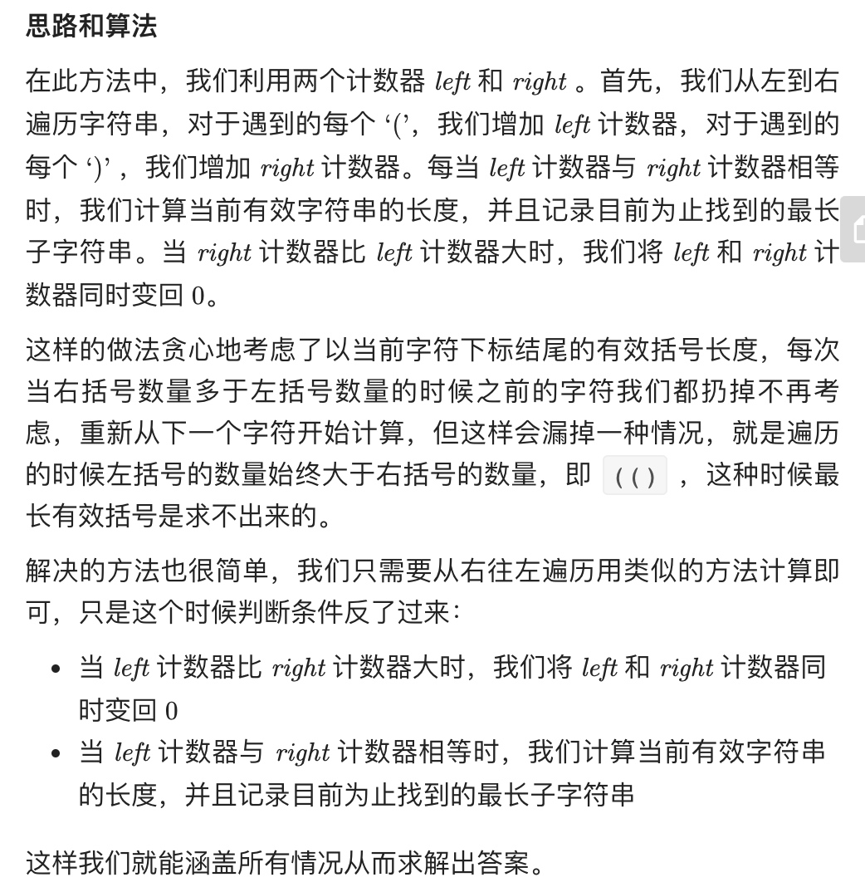

#### 利用栈 ***

> 通过栈，我们可以在遍历给定字符串的过程中去判断到目前为止扫描的子串的有效性，同时能得到最长有效括号的长度。
> 具体做法是我们始终保持栈底元素为当前已经遍历过的元素中「最后一个没有被匹配的右括号的下标」，这样的做法主要是考虑了边界条件的处理，栈里其他元素维护左括号的下标：

* 对于遇到的每个 ‘(’ ，我们将它的下标放入栈中
* 对于遇到的每个 ‘)’ ，我们先弹出栈顶元素表示匹配了当前右括号：
  * 如果栈为空，说明当前的右括号为没有被匹配的右括号，我们将其下标放入栈中来更新我们之前提到的「最后一个没有被匹配的右括号的下标」
  * 如果栈不为空，当前右括号的下标减去栈顶元素即为「以该右括号为结尾的最长有效括号的长度」

> 我们从前往后遍历字符串并更新答案即可。
> 需要注意的是，如果一开始栈为空，第一个字符为左括号的时候我们会将其放入栈中，这样就不满足提及的「最后一个没有被匹配的右括号的下标」，为了保持统一，我们在一开始的时候往栈中放入一个值为 -1−1 的元素。

拜服
【反思】之前 020 就用栈判断了是否为有效的括号序列，但之前想的是：入栈的都是左括号/右括号。现在回想起来，入栈的永远只有左括号，而**栈的高度恰好反映了左括号比右括号多多少**。另外没想到的是，与其只入栈没有意义的左括号符号，**栈的元素还可以用来记录该括号的位置信息**，也就是「通过栈，我们可以在遍历给定字符串的过程中去判断到目前为止扫描的子串的有效性，同时能得到最长有效括号的长度」。

```python
    def longestValidParentheses3(self, s: str) -> int:
        maxans = 0
        stack = [-1]    # 先入栈一个 -1
        for i, c in enumerate(s):
            if c == '(':
                stack.append(i)
            else:
                stack.pop()
                if not stack:
                    stack.append(i)
                else:
                    maxans = max(maxans, i-stack[-1])
        return maxans
```

#### DP算法

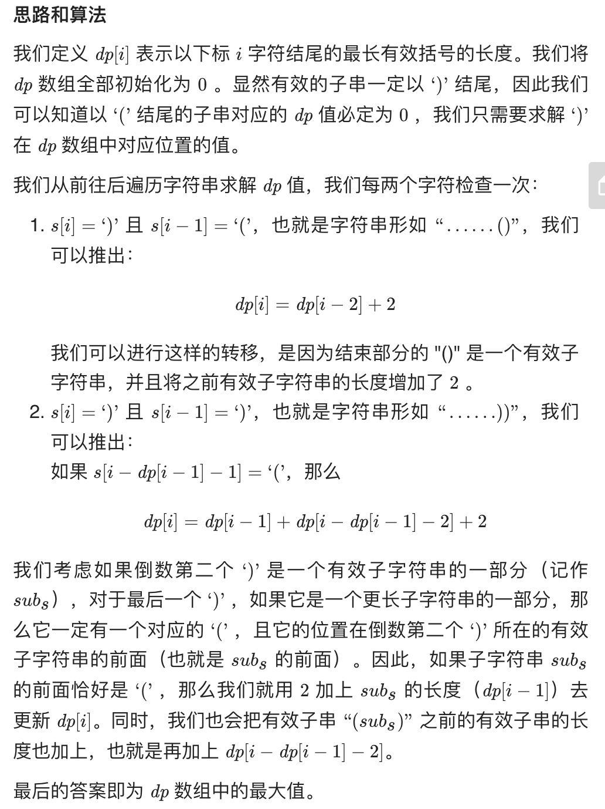

```python
    def longestValidParentheses4(self, s: str) -> int:
        dp = [0 for _ in range(len(s))]
        for i in range(1, len(s)):
            if s[i] == ')':
                if s[i-1] == '(':
                    dp[i] = (dp[i-2] if i>=2 else 0) + 2
                else:
                    if i-dp[i-1]>0 and s[i-dp[i-1]-1] == '(':
                        dp[i] = dp[i-1] + (dp[i - dp[i - 1] - 2] if i - dp[i - 1]>=2 else 0) + 2
        maxans = max(dp)
        return maxans
```

### 033 搜索旋转排序数组

```python
在升序数组中查找 target 复杂度为 O(log(n))
现在给的是发生了一次「旋转」的（原本升序）数组 nums，例如 [0,1,2,4,5,6,7] 在下标 3 处旋转 [4,5,6,7,0,1,2]
目标是在 nums 中进行检索
nums 中的每个值都 独一无二

输入：nums = [4,5,6,7,0,1,2], target = 0
输出：4

输入：nums = [4,5,6,7,0,1,2], target = 3
输出：-1
```

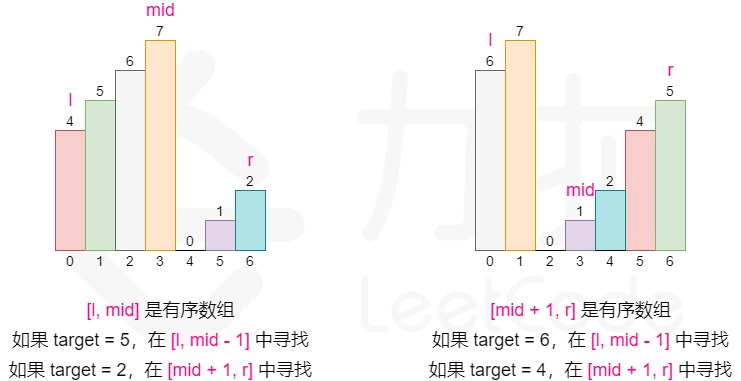

【二分查找】思路还是比较明确的，就是用二分法。在排序数组中的判断条件比较简单，而在这里，我们需要根据 （1）mid 左右两侧的数列哪一个是排序的哪一个是包含旋转点的；（2）target 和 旋转点的关系；（3）mid 和 target 的关系；这些信息进行判断。
例如，假设 target=5。
在左图中：target>nums[0]，说明要在从 nums[0] 开始的升序数列中查找；若此时 nums[mid]>nums[0] 说明 mid 左侧是升序序列；而 target<nums[mid]；综上，可以在 mid 左侧的升序序列中查找。
在右图中：target<nums[0]，说明要从 nums[n-1] 开始的逆序降序序列中查找；nums[mid]<nums[n-1] 说明 mid 右侧是逆序降序部分；而 target>nums[mid]；综上，可在 mid 右侧的逆序降序序列中查找。

#### 081 搜索旋转排序数组2 **

```python
假设按照升序排序的数组在预先未知的某个点上进行了旋转。
( 例如，数组[0,0,1,2,2,5,6]可能变为[2,5,6,0,0,1,2])。
编写一个函数来判断给定的目标值是否存在于数组中。若存在返回true，否则返回false。


这是 搜索旋转排序数组 的延伸题目，本题中的 nums  可能包含重复元素。【之前的 033 中元素的互不相同的】
这会影响到程序的时间复杂度吗？会有怎样的影响，为什么？


输入: nums = [2,5,6,0,0,1,2], target = 0
输出: true

输入: nums = [2,5,6,0,0,1,2], target = 3
输出: false
```

与前者不一样之处在于，若给定的数组 nums 的首末两元素相等，并且中间的元素也为此，那么就无法判断 target 是在哪一边了。
一个 naive 的判断方案就是，若出现 nums[0]==nums[-1] 的情况，则我们将末尾的与 nums[0] 相等的元素丢掉，这样，我们在判断数字在哪里发生「旋转/跳跃」的时候就和上一题类似了。
注意，由于出现了元素可能相等的情况，下面循环中的判定条件需要更为细致：我们规定 base 为首元素的值。
若 `nums[mid] >= base` 则说明 mid 左侧为上升段；
（1）那么在这种情况下，何时我们要更新 `right=mid-1`？答案是 `nums[left] <= target < nums[mid]`，左侧可取等号是因为，我们还没对 left 元素进行判断（**注意我们每次判断的元素都是 mid**）；
（2）否则，我们就可放心地更新 `left = mid + 1`
另外一种情况也类似。

```python
class Solution:
    def search(self, nums: List[int], target: int) -> bool:
        if not nums:
            return False
        while len(nums)>1 and nums[0] == nums[-1]:
            nums.pop()

        base = nums[0]

        left, right = 0, len(nums)-1
        while left <= right:
            mid = (left + right)//2
            if nums[mid] == target:
                return True
            if nums[mid] >= base:
                if nums[left] <= target < nums[mid]:
                    right = mid - 1
                else:
                    left = mid + 1
            else:
                if nums[mid] < target <= nums[right]:
                    left = mid + 1
                else:
                    right = mid - 1
        return False
```

### 034 在排序数组中查找元素的第一个和最后一个位置

```python
给定一个按照升序排列的整数数组 nums，和一个目标值 target。找出给定目标值在数组中的开始位置和结束位置。
如果数组中不存在目标值 target，返回[-1, -1]。

输入：nums = [5,7,7,8,8,10], target = 8
输出：[3,4]

输入：nums = [5,7,7,8,8,10], target = 6
输出：[-1,-1]
```

思路也是非常清楚的，比较容易想到的大概是先进行一次二分查找，若没有找到则直接返回 [-1,-1]；找到的话，在 [left, mid], [mid, right] 两个区间内分别再进行二分查找，找到最左侧和最右侧的 target。

#### 二分查找 ***

题号为 704

【二分查找】关于二分查找的检查条件

明确问题：有两指针 left, right（是未检查过的）目标为 target，每次进行检查的是 `pivot=(left+right)//2` （注意到当 right=left+1 时，pivot=left 指针重合）。根据 mid 指针和 target 的关系，更新 `left=pivot+1` 或 `right=pivot-1`。

**边界条件**：注意 right=left+1 时，pivot==left。
（1）若 nums[pivot]<target，则更新 left=pivot+1 （=right），此时 left=right，但 right 并未得以检查，再更新一次 pivot=right=left（因此可设计循环条件为 `left<=right`）；
（2）nums[pivot]<target，则更新 right=pivot-1 （<left），此时已全部检查完毕，`left<=right` 的循环条件也恰好不满足。
综上，循环条件为 `left<=right`，这是由 `pivot=(left+right)//2` 的计算公式和 `left=pivot+1` 或 `right=pivot-1` 这两条更新公式共同决定的。
另外，可以看到 pivot 可能会和 left 指针重合，而与 right 重合的唯一情况是 pivot=left=right，它是我们正在判断的位置，因此我之前用 mid 来命名其实是不太合适的。

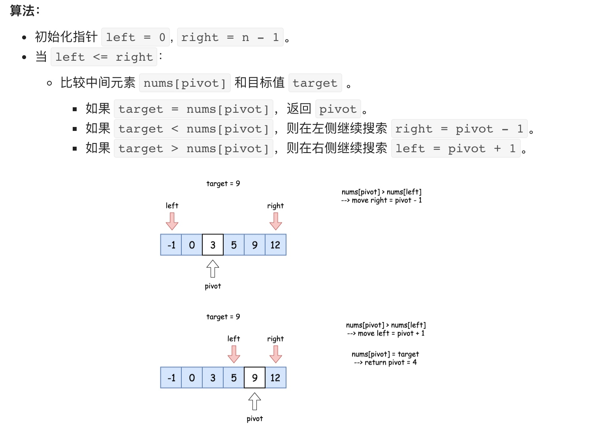

```Python
class Solution:
    def search(self, nums: List[int], target: int) -> int:
        left, right = 0, len(nums) - 1
        while left <= right:
            pivot = left + (right - left) // 2
            if nums[pivot] == target:
                return pivot
            if target < nums[pivot]:
                right = pivot - 1
            else:
                left = pivot + 1
        return -1
```

#### 034

回到 034，我这里相当于用了三次二分查找。注意 `find_most_left`, （或 `find_most_right`） 由于是要找到最左的一个 target，我又用了一个 most_left 指针。在 👆论述的边界条件下，left, right 指针最后是均会被检查到的，因此可放心地更新为 `mid + 1` 和 `mid - 1`。
【代码复用】标答为了简化代码，将我这里的两个函数进行了整合。函数目标是找到第一个大于或小于 target 的数的位置（利用一个参数 `lower` 来标识是什么任务）。

```python
class Solution:
    def searchRange(self, nums: List[int], target: int) -> List[int]:
        def find_most_left(left, right):
            most_left = right
            while left<=right:
                mid = (left+right)//2
                if nums[mid]==target:
                    most_left = mid
                    right = mid - 1
                else:
                    left = mid + 1
            return most_left
        def find_most_right(left, right):
            most_right = left
            while left<=right:
                mid = (left+right)//2
                if nums[mid]==target:
                    most_right = mid
                    left = mid + 1
                else:
                    right = mid-1
            return most_right

        left, right = 0, len(nums)-1
        while left <= right:
            mid = (right+left)//2
            if nums[mid]==target:
                left_ = find_most_left(left, mid)
                right_ = find_most_right(mid, right)
                return [left_, right_]
            elif nums[mid]<target:
                left = mid+1
            else:
                right = mid-1
        return [-1, -1]
```

#### 035 搜索插入位置

```python
给定一个排序数组和一个目标值，在数组中找到目标值，并返回其索引。如果目标值不存在于数组中，返回它将会被按顺序插入的位置。
你可以假设数组中无重复元素。
```

【思路一】还多了一个条件：当查找失败时需要返回待插入的位置。也就是 `nums[pos-1]<target<=num[pos]`，而在标准二分查找时则为 `target=num[pos]`，整合：在数组中找到第一个满足 `target<=num[pos]` 的 pos。
【思路二】分析标准二分查找边界情况（初始状态）：left=right-1, pivot=left
（1）nums[pivot]>target，也就是说 left right 均比 target 大，因此插入位置应为 `left`。而更新结果 right=pivot-1=left-1, left=left=left【这里第一个等号是更新公式；最右边的 left 是指初始状态下的 left】
（2）nums[pivot]<target，此时插入位置为 `right`。更新 right=right, left=pivot+1=right。在下一轮中，pivot=left=right，更新结果 right=pivot-1=right-1, left=left=right
观察上面的最终结果，left 都指向了待插入的位置。
综上，可以在二分查找框架不变的情况下，将未找到时的输出从 -1 改为left。

### 037 解数独

【思路】简单的递归，尝试求解。
👇自己的实现中，通过 `get_potential_values(r, c)` 搜索 (r,c) 位置可能填入的数字；`find_first_empty(r,c)` 找到 (r,c) 之后第一个为空的位置。基于这两个辅助函数进行递归
需要注意的地方是当递归（DFS）失败，需要将目前填入的数字清除。这里检查是否失败的条件是新的空格处是否不能填入任何数字，并 return False 表示失败；相应地，检查尝试成功时需要 return True，检查成功是基于 find_first_empty(r,c) 传回空，也就是全部填满了。
根据递归调用传回的值，在 `for potential in potentials:` 这条循环语句中，逻辑是：若返回成功则直接返回；若返回的失败信号，则先将这个位置清除。

```python
class Solution:
    def solveSudoku(self, board: List[List[str]]) -> None:
        """
        Do not return anything, modify board in-place instead.
        """

        def get_potential_values(r, c):
            potentials = set("123456789")
            row = board[r]
            potentials = potentials - set(row)
            col = [board[i][c] for i in range(9)]
            potentials = potentials - set(col)
            sub_r = r//3*3
            sub_c = c//3*3
            sub_board = [board[i][j] for i in range(sub_r, sub_r+3) for j in range(sub_c, sub_c+3)]
            potentials -= set(sub_board)
            return potentials
        # print(get_potential_values(0,3))

        def find_first_empty(r,c):
            # 从 (r,c) 坐标开始找到第一个非空点
            for col in range(c, 9):
                if board[r][col] == '.':
                    return r, col
            for row in range(r+1, 9):
                for col in range(9):
                    if board[row][col] == ".":
                        return row, col
            return -1, -1

        def backtrack(c, r):
            newr, newc = find_first_empty(c, r)
            if newc == newr == -1:
                # 没有待填空格，说明已成功
                return True
            potentials = get_potential_values(newr, newc)
            if not potentials:
                # 没有符合要求的了数可填入，需要将 (c,r) 处的尝试删去 ---（1）
                return False
            for potential in potentials:
                board[newr][newc] = potential
                res = backtrack(newr, newc)
                # 接收（1）处传来的尝试结果，若尝试失败则清除尝试填入的数字
                if not res:
                    board[newr][newc] = '.'
                else:
                    return res  # 若成功则直接回传

        backtrack(0, 0)
```

### 038 外观数列

```python
1.     1
2.     11
3.     21
4.     1211
5.     111221
第一项是数字 1
描述前一项，这个数是 1 即 “ 一 个 1 ”，记作 "11"
描述前一项，这个数是 11 即 “ 二 个 1 ” ，记作 "21"
描述前一项，这个数是 21 即 “ 一 个 2 + 一 个 1 ” ，记作 "1211"
描述前一项，这个数是 1211 即 “ 一 个 1 + 一 个 2 + 二 个 1 ” ，记作 "111221"

输入：n = 1
输出："1"
解释：这是一个基本样例。

输入：n = 4
输出："1211"
解释：
countAndSay(1) = "1"
countAndSay(2) = 读 "1" = 一 个 1 = "11"
countAndSay(3) = 读 "11" = 二 个 1 = "21"
countAndSay(4) = 读 "21" = 一 个 2 + 一 个 1 = "12" + "11" = "1211"
```

简单题，题目其实无关紧要，只是用到一些小技巧

#### 哨兵

我们需要遍历整个数组，需要记录一个字符是否与前一个同（所以本质上就是双指针吧）
（1）这里用了 `pre=""` 进行初始化，相应在输出行 `says.append(str(count) + str(pre))` 前对 pre 指针是否为空进行判断。
（2）最后的一个字符无法被计入，为此可在字符串最后加上一个「哨兵」，仅用作填充，注意其需要和真正字符串末位不同。

```python
class Solution:
    def countAndSay(self, n: int) -> str:
        if n==1:
            return "1"

        namedstr = "1"

        def convert():
            nonlocal namedstr
            says = []
            pre = ''
            count = 1
            """
            一个有意思的小技巧：由于最后一个字符无法计数，加一个「哨兵」在最后
            """
            for c in namedstr + ' ':   
                if c==pre:
                    count += 1
                else:
                    if pre:
                        # 去除第一个空的 pre 字符
                        says.append(str(count) + str(pre))
                    pre = c
                    count = 1
            namedstr = "".join(says)

        for _ in range(n-1):
            convert()

        return namedstr
```

### 040 组合总和 2

#### 039 组合总和

```python
给定一个无重复元素的数组 candidates和一个目标数 target ，找出 candidates 中所有可以使数字和为 target的组合。
candidates 中的数字可以无限制重复被选取。

输入：candidates = [2,3,6,7], target = 7,
所求解集为：
[
  [7],
  [2,2,3]
]
```

【思路】DFS
这里的要求是可以重复使用数组中元素的，那么对于目前检索的 num，选取的数量 q 可以从 remainder//num 到 0 进行遍历，尝试加入并更新 remainder；然后递归检索。

```python
class Solution:
    def combinationSum(self, candidates: List[int], target: int) -> List[List[int]]:
        candidates.sort()
        combination = {}
        results = []

        def record():
            results.append([k for k, v in combination.items() for _ in range(v)])

        def backtrace(i, remains):
            if i == -1:
                return
            num = candidates[i]
            quiotient, _ = divmod(remains, num)

            for q in range(quiotient, -1, -1):
                new_remains = remains - q*num
                combination[num] = q
                if new_remains == 0:
                    record()
                else:
                    backtrace(i-1, new_remains)

        backtrace(len(candidates)-1, target)
        return results
```

#### 040

```python
输入: candidates = [10,1,2,7,6,1,5], target = 8,
所求解集为:
[
  [1, 7],
  [1, 2, 5],
  [2, 6],
  [1, 1, 6]
]
```

和上一题的区别是 candidates 中的数字可能重复，但只能用一次了。
也就是说每一个数字可能用到的次数有了上限。一开始想复杂了，但实际上只需要根据上一题的思路稍作改进：对于所检索的 num，选取的数量 q 从 min(remainder//num, count(num)) 到 0 进行遍历。

```python
class Solution:
    def combinationSum2(self, candidates: List[int], target: int) -> List[List[int]]:
        from collections import Counter
        sorted_nums = sorted(Counter(candidates).items())
        # 记录了(num, count)元组

        combination = {}
        results = []

        def record():
            results.append([k for k, v in combination.items() for _ in range(v)])

        def backtrace(i, remains):
            if i == -1:
                return
            num, count = sorted_nums[i]
            quiotient, _ = divmod(remains, num)

            for q in range(min(quiotient, count), -1, -1):
                new_remains = remains - q * num
                combination[num] = q
                if new_remains == 0:
                    record()
                else:
                    backtrace(i - 1, new_remains)

        backtrace(len(sorted_nums) - 1, target)
        return results
```

### 041 缺失的第一个正数 ***

```python
给你一个未排序的整数数组 nums ，请你找出其中没有出现的最小的正整数。

输入：nums = [3,4,-1,1]
输出：2

输入：nums = [7,8,9,11,12]
输出：1
```

如果本题没有额外的时空复杂度要求，那么就很容易实现：

* 我们可以将数组所有的数放入哈希表，随后从 1 开始依次枚举正整数，并判断其是否在哈希表中；
* 我们可以从 1 开始依次枚举正整数，并遍历数组，判断其是否在数组中。

如果数组的长度为 N，那么第一种做法的时间复杂度为 O(N)，空间复杂度为 O(N)；第二种做法的时间复杂度为 O(N^2)，空间复杂度为 O(1)。但它们都不满足时间复杂度为 O(N)O(N) 且空间复杂度为 O(1)。

「真正」满足时间复杂度为 O(N) 且空间复杂度为 O(1) 的算法是不存在的，但是我们可以退而求其次：**利用给定数组中的空间来存储一些状态**。也就是说，如果题目给定的数组是不可修改的，那么就不存在满足时空复杂度要求的算法；但如果我们可以修改给定的数组，那么是存在满足要求的算法的。

【思路】注意这里核心是「利用给定数组中的空间来存储一些状态」。而这需要避免丢失所关心的信息。利用到的一点：由于数组长度为 n，要找到第一个缺失正数，只有数组中值为 [1,n] 的元素才是有意义的。

* 方案一：将所有出现在 [1,n] 范围内的数字「归位」，即 nums[i-1]=i；这样第二次遍历仅需顺序找到不满足此公式的数即可。主要需要处理的可能需要多次进行交换的情况，要避免死循环。
* 方案二：用负数存储信息，先将所有数变为正数，利用不在 [1,n] 范围内的正数表示无关信息。第二次循环中将数组中所有出现在范围内的数字所在坐标的数变为负数（因此要知道原本的数需要加 abs），这样就利用了原本的数组存放了需要的信息。

```python
class Solution:
    # 想法是将所有出现在 [1,n] 范围内的数字「归位」，即 nums[i-1]=i；这样第二次遍历仅需顺序找到不满足此公式的数即可。
    # 需要注意的是所更换的数字需要二次交换，即对于第 i 位的 nums[i]=num，其指向的元素 nums[num-1] 仍是在 [1,n]，则需继续交换。注意避免死循环，即若 nums[num-1]=num，则不需要进行交换
    def firstMissingPositive(self, nums: List[int]) -> int:
        n = len(nums)

        for i in range(n):
            # num = nums[i]
            # # 若是 i 位置的元素 num<=n，则要将其放到 num 位置上，也即交换；
            # # 若交换的数字 nums[num] 仍然 <= 且在另外一个位置上，需要继续交换
            # while 0<num<=n and num!=i+1:
            #     num_to_swep = nums[num-1]
            #     if num_to_swep != num-1:    # 避免循环
            #         nums[num-1], nums[i] = num, num_to_swep
            #         num = num_to_swep
            #     else:
            #         break

            # 简化成一行
            # 需要在（1）nums[i] 属于 [1,n] 范围内；（2）nums[i]与其指向位置的值不相等时进行交换。其中第二点是为了避免死循环。
            while 0<nums[i]<=n and nums[nums[i]-1] != nums[i]:
                nums[nums[i] - 1], nums[i] = nums[i], nums[nums[i]-1]
        i = 0
        while i<n:
            if nums[i] != i+1:
                break
            i += 1
        return i+1

    # 用负数表示元素存在；为此，先将所有不在 [1,n] 范围内的数变为 n+1（或其他正数）；
    # 第二次遍历，将在 [1,n] 范围内的数字所对应的列表元素变为负数；
    # 第三次，找到第一个非负的就是所求
    def firstMissingPositive2(self, nums: List[int]) -> int:
        n = len(nums)
        for i in range(n):
            if nums[i] <= 0:
                nums[i] = n+1
        for i in range(n):
            if abs(nums[i]) <= n and nums[abs(nums[i])-1] > 0:
                nums[abs(nums[i]) - 1] *= -1
        for i in range(n):
            if nums[i] > 0:
                return i+1
        return n+1
```

### 042 接雨水

```python
给定 n 个非负整数表示每个宽度为 1 的柱子的高度图，计算按此排列的柱子，下雨之后能接多少雨水。

输入：height = [0,1,0,2,1,0,1,3,2,1,2,1]
输出：6
解释：上面是由数组 [0,1,0,2,1,0,1,3,2,1,2,1] 表示的高度图，在这种情况下，可以接 6 个单位的雨水（蓝色部分表示雨水）。
```

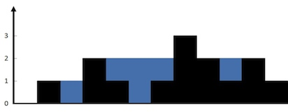

#### 双指针

双指针
与之前 011 很类似，自己有想过这个方向，轻易居然放弃了，不该。
思路就是左右双指针，每次移动其中较小的一个；同时**记录左侧和右侧的最高值**

这里有细节（可以避免一些麻烦，否则需要对  left_max, right_max 初始化）。例如在👇注释部分，若移动的是左指针，这说明此时 left_max < right_max !
这是因为，左右两个 max 指针是递增的，left_max < right_max满足时，left 始终指向这个最大值，直至左侧出现更高的柱子。

```python
    def trap3(self, height: List[int]) -> int:

        result = 0
        left, right = 0, len(height)-1
        left_max, right_max = 0, 0
        while left<right:
            if height[left] < height[right]:
                nex = left+1
                if height[nex] > left_max:
                    left_max = height[nex]
                else:
                    # 注意，若移动的是左指针，这说明此时 left_max < right_max !
                    # 因为左右两个 max 指针是递增的，left_max < right_max满足时，left 始终指向这个最大值，直至左侧出现更高的柱子
                    result += left_max - height[nex]
                left = nex
            else:
                nex = right-1
                if height[nex] > right_max:
                    right_max = height[nex]
                else:
                    result += right_max - height[nex]
                right = nex
        return result
```

#### 递减栈 ***

【递减栈】
从左向右搜索的过程中，我们要记录的其实是那些较高的柱子（的位置）。
若遇到了一些低洼部分，直接填平（累积到结果中）。
这里就用到了「递减栈」：记录了从左向右「向下的一个个台阶」的形状，若右侧出现了某个更高的柱子，可以将这些台阶按照一个个矩形的方式填充。

这里需要注意的是栈的修改情况：注意到，**遍历的每一个点都是会入栈的** —— 无论是较低的或者是最高的柱子。
若遇到等高的柱子怎么办？也是直接入栈，这个矩形面积的计算有关；
如何计算矩形面积？我们入栈的递减的柱子序号，若当前遍历的柱高 h>stack[-1]，说明可以积水
（1）pop 出左侧节点，从而得到的左侧节点的高度 left_height
（2）宽度计算为 i-stack[-1]-1
（3）而最大的高度为 min(h, height[stack[-1]]) - left_height
当遇到等高情况是，右侧的柱子 h>stack[-1] 始终满足，因此虽然第一次根据上式计算的面积为 0，但不影响最终结果。

```python
    def trap2(self, height: List[int]) -> int:
        stack = []
        n = len(height)
        result = 0
        for i in range(n):
            h = height[i]
            while stack and h > height[stack[-1]]:
                left_height = height[stack.pop()]
                if not stack:
                    break
                result += (min(h, height[stack[-1]]) - left_height) * (i-stack[-1]-1)
            stack.append(i)     # 入栈
        return result
```

#### 动态规划

考虑暴力计算每一点（宽度为 1）可能积水量 —— 取决于其左右两侧的最大高度中较低的一个。因此，暴力法可以依次遍历数组的每一个元素计算其积水量。
可以简化搜索左右最大高度的方式：分别左右搜索一次，记录到两个数组中。

```python
    def trap1(self, height: List[int]) -> int:
        n = len(height)
        max_from_left = [0 for _ in range(n)]
        max_from_right = [0 for _ in range(n)]
        highest = 0
        for i in range(n):
            if height[i] > highest:
                highest = height[i]
            max_from_left[i] = highest
        highest = 0
        for i in range(n-1, -1, -1):
            if height[i] > highest:
                highest = height[i]
            max_from_right[i] = highest
        waters = [min(max_from_right[i], max_from_left[i])-height[i] for i in range(n)]
        return sum(waters)
```

### 045 跳跃游戏 2

```python
给定一个非负整数数组，你最初位于数组的第一个位置。
数组中的每个元素代表你在该位置可以跳跃的最大长度。
你的目标是使用最少的跳跃次数到达数组的最后一个位置。

输入: [2,3,1,1,4]
输出: 2
解释: 跳到最后一个位置的最小跳跃数是 2。
    从下标为 0 跳到下标为 1 的位置，跳 1 ，然后跳 3 步到达数组的最后一个位置。
```

#### 贪心

如果我们「贪心」地进行正向查找，每次找到可到达的最远位置，就可以在线性时间内得到最少的跳跃次数。
例如，对于数组 [2,3,1,2,4,2,3]，初始位置是下标 0，从下标 0 出发，最远可到达下标 2。下标 0 可到达的位置中，下标 1 的值是 3，从下标 1 出发可以达到更远的位置，因此第一步到达下标 1。
从下标 1 出发，最远可到达下标 4。下标 1 可到达的位置中，下标 4 的值是 4 ，从下标 4 出发可以达到更远的位置，因此第二步到达下标 4。

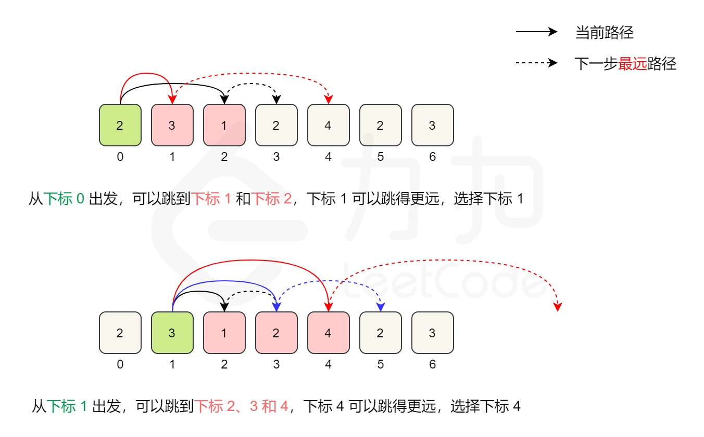

【思路】就是每次选择下一个结点时，同时考虑此时可以到达的节点和到达节点可以跳跃的长度（加起来维护一个可以到达的最远边界）；然后选择其中最大的即可。
没看答案之前用了 DFS 的想法，正是由于没考虑到达节点上的取值而出了问题。

```python
    def jump(self, nums: List[int]) -> int:
        # 贪心
        n = len(nums)
        steps = 0
        curr = 0

        while curr < n-1:
            max_hop_two = 0
            nex = 0
            for hop in range(nums[curr], 0, -1):
                if hop + curr >= n-1:
                    return steps+1
                if nums[curr+hop] + hop + curr >= n-1:
                    return steps+2
                if nums[curr+hop] + hop > max_hop_two:
                    max_hop_two = nums[curr+hop] + hop
                    nex = hop
            curr = curr + nex
            steps += 1
        return steps
```

#### 055 跳跃问题

某些格子的值换成了 0，要求是返回能否到达。

和上面的思路是一样的，也是贪心算法。放出下面的官答是因为其过于简洁……
直接用一个 rightmost 维护最远距离，因为不要求最少跳数，只用了一次 `for i in range(n):` 遍历整个数组，通过 `i <= rightmost` 的判断就给出了答案。

```python
    def canJump2(self, nums: List[int]) -> bool:
        n, rightmost = len(nums), 0
        for i in range(n):
            if i <= rightmost:
                rightmost = max(rightmost, i + nums[i])
                if rightmost >= n - 1:
                    return True
        return False
```

### 052 N 皇后 2

```python
返回 n 皇后解决方案的数量
```

#### 基于集合的回溯

在 051 返回 N 皇后的所有解一题中，自己原本是直接构建了 board 二维数组，然后写了 is_valid(r,c) 函数判断一个点是否有效。
但这样的效率较低，这里的思路是，**采用三个集合，来记录每一列/斜线位置是否已有皇后**。这样可以将 is_valid 判断减小复杂度到 O(1)。例如，注意到在同一个主对角线方向上的 row-col 值都相等，因此可将其值加入到 diagonal1 中，在检查的时候只需要判断新的行列差值是否在这个集合中。

【事实上，根据这一思路，对于 051 题返回 N 皇后所有解，**也不需要构建 board 二维数组**，均需要（1）用一个 cols 数组记录每一行的摆放位置；（2）用和这里一样的数据结构保存冲突信息。】

```python
class Solution:
    """
    采用三个集合，来记录每一列/斜线位置是否已有皇后。这样可以将 is_valid 判断减小复杂度到 O(1)
    注意，因为只需要输出综述，就不需要「棋盘」的概念了
    """
    def totalNQueens(self, n: int) -> int:
        columns = set()
        diagonal1 = set()
        diagonal2 = set()
        def dfs(row):
            # 说明 n 行全部填充成功
            if row == n:
                return 1
            else:
                count = 0
                for col in range(n):
                    if col in columns or row-col in diagonal1 or row+col in diagonal2:
                        continue
                    columns.add(col)
                    diagonal1.add(row-col)
                    diagonal2.add(row+col)
                    count += dfs(row+1)
                    columns.remove(col)
                    diagonal1.remove(row-col)
                    diagonal2.remove(row+col)
                return count
        return dfs(0)
```

#### 基于位运算的回溯

和采用集合法来记录的想法类似，不过这里用了仅仅一个数字，采用位运算来记录。
在递归遍历 row 的时候，我们用三个数字来记录列和两个对角线方向上，**下一行已被占用的位置**。例如，在检查第 2 行时，若 0 和 1 行的皇后位置如下图所示，则第 2 行由于三个方向的冲突而被占用的位置如下图的三个向量（所对应的数字）所示。

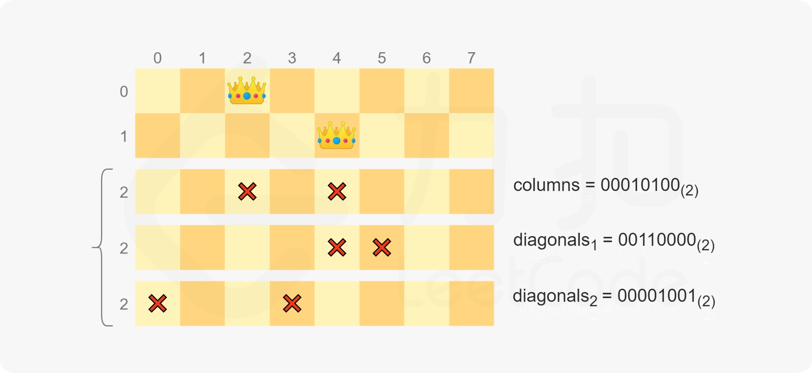

在更新行的时候，为了记录下一行被占用的情况，对于主对角线来说，仅需要加入当前行的限制，再将原本的限制整体左移一位即可，即 `(diagonal1|position)>>1`。
最终所有可能的皇后摆放位置可由 `availavle_positions = ((1<<n)-1) & (~(columnes | diagonal1 | diagonal2))` 表示。

为了得到其中的为一个可放位置（同样是二进制表示）（例如，位置表示为 `0001001`，则我们分别希望得到 `0000001` 和 `0001000`），题解又有个骚操作：

* 每次用 `x & (-x)` 得到最低位的二进制表示（注意负数为取反加一，因此 x & (-x) 唯一非零位为 x 从左到右第一个非零位）；
* 用 `x = x & (x-1)` 将 x 最低非零位置零（假设 x 的第 n 位为最右的非零位，注意到 x-1 与 x 的前 n-1 位相同而 n 位为零）；

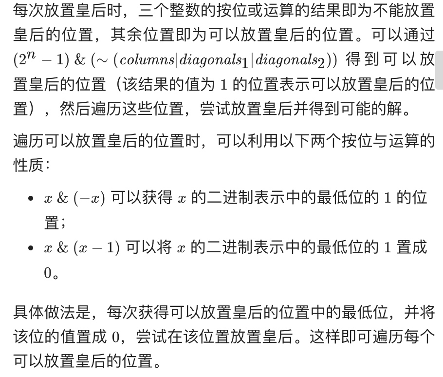

```python
    def totalNQueens2(self, n: int) -> int:
        def solve(row, columnes, diagonal1, diagonal2):
            if row == n:
                return 1
            else:
                count = 0
                availavle_positions = ((1<<n)-1) & (~(columnes | diagonal1 | diagonal2))
                while availavle_positions:
                    position = availavle_positions & (-availavle_positions)
                    availavle_positions = availavle_positions & (availavle_positions-1)
                    count += solve(row+1, columnes|position, (diagonal1|position)<<1, (diagonal2|position)>>1)
                return count
        return solve(0, 0, 0, 0)
```

### 053 最大子序列求和

```python
给定一个整数数组 nums，找出其中具有最大和的连续自数组，返回最大和

输入：nums = [-2,1,-3,4,-1,2,1,-5,4]
输出：6
解释：连续子数组 [4,-1,2,1] 的和最大，为 6 。
```

#### 基于 DP

一开始想了乱七八糟的方式，结果走不通。
这种题型 DP 肯定是可解的，但一直没想到该如何设计。
或者说，如何简化问题，使得子问题的递归较为简单。
【核心思路】dp 记录「以 i 元素结尾的最大和」，然后返回 max(dp) 即可。
相应的，更新公式：`dp[i] = max(dp[i-1]+nums[i], nums[i])`，DP 的精髓即在此。

```python
class Solution:
    """
    dp 记录「以 i 元素结尾的最大和」，然后返回 max(dp) 即可
    更新公式：dp[i] = max(dp[i-1]+nums[i], nums[i])
    """
    def maxSubArray(self, nums: List[int]) -> int:
        dp = [0 for _ in range(len(nums))]
        dp[0] = nums[0]
        for i in range(1, len(nums)):
            dp[i] = max(dp[i-1]+nums[i], nums[i])
        return max(dp)
    """
    上述空间复杂度为 O(N)
    事实上由于更新 dp 过程中仅需要前一个元素即可，而 max 操作也可分步进行，因此可将其减少为 O(1)
    「滚动数组」
    """

    def maxSubArray2(self, nums: List[int]) -> int:
        pre = 0
        max_temp = nums[0]
        for num in nums:
            pre = max(pre+num, num)
            max_temp = max(max_temp, pre)
        return max_temp
```

#### 基于线段树/分治

分治思想，维护以下四个变量，更新公式还是较为显然的。

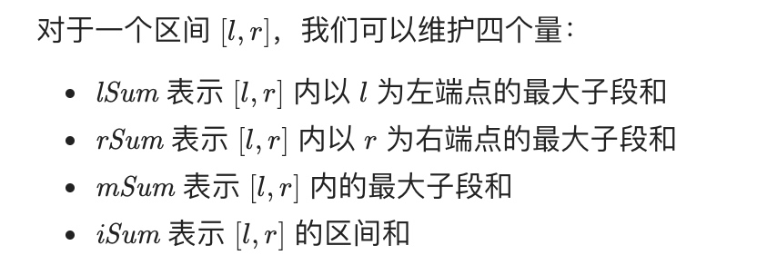

「方法二」相较于「方法一」来说，时间复杂度相同，但是因为使用了递归，并且维护了四个信息的结构体，运行的时间略长，空间复杂度也不如方法一优秀，而且难以理解。那么这种方法存在的意义是什么呢？

对于这道题而言，确实是如此的。但是仔细观察「方法二」，它不仅可以解决区间 [0, n-1][0,n−1]，还可以用于解决任意的子区间 [l,r][l,r] 的问题。如果我们把 [0, n-1][0,n−1] 分治下去出现的所有子区间的信息都用堆式存储的方式记忆化下来，即建成一颗真正的树之后，我们就可以在 O(\log n)O(logn) 的时间内求到任意区间内的答案，我们甚至可以修改序列中的值，做一些简单的维护，之后仍然可以在 O(\log n)O(logn) 的时间内求到任意区间内的答案，对于大规模查询的情况下，这种方法的优势便体现了出来。这棵树就是上文提及的一种神奇的数据结构——线段树。

### 054 螺旋数组

```python
给定一个矩阵，按照顺时针方式返回每一个元素

输入：matrix = [[1,2,3],[4,5,6],[7,8,9]]
输出：[1,2,3,6,9,8,7,4,5]
```

难度中等，但是有一些技巧可简化判断。
【naive】我直接想到的是用 direction 数字变量存储目前的方向，然后用 limit[] 这个长度为 4 的数组存储每个方向的最远距离。这样总体的效率其实挺高，但是代码比较冗长，边界判断复杂。
【思路一】用一个和原矩阵大小相等的 visited 记录是否已访问，并且由于我们已知矩阵大小，因此可用 `for i in range(total)` 遍历输出。另外用可 `directions = [[0, 1], [1, 0], [0, -1], [-1, 0]]` 和 directionIndex 变量辅助方向的更新。
这一思路代码实现较为简洁，问题在于 visited 空间开销。
【思路二】在我的方案中，需要对于每一个方向进行判断，而这里的思路是简化为**每次循环一圈**。为此，维护 `left, right, top, bottom = 0, columns - 1, 0, rows - 1` 四个变量。
如何解决最后只剩下一行/一列的问题？注意到向右和向下的遍历操作始终是合法的，而向左和向上的遍历，在 `left < right and top < bottom` 的条件下是需要的。

```python
while left <= right and top <= bottom:
    for column in range(left, right + 1):
        order.append(matrix[top][column])
    for row in range(top + 1, bottom + 1):
        order.append(matrix[row][right])
    if left < right and top < bottom:
        for column in range(right - 1, left, -1):
            order.append(matrix[bottom][column])
        for row in range(bottom, top, -1):
            order.append(matrix[row][left])
    left, right, top, bottom = left + 1, right - 1, top + 1, bottom - 1
```

### 056 合并区间

```python
以数组 intervals 表示若干个区间的集合，其中单个区间为 intervals[i] = [starti, endi] 。请你合并所有重叠的区间，并返回一个不重叠的区间数组，该数组需恰好覆盖输入中的所有区间。

输入：intervals = [[1,3],[2,6],[8,10],[15,18]]
输出：[[1,6],[8,10],[15,18]]
解释：区间 [1,3] 和 [2,6] 重叠, 将它们合并为 [1,6].
```

【思路】再次被官答蹂躏……首先是**排序**，事先对数组进行排序可以简化操作。
注意到排序过后，只需要一次对相邻的两个区间合并即可；也即，不可能出现 i 和 i+1 不能合并但是与 i+2 有交集的情况。因此此时的条件是 i.right>=(i+2).left, i.right<(i+1).left 与排序条件违背。

```python
    def merge2(self, intervals: List[List[int]]) -> List[List[int]]:
        intervals.sort(key=lambda x: x[0])
        merged = []
        for interval in intervals:
            # 如果列表为空，或者当前区间与上一区间不重合，直接添加
            if not merged or merged[-1][1] < interval[0]:
                merged.append(interval)
            else:
                # 否则的话，我们就可以与上一区间进行合并
                merged[-1][1] = max(merged[-1][1], interval[1])
        return merged
```

#### 057 插入区间

```python
给你一个 无重叠的 ，按照区间起始端点排序的区间列表。
在列表中插入一个新的区间，你需要确保列表中的区间仍然有序且不重叠（如果有必要的话，可以合并区间）。

输入：intervals = [[1,2],[3,5],[6,7],[8,10],[12,16]], newInterval = [4,8]
输出：[[1,2],[3,10],[12,16]]
解释：这是因为新的区间 [4,8] 与 [3,5],[6,7],[8,10] 重叠。
```

难度中等，但如果走偏了的话需要考虑的情况非常复杂，代码容易混乱。
另外，和上一题其实没太多关联。

之前一直纠结于不使用额外的空间存储结果……结果尝试了两种方案都失败（很难考虑周全）。于是照着答案写了一份。核心思路是对于 [left, right] 和队列中的每一个 [li, ri] 进行是否重叠的判断：若 ri<left 或 li>right 则两区间是不重叠的，将 [li, ri] 加入结果集即可，否则更新 `left = min(left, li); right = max(right, ri)` 继续遍历。

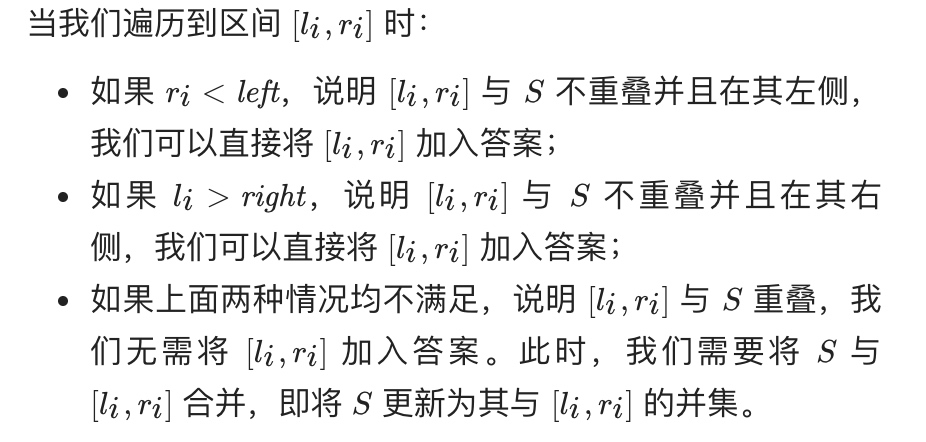

```python
    def insert(self, intervals: List[List[int]], newInterval: List[int]) -> List[List[int]]:
        left, right = newInterval
        placed = False
        ans = []
        for li, ri in intervals:
            if li > right:
                if not placed:
                    ans.append([left, right])
                    placed = True
                ans.append([li, ri])
            elif ri < left:
                ans.append([li, ri])
            else:
                left = min(left, li)
                right = max(right, ri)
        if not placed:
            ans.append([left, right])
        return ans
```

### 067 最小覆盖子串

```python
给你一个字符串 s 、一个字符串 t 。返回 s 中涵盖 t 所有字符的最小子串。如果 s 中不存在涵盖 t 所有字符的子串，则返回空字符串 "" 。
注意：如果 s 中存在这样的子串，我们保证它是唯一的答案。
s 和 t 由英文字母组成

输入：s = "ADOBECODEBANC", t = "ABC"
输出："BANC"

输入：s = "a", t = "a"
输出："a"
```

注意到，这里的题目要求是 s 中的子串覆盖 t 中的所有字符，同一个字母出现多次则要均覆盖才可。
原本以为是二分查找的题目：left 是 t 的长度，而 right 是 s 的长度，实现一个 `search(k)` 函数来判断 s 中是否存在长为 k 的子串可覆盖 t。
实现如下。注意其中二分查找的思路：**保持 right 为搜索成功的 k 再加一；保持 left 为搜索失败的k**，但这时要注意，计算的 mid 应该是 left right 中靠右的。

```python
    def minWindow(self, s: str, t: str) -> str:
        if len(s) < len(t):
            return ''

        from collections import Counter
        t_dict = Counter(t)

        def search(k):
            # 检查是否
            keys = t_dict.keys()
            start = [c for c in s[:k] if c in keys]
            now = dict(t_dict)
            for c in start:
                now[c] -= 1
            def test():
                return all([v<=0 for v in now.values()])
            if test():
                return 0
            for i in range(k, len(s)):
                if s[i] in keys:
                    now[s[i]] -= 1
                if s[i-k] in keys:
                    now[s[i-k]] += 1
                if test():
                    return i-k+1
            return -1

        # 二分搜索，和上面一样
        left, right = len(t)-1, len(s)
        while left != right:
            mid = left + (right-left)//2
            if (right-left) % 2:
                mid += 1
            res = search(mid)
            if res == -1:
                left = mid
            else:
                right = mid - 1
        if right == len(s):
            return ''
        k = right + 1
        res = search(k)
        return s[res: res+k]
```

#### 方法一：滑动窗口

官答给了更为精巧的解法：我们可以用滑动窗口的思想解决这个问题。在滑动窗口类型的问题中都会有两个指针，一个用于「延伸」现有窗口的 r 指针，和一个用于「收缩」窗口的 l 指针。在任意时刻，只有一个指针运动，而另一个保持静止。我们在 s 上滑动窗口，通过移动 r 指针不断扩张窗口。当窗口包含 t 全部所需的字符后，如果能收缩，我们就收缩窗口直到得到最小窗口。

【思路】也即，维护两个指针 left right

1. 每次先移动 right 找到可满足的地方；
2. 然后移动 left 指针，直到 left 指向最后一个可满足的地方，则此时 [left, right] 之间是一个可能的最小子串；
    * 在右移 left，此时不满足左右指针之间的子串可覆盖 t，回到步骤（1）中搜索 right；

实现如下，有点冗杂，有机会再优化。

```python
def minWindow2(self, s: str, t: str) -> str:

        from collections import Counter
        target = Counter(t)
        keys = target.keys()
        now = dict(target)
        def check():
            return all([v<=0 for v in now.values()])

        l = 0
        r = -1
        ansLen = float('inf')
        ansL, ansR = -1, -1
        while r < len(s)-1:
            r += 1
            if s[r] in keys:
                now[s[r]] -= 1

            while check() and l<=r:
                if r-l+1<ansLen:
                    ansLen = r-l+1
                    ansL = l
                if s[l] in keys:
                    now[s[l]] += 1
                l += 1
        if ansL == -1:
            return ""
        else:
            return s[ansL: ansL+ansLen]
```

## 二进制

#### 067 二进制求和

题目无关紧要了，反正就是要求不用加减乘除实现两个数的加法运算。

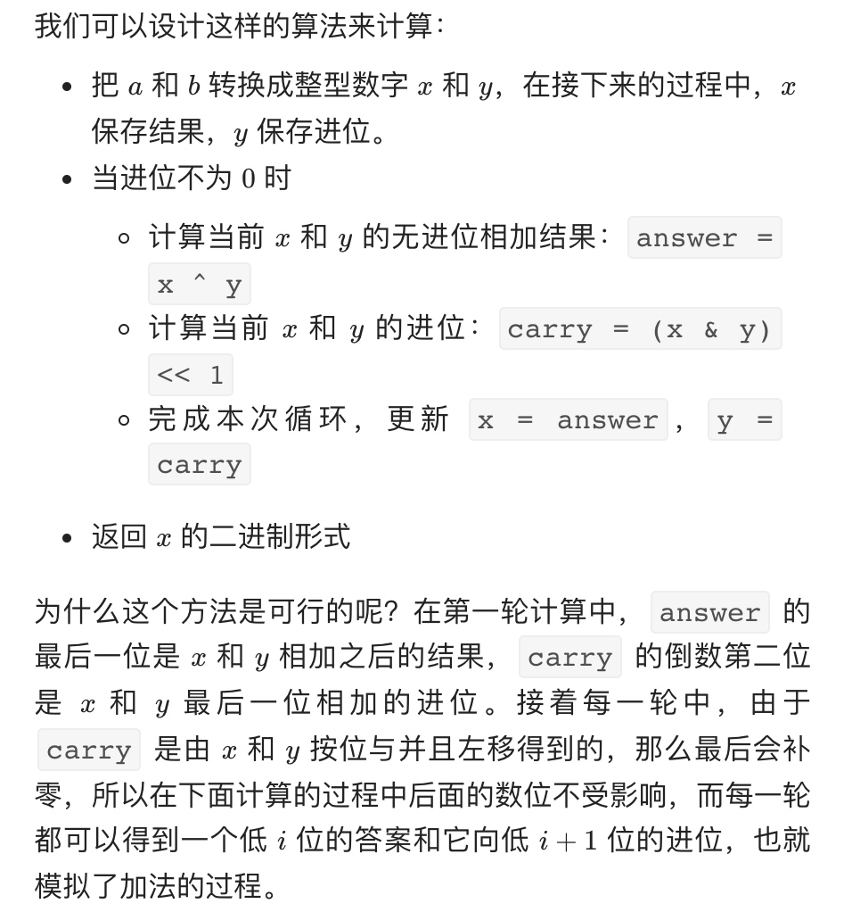

```python
    def addBinary2(self, a, b):
        x, y = int(a, 2), int(b, 2)
        while y:
            answer = x^y
            carry = (x & y) << 2
            x, y = answer, carry
        return bin(x)[2:]       # 注意 bin 返回的是形如 '0b100010' 的字符串
```

#### 137 只出现一次的数字 2 ***

```python
给定一个非空整数数组，除了某个元素只出现一次以外，其余每个元素均出现了三次。找出那个只出现了一次的元素。
说明：
你的算法应该具有线性时间复杂度。 你可以不使用额外空间来实现吗？

输入: [0,1,0,1,0,1,99]
输出: 99
```

答案给了三种解法，前面的两种基于 hashSet 和 hashMap 是比较好理解的。
后面用了位运算来记录……

为了区分出现一次的数字和出现三次的数字，使用两个位掩码：seen_once 和 seen_twice。
思路是：

* 仅当 seen_twice 未变时，改变 seen_once。
* 仅当 seen_once 未变时，改变seen_twice。

位掩码 seen_once 仅保留出现一次的数字，不保留出现三次的数字。

```python
seen_once = ~seen_twice & (seen_once ^ num)
seen_twice = ~seen_once & (seen_twice ^ num)
```

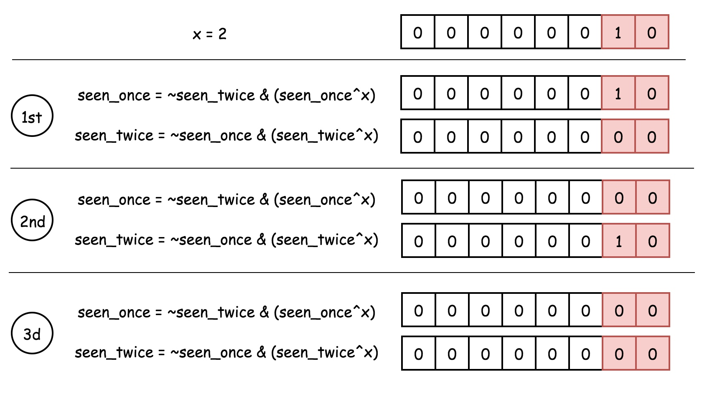

【思路】只能说给出一个大致的解释：我们知道 `(x^num^num)=x` ，也就是异或运算天然地可以消除连续两个数字的影响。而这里的思路是用了另一个掩码来记录出现两次的情况。
简化起见假设 seen_twice 为空而 seen_once 中已保存 num（以及一些其他的数字）
（1）对更新式 `seen_once = ~seen_twice & (seen_once ^ num)`，则 `seen_once ^ num` 将把 seen_one 中的相应位数字反转；
（2）`seen_twice = ~seen_once & (seen_twice ^ num)` 中，seen_twice ^ num = num （假设前者为空），再利用一次与操作将 seen_once 与 num 有关相关位记录到 seen_twice 掩码上去。

```python
class Solution:
    # 方法一：HashSet
    def singleNumber(self, nums):
        return (3 * sum(set(nums)) - sum(nums)) // 2

    # 方法二：HashMap
    def singleNumber2(self, nums):
        from collections import Counter
        counter = Counter(nums)
        for k, v in counter.items():
            if v==1:
                return k

    # 方法三：位运算符：NOT，AND 和 XOR
    def singleNumber3(self, nums):
        seen_once, seen_twice = 0, 0
        for num in nums:
            seen_once = ~seen_twice & (seen_once ^ num)
            seen_twice = ~seen_once & (seen_twice ^ num)
        return seen_once
```

#### 260 只出现一次的数字3

```python
给定一个整数数组 nums，其中恰好有两个元素只出现一次，其余所有元素均出现两次。 
找出只出现一次的那两个元素。你可以按 任意顺序 返回答案。


输入：nums = [1,2,1,3,2,5]
输出：[3,5]
解释：[5, 3] 也是有效的答案。
```

我们希望进行分组，使得：（1）两只出现一次的元素出现在不同组；（2）出现两次的元组都出现的一个组中。
为此，先对所有数字异或，例如将结果记为 ret = xi,...,x2,x1,x0 注意到其为 1 的位的含义：说明两个只出现一次的数字 a 和 b 在这一位上不等。
因此，可任意找 ret 中取 1 的一个位，基于此将所有数分成两组。

```python
    def singleNumber2(self, nums: List[int]):
        import functools
        ret = functools.reduce(lambda x,y: x^y, nums)
        div = 1
        while div ^ ret ==0:
            div <<= 1
        a, b = 0, 0
        for n in nums:
            if n & div:
                a ^=n
            else:
                b ^= n
        return [a,b]
```

#### 187 重复的 DNA 序列

```python
所有 DNA 都由一系列缩写为 'A'，'C'，'G' 和 'T' 的核苷酸组成，例如："ACGAATTCCG"。在研究 DNA 时，识别 DNA 中的重复序列有时会对研究非常有帮助。
编写一个函数来找出所有目标子串，目标子串的长度为 10，且在 DNA 字符串 s 中出现次数超过一次。

输入：s = "AAAAACCCCCAAAAACCCCCCAAAAAGGGTTT"
输出：["AAAAACCCCC","CCCCCAAAAA"]

输入：s = "AAAAAAAAAAAAA"
输出：["AAAAAAAAAA"]
```

官方给出了三种思路

* 方法一：线性时间窗口切片 + HashSet。就是简单将出现的子串用字典存起来。这样所谓第 i 次「切片」就需要截取 [i:i+L] 部分的子串，也即线性时间复杂度。因此总复杂度为 O((N-L)L)
* 方法二：Rabin-Karp：使用旋转哈希实现常数时间窗口切片。将字符串采用 Rabin-Karp 编码（在 1044最长重复子串 中也用到），想法就是对于长 L 的子串每一位赋权，初始化第一个子串对应的值之后，每次滑动窗口更新增减的字母（所对应的数字）即可。
* 方法三：位操作：使用掩码实现常数时间窗口切片。注意到这里较为特殊：核苷酸序列仅由 'A'，'C'，'G'，'T' 组成，因此每个字符可采用二进制编码 00, 01, 10, 11，这样我们可以把长 L 的子串转化为长 2L 的 bit 串，滑动窗口时需要用位运算作相应更新。

例如，下面是官答中的更新方式：

```python
# left shift to free the last 2 bit
bitmask <<= 2
# add a new 2-bits number in the last two bits
bitmask |= nums[start + L - 1]
# unset first two bits: 2L-bit and (2L + 1)-bit
bitmask &= ~(3 << 2 * L)
```

先左移两位；在最低两位记录新出现的数字；注意现在的 bitmask 长度为 2L+2，利用 `bitmask &= ~(3 << 2 * L)` 将最高两位置零。

```python
class Solution:
    def findRepeatedDnaSequences(self, s: str) -> List[str]:
        L, n = 10, len(s)
        seen, output = set(), set()
        for start in range(n-L+1):
            tmp = s[start: start+L]
            if tmp in seen:
                output.add(tmp)
            seen.add(tmp)
        return list(output)


    def findRepeatedDnaSequences2(self, s: str) -> List[str]:
        L, n = 10, len(s)
        if n<=L:
            return []

        # rolling hash parameters: base a
        a = 4
        aL = pow(a, L)

        to_int = {'A': 0, 'C':1, 'G':2, 'T':3}
        nums = [to_int.get(c) for c in s]

        h = 0
        seen, output = set(), set()
        for start in range(n-L+1):
            if start != 0:
                # compute hash of the current sequence in O(1) time
                h = h*a - nums[start-1]*aL + nums[start+L-1]
            else:
                # compute hash of the first sequence in O(L) time
                for i in range(L):
                    h = h*a + nums[i]
            if h in seen:
                output.add(s[start: start+L-1])
            seen.add(h)
        return list(output)


    def findRepeatedDnaSequences3(self, s: str) -> List[str]:
        L, n = 10, len(s)
        if n <= L:
            return []

        # convert string to the array of 2-bits integers:
        # 00_2, 01_2, 10_2 or 11_2
        to_int = {'A': 0, 'C': 1, 'G': 2, 'T': 3}
        nums = [to_int.get(s[i]) for i in range(n)]

        bitmask = 0
        seen, output = set(), set()
        # iterate over all sequences of length L
        for start in range(n - L + 1):
            # compute bitmask of the sequence in O(1) time
            if start != 0:
                # left shift to free the last 2 bit
                bitmask <<= 2
                # add a new 2-bits number in the last two bits
                bitmask |= nums[start + L - 1]
                # unset first two bits: 2L-bit and (2L + 1)-bit
                bitmask &= ~(3 << 2 * L)
            # compute bitmask of the first sequence in O(L) time
            else:
                for i in range(L):
                    bitmask <<= 2
                    bitmask |= nums[i]
            if bitmask in seen:
                output.add(s[start:start + L])
            seen.add(bitmask)
        return list(output)
```

#### 318 最长单词长度乘积

```python
给定一个字符串数组words，找到length(word[i]) * length(word[j])的最大值，并且这两个单词不含有公共字母。你可以认为每个单词只包含小写字母。如果不存在这样的两个单词，返回 0。

输入: ["abcw","baz","foo","bar","xtfn","abcdef"]
输出: 16
解释: 这两个单词为 "abcw", "xtfn"。

输入: ["a","ab","abc","d","cd","bcd","abcd"]
输出: 4
解释: 这两个单词为 "ab", "cd"。

输入: ["a","aa","aaa","aaaa"]
输出: 0
解释: 不存在这样的两个单词。
```

官方给出了两种方法，都是基于两两比较的框架，即更新公式为 `max_len = max(max_len, len(words[i])*len(words[j]))`。下面从两个点分别进行了一定的优化。
（1）优化比较是否有重叠字符的函数 noCommonLetters。由于给定的字符串限定了所有字符均为小写字母，因此可用一个 32 位的二进制数保存出现的所有字母。这里所谓 「预计算」 就是先把所有的数字对应的二进制表示保存为和 words 等长的数组中。【为什么不用 hashmap？据说在 JAVA 中 hashmap 的优化比较差数组会快一些。】这样，两个 words 是否有相同字符的比较就转化为 `words_mask[i] & words_mask[j] == 0` 的判断。
（2）希望能减少比较的次数，例如 `aba`, `aabbbaaa` 两个字符串，显然有用的只有后者。因此，建立 「HashMap」，以每个 word 对应的二进制表示为 key，value 为这些词中长度最大的一个。

```python
class Solution:
    """
    方法一：优化的方法 noCommonLetters：位操作+预计算
    还是基于两两组合，选出最大值的框架，用了位运算来加速比较是否有交集。
    """
    def maxProduct(self, words: List[str]) -> int:
        char2num = lambda c: ord(c) - ord('a')

        def str2bitmask(s):
            s = set(s)
            bitmask = 0
            for c in s:
                bitmask |= 1<<char2num(c)
            return bitmask

        words_mask = [str2bitmask(s) for s in words]

        max_len = 0
        n = len(words)
        for i in range(n):
            for j in range(i+1, n):
                if words_mask[i] & words_mask[j] == 0:
                    max_len = max(max_len, len(words[i])*len(words[j]))

        return max_len

    """
    方法二：优化比较次数：位操作+预计算+HashMap
    """
    def maxProduct2(self, words: List[str]) -> int:
        char2num = lambda c: ord(c) - ord('a')

        def str2bitmask(s):
            s = set(s)
            bitmask = 0
            for c in s:
                bitmask |= 1<<char2num(c)
            return bitmask

        from collections import defaultdict
        hashmap = defaultdict(int)
        for w in words:
            mask = str2bitmask(w)
            hashmap[mask] = max(hashmap[mask], len(w))

        max_len = 0
        for x in hashmap:
            for y in hashmap:
                if x&y==0:
                    max_len = max(max_len, hashmap[x]*hashmap[y])
        return max_len
```

#### 421 数组中两个数的最大异或值 ***

```python
给定一个非空数组，数组中元素为 a0, a1, a2, … , an-1，其中 0 ≤ ai < 231。
找到 ai 和aj最大的异或 (XOR) 运算结果，其中0 ≤ i,j < n。
你能在O(n)的时间解决这个问题吗？

输入: [3, 10, 5, 25, 2, 8]
输出: 28
解释: 最大的结果是 5 ^ 25 = 28.
```

题目要求 O(N) 时间复杂度，下面会讨论两种典型的 O(N) 复杂度解法。

* 利用哈希集合存储按位前缀。
* 利用字典树存储按位前缀。

这两种解法背后的思想是一样的，都是先将整数转化成二进制形式，再从最左侧的比特位开始逐一处理来构建最大异或值。两个方法的不同点在于采用了不同的数据结构来存储按位前缀。第一个方法在给定的测试集下执行速度更快，但第二种方法更加普适，更加简单。

##### 方法一：利用哈希集合存储按位前缀

假设数组中最大长度二进制数为 L，则将所有数字表示为 L长二进制数，依次比较最左侧的数字：能否取到 1, 11, 111...
注意到，由于异或是不会进位的，因此若前三位最大能取到 110，则这一轮只需要检查任意两数前四位能否取到 1101，也即下面代码中的 `max_xor |= any(curr_xor^p in prefixed for p in prefixed)` 其中 prefixed 是所有数的前 i 位二进制数。

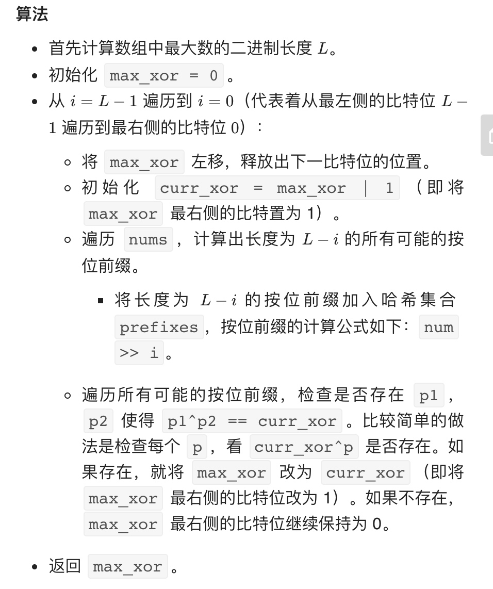

```python
class Solution:
    # 方法一：利用哈希集合存储按位前缀
    def findMaximumXOR(self, nums: List[int]) -> int:
        L = len(bin(max(nums)))-2
        max_xor = 0
        for i in range(L)[::-1]:
            max_xor <<= 1
            # max_xor 保存在前 i 个 bin 可能的最大与结果，则 max_xor <<= 1 是肯定取得到的
            # 接下来判断更新后的末位是否也可取 1，即 curr_xor = max_xor | 1 能否满足
            # 也即，在 prefixed 中是否存在 x,y 满足 x^y=curr_xor
            # 转化成 any(curr_xor^p in prefixed for p in prefixed) 这句代码判断是否满足
            curr_xor = max_xor | 1  # 将目前最后一位置为 1
            prefixed = {num>>i for num in nums}
            max_xor |= any(curr_xor^p in prefixed for p in prefixed)
        return max_xor
```

##### 方法二：逐位字典树 ***

另一种思路是用字典树的方式存储所有数字，这样检查数分支即相当于遍历了所有存储在 trie 中的数字。例如对于下面这棵 trie 来说，要检查与 25=0x11001 的最大异或，则各位的最好取值应该是 00110，基于 trie 从上向下，直至找到与目标最为接近的一个数。

另外，注意到一个数与自身的异或为 0，因此不影响结果。此外，可以**一边建立 trie 一边进行搜索**。

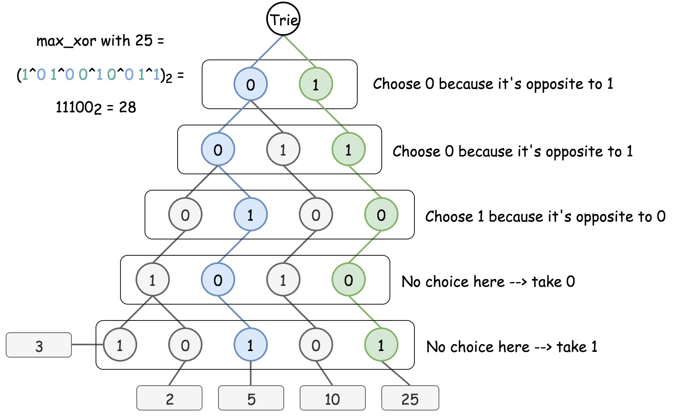

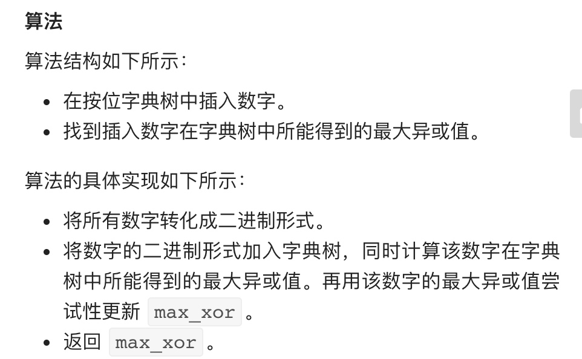

```python
    # 方法二：逐位字典树
    def findMaximumXOR2(self, nums: List[int]) -> int:
        L = len(bin(max(nums))) - 2
        nums = [[(x>>i)&1 for i in range(L)][::-1] for x in nums]

        # 构建字典树
        # trie = {}
        # for num in nums:
        #     node = trie
        #     for bit in num:
        #         if not bit in node:
        #             node[bit] = {}
        #         node = node[bit]
        max_xor = 0
        trie = {}
        for num in nums:
            node = trie
            xor_node = trie
            curr_xor = 0
            for bit in num:
                # 将新的数字插入字典树
                if not bit in node:
                    node[bit] = {}
                node = node[bit]

                # 试图查找当前位的相反位
                toggled_bit = 1-bit
                if toggled_bit in xor_node:
                    curr_xor = (curr_xor<<1) | 1
                    xor_node = xor_node[toggled_bit]
                else:
                    curr_xor = curr_xor<<1
                    xor_node = xor_node[bit]
            max_xor = max(max_xor, curr_xor)
        return max_xor
```

#### 1044-最长重复子串 ***

```python
给出一个字符串S，考虑其所有重复子串（S 的连续子串，出现两次或多次，可能会有重叠）。
返回任何具有最长可能长度的重复子串。（如果 S不含重复子串，那么答案为""。）

输入："banana"
输出："ana"

输入："abcd"
输出：""
```

##### Rabin-Karp + 二分查找

转化成两个子问题

* 从 1-N 中选取子串的长度 L
* 查看是否存在长度为 L 重复子串

（1）对于第一个问题，采用二分查找，注意这里的问题是**找到最大的存在重复子串的长度 L**
（2）检查是否有重复子串，采用经典的 **Rabin-Karp** 字符串编码，计算和更新公式如下

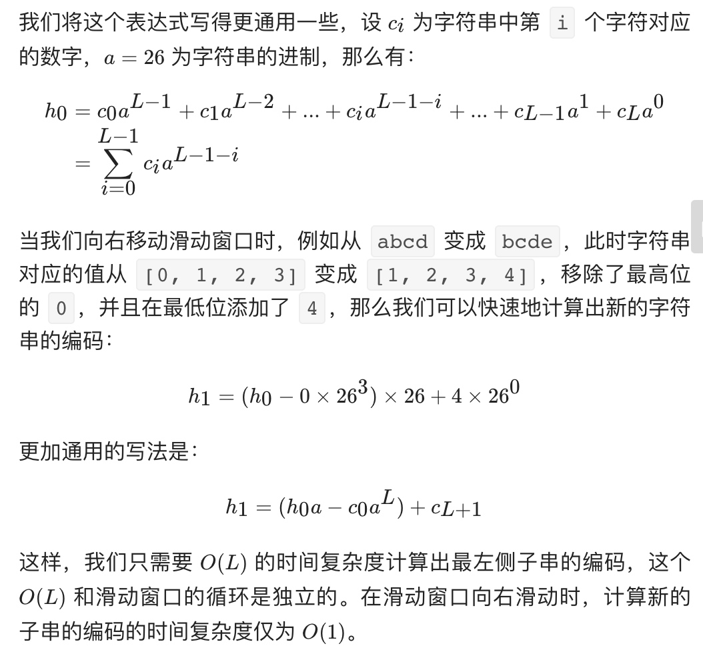

【另外，注意这里的二分查找公式。之前，包括在 [基础篇之二分查找(下)](https://aleej.com/2019/10/30/%E6%95%B0%E6%8D%AE%E7%BB%93%E6%9E%84%E4%B8%8E%E7%AE%97%E6%B3%95%E4%B9%8B%E7%BE%8E%E5%AD%A6%E4%B9%A0%E7%AC%94%E8%AE%B0/) 这里看到的二分查找公式的循环条件都是 left<=right，也就是当 left=right 的时候 mid=left=right 也会去判断。
而在这里，循环条件则是 `left!=right`，例如要检查 [1, n-1] 这些可能性，初始化 left, right = 1, n。之后每次检查成功后 `left = L + 1`，而失败则 `right = L`。也就是说，保证了「循环条件」 **left 左侧的元素都是成功的，而 right 及其左侧的元素都不可能**；这样，循环条件为 left right 相遇也就顺其自然了。最后，我们需要的，满足条件的最大数序号为 `left-1`。
考虑边界情况：（1）left+1=right，此时 mid=left，成功则右移 left 失败则左移 right，仍满足「循环条件」；（2）例如这里的 1 到 n-1 均满足，则 left=n，成立；（3）若均不满足，则最终 left=1，在此题中的含义就是最长重复子串长度为 0，这里没有特别处理，因为返回的 `S[start: start + left - 1]` 天然就是空字符串。】

【注】下面照抄的 [题解](https://leetcode-cn.com/problems/longest-duplicate-substring/solution/zui-chang-zhong-fu-zi-chuan-by-leetcode/) 居然过不了，因为**取模运算可能会出现冲突**。

> 在解决算法题时，我们只要判断两个编码是否相同，就表示它们对应的字符串是否相同。但在实际的应用场景中，会出现字符串不同但编码相同的情况，因此在实际场景中使用 Rabin-Karp 字符串编码时，推荐在编码相同时再对字符串进行比较，防止出现错误。

然后我在 `if h in seen: return start` 部分加了一个判断条件，结果居然超时了 —— 应该是出现冲突的概率较大？
最后，把参数 `a = 26, modulus = 2 ** 32`，例如去 `a=51, modulus = 2 ** 56` 居然就过了 hhhh

```python
class Solution:
    def search(self, L: int, a: int, modulus: int, n: int, nums: List[int]) -> int:
        """
        Rabin-Karp with polynomial rolling hash.
        Search a substring of given length
        that occurs at least 2 times.
        @return start position if the substring exits and -1 otherwise.
        """
        # compute the hash of string S[:L]
        h = 0
        for i in range(L):
            h = (h * a + nums[i]) % modulus

        # already seen hashes of strings of length L
        seen = {h}
        # const value to be used often : a**L % modulus
        aL = pow(a, L, modulus)
        for start in range(1, n - L + 1):
            # compute rolling hash in O(1) time
            h = (h * a - nums[start - 1] * aL + nums[start + L - 1]) % modulus
            if h in seen:
                return start
            seen.add(h)
        return -1

    def longestDupSubstring(self, S: str) -> str:
        n = len(S)
        # convert string to array of integers
        # to implement constant time slice
        nums = [ord(S[i]) - ord('a') for i in range(n)]
        # base value for the rolling hash function
        a = 26
        # modulus value for the rolling hash function to avoid overflow
        modulus = 2 ** 32

        # binary search, L = repeating string length
        left, right = 1, n
        while left != right:
            L = left + (right - left) // 2
            if self.search(L, a, modulus, n, nums) != -1:
                left = L + 1
            else:
                right = L

        start = self.search(left - 1, a, modulus, n, nums)
        return S[start: start + left - 1] if start != -1 else ""
```

## DP 动态规划

#### 072 编辑距离

给你两个单词word1 和word2，请你计算出将word1转换成word2 所使用的最少操作数。
你可以对一个单词进行如下三种操作：

* 插入一个字符
* 删除一个字符
* 替换一个字符

肯定是基于动态规划。因此要从前面的状态推算出 i,j 位置的值。
注意到，👆的三种操作，最多会改变 word 长度 1。
因此对于 dp[i,j] 来说，先判断 word1[i], words2[j] 是否相等，不相等的话，可以从 dp[i-1, j-1]+1, dp[i, j-1]+1, dp[i-1, j]+1 中递推过来。
若 word1[i], words2[j] 相等，除了 dp[i, j-1]+1, dp[i-1, j]+1 之外，一个更有可能的结果是 dp[i-1, j-1]。

```python
输入：word1 = "horse", word2 = "ros"
输出：3
解释：
horse -> rorse (将 'h' 替换为 'r')
rorse -> rose (删除 'r')
rose -> ros (删除 'e')

输入：word1 = "intention", word2 = "execution"
输出：5
解释：
intention -> inention (删除 't')
inention -> enention (将 'i' 替换为 'e')
enention -> exention (将 'n' 替换为 'x')
exention -> exection (将 'n' 替换为 'c')
exection -> execution (插入 'u')
```

```python
class Solution:
    def minDistance(self, word1: str, word2: str) -> int:
        n, m = len(word1), len(word2)
        dp = [[0]*(m+1) for _ in range(n+1)]
        for j in range(1, m+1):
            dp[0][j] = j
        for i in range(1, n+1):
            dp[i][0] = i
        for i in range(1, n+1):
            for j in range(1, m+1):
                if word2[j-1] == word1[i-1]:
                    dp[i][j] = min(dp[i-1][j-1], dp[i][j-1]+1, dp[i-1][j]+1)
                else:
                    dp[i][j] = min(dp[i - 1][j - 1], dp[i][j - 1], dp[i - 1][j]) + 1
        return dp[n][m]
```

## 二分查找

#### 073 搜索二维矩阵

```python
编写一个高效的算法来判断m x n矩阵中，是否存在一个目标值。该矩阵具有如下特性：

每行中的整数从左到右按升序排列。
每行的第一个整数大于前一行的最后一个整数。

输入：matrix = [[1,3,5,7],[10,11,16,20],[23,30,34,60]], target = 3
输出：true
```

就是将升序数组的搜索变成了二维矩阵形式，将 index 进行相应变化即可。

```python
class Solution:
    def searchMatrix(self, matrix: List[List[int]], target: int) -> bool:
        m, n = len(matrix), len(matrix[0])
        def listIndex2matrixIndes(i):
            quotient, remainder = divmod(i, n)
            return quotient, remainder
        left, right = 0, m*n-1
        while left <= right:
            mid = (left+right)//2
            i,j = listIndex2matrixIndes(mid)
            if matrix[i][j] == target:
                return True
            elif matrix[i][j] < target:
                left = mid+1
            else:
                right = mid-1
        return False
```

### 215 数组中第 k 大的元素

```python
在未排序的数组中找到第 k 个最大的元素。请注意，你需要找的是数组排序后的第 k 个最大的元素，而不是第 k 个不同的元素。

输入: [3,2,1,5,6,4] 和 k = 2
输出: 5

输入: [3,2,3,1,2,4,5,5,6] 和 k = 4
输出: 4
```

一道经典的面试题。

* 我之前第一想到的是维护一个大小为 k 的最大堆，这样的时间复杂度为 O(nlog(k))。
* 一个平均复杂度更低的是基于快排思想的：总而言之问题转化为需要找到排序后的数组中位置为 k 的元素。

注意👇代码技巧，`partition(l, r)` 完全是按照《算法导论》书上的，而 `randomSelect(l, r)` 则是引入了随机因素；而主要逻辑 `quickSecelt(l, r, k)` 其实非常简单就是一个二分搜索。

> 我们可以引入随机化来加速这个过程，它的时间代价的期望是 O(n)，证明过程可以参考「《算法导论》9.2：期望为线性的选择算法」。

#### 方法一：基于快速排序的选择方法

```python
    def findKthLargest2(self, nums: List[int], k: int) -> int:
        import random
        def partition(l, r):
            pivot = nums[r]
            i = l-1
            for j in range(l, r):
                if nums[j] <= pivot:
                    i += 1
                    nums[j], nums[i] = nums[i], nums[j]
            nums[i+1], nums[r] = nums[r], nums[i+1]
            return i+1
        def randomSelect(l, r):
            i = random.randint(l, r)
            nums[i], nums[r] = nums[r], nums[i]
            return partition(l, r)

        def quickSecelt(l, r, k):
            if l<r:
                q = randomSelect(l, r)
                if q==k:
                    return nums[q]
                if q<k:
                    return quickSecelt(q+1, r, k)
                else:
                    return quickSecelt(l, q-1, k)
        return quickSecelt(0, len(nums)-1, len(nums)-k)
```

#### 方法二：基于堆排序的选择方法

> 我们也可以使用堆排序来解决这个问题——建立一个大根堆，做 k - 1 次删除操作后堆顶元素就是我们要找的答案。在很多语言中，都有优先队列或者堆的的容器可以直接使用，但是在面试中，面试官更倾向于让更面试者自己实现一个堆。所以建议读者掌握这里大根堆的实现方法，在这道题中尤其要搞懂「建堆」、「调整」和「删除」的过程。
> 友情提醒：「堆排」在很多大公司的面试中都很常见，不了解的同学建议参考《算法导论》或者大家的数据结构教材，一定要学会这个知识点哦！^_^

```python
    def findKthLargest(self, nums: List[int], k: int) -> int:
        def maxHeapify(i, heapSize):
            l = i*2+1
            r = i*2+2
            largest = i

            if l<heapSize and nums[l]>nums[largest]:
                largest = l
            if r<heapSize and nums[r]>nums[largest]:
                largest = r
            if largest!=i:
                nums[i], nums[largest] = nums[largest], nums[i]
                # 递归调用
                maxHeapify(largest, heapSize)

        def buildMaxHeap(heapSize):
            for i in range(heapSize//2, -1, -1):
                maxHeapify(i, heapSize)

        heapSize = len(nums)
        buildMaxHeap(heapSize)
        for i in range(len(nums)-1, len(nums)-k, -1):
            nums[0] = nums[i]
            heapSize -= 1
            maxHeapify(0, heapSize)
        return nums[0]
```

#### 347 前 k 个高频元素 ***

```python
给定一个非空的整数数组，返回其中出现频率前 k 高的元素。

输入: nums = [1,1,1,2,2,3], k = 2
输出: [1,2]

输入: nums = [1], k = 1
输出: [1]
```

和上一题非常类似，下面也是用了两种方法实现。
（1）区别在于，这里 heap 直接调用了 `heapq` 库，但是由于是对于一个个元组进行的运算，需要对数组结构做好规划。另外，**这里要求返回的是频率最高的元素，因此建立的应该是大小为 k 的最小堆**。
（2）采用快排思路的代码中，可能是因为没有彻底理清快排递归的逻辑，由于一些可笑的 bug 导致调了好久。注意到，这里的 `quicksort` 递归过程中进行了判断，是否**左指标小于右指标**。这里应该是必要的，但我下面实现的时候没写居然也通过了……但应该只是特殊情况，在一般的 QS 算法中是必须的。

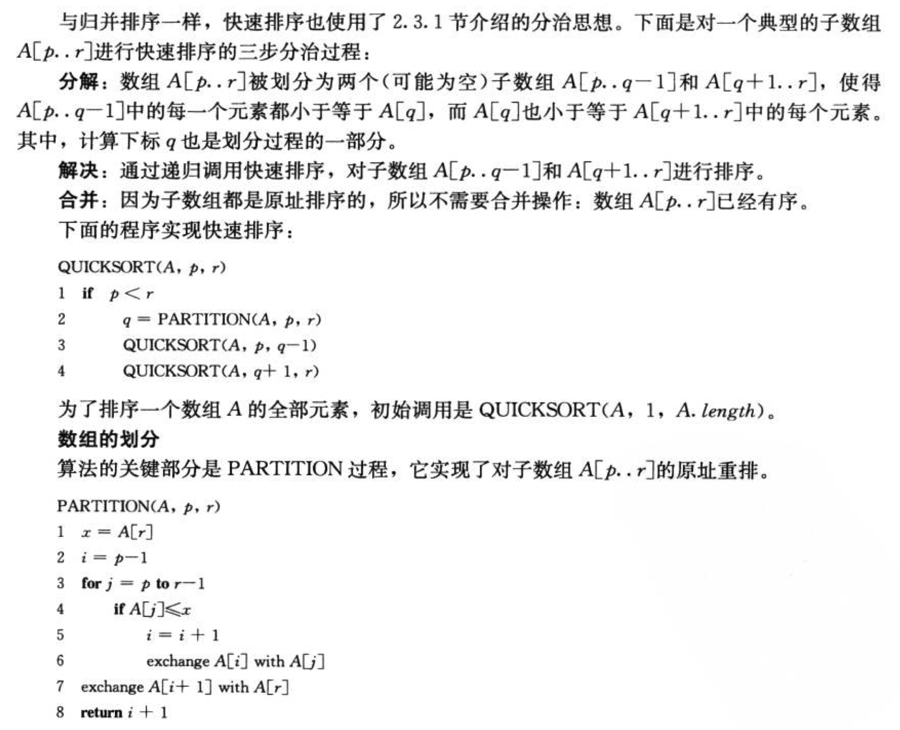

```python
class Solution:
    def topKFrequent(self, nums: List[int], k: int) -> List[int]:
        from collections import Counter
        nCounter = Counter(nums)

        # import queue
        # 有问题，当 queue 满时，优先队列的实现会等待优先级最高的出了再入
        # q = queue.PriorityQueue(k)
        # for k, v in nCounter.items():
        #     q.put((-v, k))
        # res = []
        # for _ in range(k):
        #     res.append(q.get())

        import heapq
        nList = [(v,k) for k, v in nCounter.items()]
        h = nList[:k]
        heapq.heapify(h)
        for item in nList[k:]:
            heapq.heappushpop(h, item)
        # res = heapq.nlargest(k, h)
        res = [v for frq, v in h]
        return res

    def topKFrequent_quicksort(self, nums: List[int], k: int) -> List[int]:
        from collections import Counter
        nCounter = Counter(nums)
        nList = [(v, k) for k, v in nCounter.items()]

        def quicksort(l, r, q):
            # print("Split: ", nList[l:r+1])
            # 基于排序的第 q 的元素划分 nList
            if l<r:
                ret = partition(l, r)
                if ret == q:
                    return
                if ret < q:
                    quicksort(ret+1, r, q)
                else:
                    quicksort(l, ret-1, q)

        def partition(l, r) -> int:
            pivot = nList[r]
            i = l-1
            for j in range(l, r):
                if nList[j] <= pivot:
                    i += 1
                    nList[j], nList[i] = nList[i], nList[j]
            nList[i+1], nList[r] = nList[r], nList[i+1]
            return i+1

        if k==len(nList):
            return [v for fre, v in nList]

        quicksort(0, len(nList)-1, len(nList)-k)
        return [v for fre, v in nList[-k:]]
```

### 295 数据流中的中位数

要求是设计数据结构。题目中讲了四种，但第一种 find 的时候直接 sort 一遍也太傻了。
所以下面中的思路一是维持内部的数组 nums 为有序状态，因此插入的时间复杂度仍然为 O(n) ，因为即使采用二分查找，把数字插入数组也可能要 O(n) 的复杂度。

后面的「方法三」维持了两个堆 low, high，分别保存前一半元素和后一半元素；注意需要维持两者的平衡，也即使得 len(low)>=len(high) 且最多多一个元素。为此，设计 low 为最大最，high 为最小堆。每进来一个元素
（1）先插入 low，然后将 low 的堆顶元素（前一半中最大的）加入 high 堆；
（2）此时可能出现两种情况（注意要维持 low 的大小大于等于 high）：若两者大小相等则 continue；若 size(high)=size(low)+1，则将 high 堆顶（后一半中最小者）pop 并加入 low 中，状态变为 size(high)=size(low)-1。
这样循环，可以保证 low 堆的元素均小于 high 堆的元素。若要输出中位数，根据奇偶数判断即可。

```python
设计一个支持以下两种操作的数据结构：

void addNum(int num) - 从数据流中添加一个整数到数据结构中。
double findMedian() - 返回目前所有元素的中位数。

addNum(1)
addNum(2)
findMedian() -> 1.5
addNum(3)
findMedian() -> 2
```

```python
class MedianFinder:
    def __init__(self):
        """
        initialize your data structure here.
        """
        self.nums = []
        self.count = 0

    def addNum(self, num: int) -> None:
        # 采用二分查找可加速
        self.count += 1
        for i in range(self.count-1):
            if self.nums[i] > num:
                self.nums.insert(i, num)
                return
        self.nums.append(num)

    def findMedian(self) -> float:
        if self.count % 2:
            return self.nums[self.count//2]
        else:
            return sum(self.nums[self.count//2-1: self.count//2+1]) / 2
```

#### 方法三：两个堆 ***

```python
import heapq
class MedianFinder2:
    def __init__(self):
        self.lo = []
        self.hi = []

    def addNum(self, num: int) -> None:
        heapq.heappush(self.lo, -num)   # 最大堆
        heapq.heappush(self.hi, -self.lo[0])
        heapq.heappop(self.lo)

        if len(self.lo) < len(self.hi):
            heapq.heappush(self.lo, -self.hi[0])
            heapq.heappop(self.hi)

    def findMedian(self) -> float:
        if len(self.lo) > len(self.hi):
            return -self.lo[0]
        else:
            return (self.hi[0] - self.lo[0]) / 2


sol = MedianFinder2()
sol.addNum(1)
sol.addNum(2)
print(sol.findMedian())
sol.addNum(3)
print(sol.findMedian())
```

#### 方法四：Multiset 和双指针

[解析](https://leetcode-cn.com/problems/find-median-from-data-stream/solution/shu-ju-liu-de-zhong-wei-shu-by-leetcode/) 还提到了 C++中的数据结构 multiset，也即是允许重复元素的集合，其一个重要性质就是可以**维持元素保持有序**。借助这一数据结构，可以进行较为简单地实现。

> c++语言中，multiset是<set>库中一个非常有用的类型，它可以看成一个序列，插入一个数，删除一个数都能够在O(logn)的时间内完成，而且他能时刻保证序列中的数是有序的，而且序列中可以存在重复的数。

参见 CSDN 上 [multiset用法总结](https://blog.csdn.net/sodacoco/article/details/84798621)。

Python 中似乎没有相应的实现。一个较为相关的模块大概是 bisect，不过这里仅仅实现了二分查找的几种形式的算法，还是未能解决数组插入可能导致的 O(n) 复杂度。
bisect 参见 [bisect](https://www.liujiangblog.com/course/python/57) 和 [官方文档](https://docs.python.org/zh-cn/3.6/library/bisect.html)。
